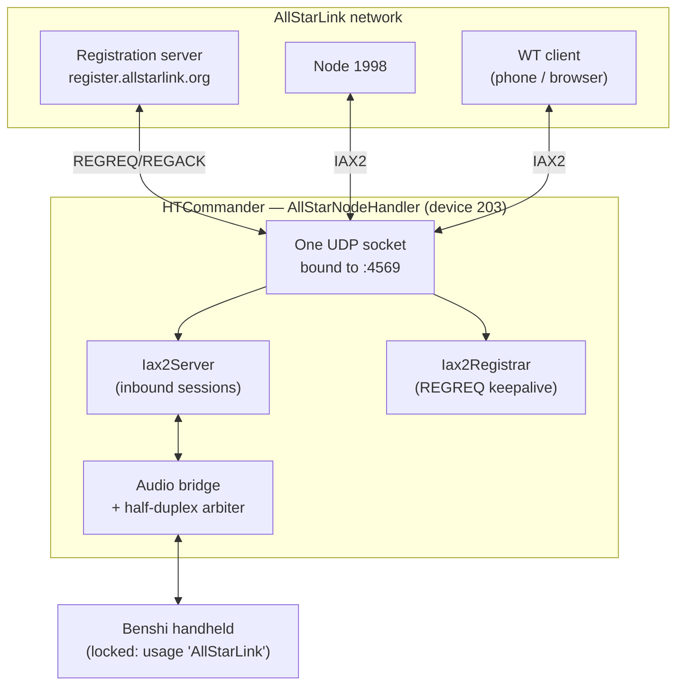
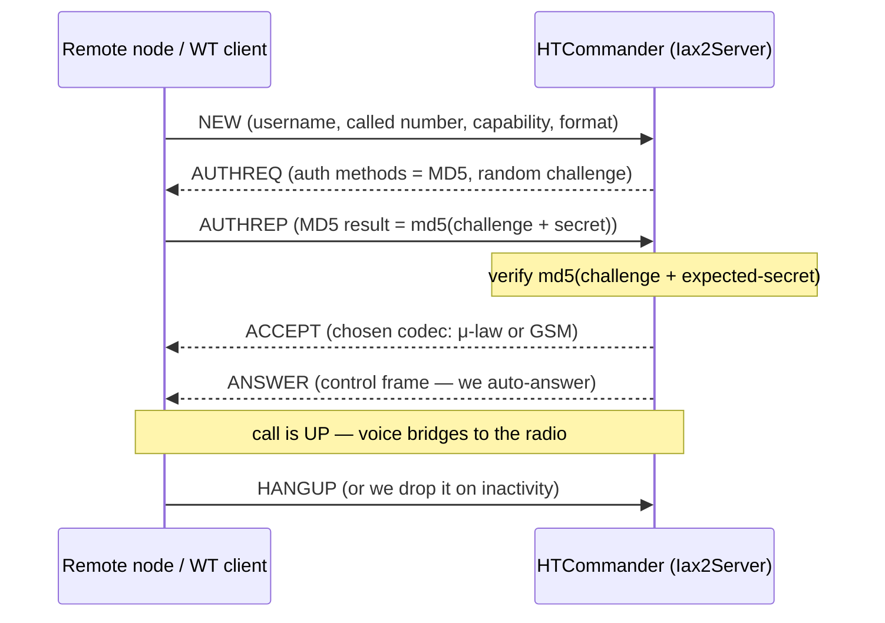
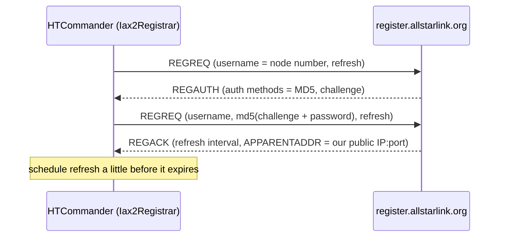
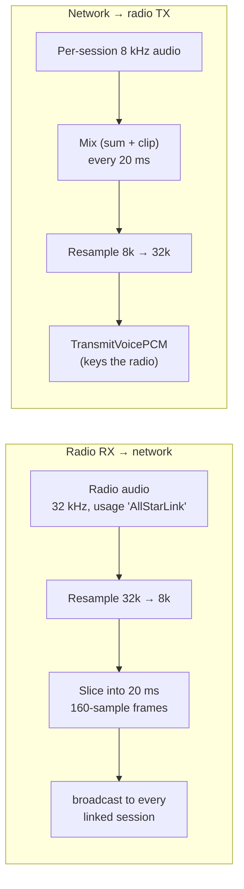
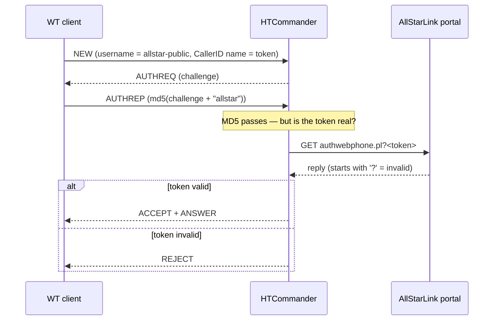

# Becoming the Node: Hosting an AllStarLink Node in HTCommander

*Our [first AllStarLink post](allstarlink-support.md) taught HTCommander to place
an outbound IAX2 call into a node — to be a **client** that dials in. This one is
about the other direction: turning HTCommander itself into a **node** that other
people dial *into*, and bridging whatever they say straight out over a Benshi
handheld's PTT. That means running an inbound IAX2 **server**, registering with
the AllStarLink network so the world can find us, arbitrating a half-duplex radio
between RF and the internet, and — because we wanted "anyone with the app can
connect" done safely — validating AllStarLink Web Transceiver tokens the exact
way a real node does. Here's how it all fits together.*

---

## From client to node

In the client post we made a product call: connect *to* one node the way phone
apps like DVSwitch Mobile do, and skip the heavy machinery of *being* a node. The
protocol core — IAX2 frames, information elements, MD5 auth, GSM/μ-law codecs —
was identical either way, so we noted that "full node participation can be layered
on later without touching the protocol core."

This is that layer. Hosting a node adds three genuinely new pieces on top of the
existing IAX2 stack:

1. An **inbound server** that answers `NEW` calls from other nodes instead of
   placing them — with the whole handshake running in reverse.
2. A **registration client** so the AllStarLink network publishes our address and
   other nodes can resolve our node number to our IP.
3. A **radio relay**: a bridge that cross-connects the internet call to a
   physical radio's receiver and transmitter, with the half-duplex arbitration a
   real repeater controller does.

And because a hosted node is exposed to the whole internet, a fourth concern runs
through all of it: **authentication and access control**.

---

## The shape of it: a background handler, device 203

The outbound AllStarLink client lives on **device 202** — a pseudo-radio you
select and talk *through*. Hosting is a different animal: it isn't a radio you
listen to, it's a service that runs in the background and *takes over* one of your
real radios. So it gets its own home.

Node hosting is an `AllStarNodeHandler` — a background Data Broker handler in the
same family as the BBS and Torrent handlers — and it publishes its control and
status on a new pseudo-device, **203**. It owns exactly one UDP socket and three
things hanging off it: the server, the registrar, and the audio bridge to a locked
radio.



When you start hosting, the handler locks the chosen radio to a new usage string,
`AllStarLink`, so the rest of the app leaves it alone (more on that lock later),
opens the socket, spins up the server and registrar, and starts a 20 ms mixer
tick. Stop hosting and it unwinds all of it — unlock the radio, hang up every
session, deregister, close the socket.

Everything below the handler is, again, **pure Dart** and transport-agnostic: the
server and registrar emit datagrams through callbacks and receive them through
plain methods, so both are unit-tested without a socket in sight.

---

## One socket, two tenants: routing by call number

Here's the first wrinkle unique to hosting. A real node uses UDP 4569 for
*everything*, and so must we — but now "everything" includes two very different
conversations sharing one socket: registration traffic to AllStarLink's servers,
and call traffic to and from every linked peer. When a datagram arrives, which one
gets it?

IAX2 hands us the answer for free. Every full frame names the **destination call
number** — the local call number the sender is talking to. So we simply partition
the call-number space:

| Tenant | Local call numbers |
|---|---|
| Inbound peer sessions (`Iax2Server`) | `1 … 0x3FFE` |
| Registration leg (`Iax2Registrar`) | `0x4000 …` |

The handler peeks at the destination call number on each inbound datagram: if it's
`≥ 0x4000` it belongs to the registrar, otherwise it's routed to the server, which
demultiplexes further by `(peer address, call number)` into the right session.
`NEW` frames — which carry destination call number `0` because the peer doesn't
know its call number yet — always go to the server to start a new session.

---

## The handshake, in reverse

The client post walked the outbound handshake: we send `NEW`, the node challenges
us with `AUTHREQ`, we answer `AUTHREP`, it says `ACCEPT` then `ANSWER`. Hosting is
the *same conversation from the other chair*. Now **we** are the one issuing the
challenge and deciding who gets in.



A few decisions that only exist on the server side:

- **We allocate the call number.** Each `NEW` gets a fresh local call number from
  the `1…0x3FFE` pool, and the session is filed under both that number and the
  peer's `(host, port, their call number)` so mini frames — which only carry the
  source call number — still route correctly.
- **We generate the challenge.** A random numeric string per session; the peer's
  `AUTHREP` must be `md5(challenge + secret)`, and we compare against our own
  computation of the same. Wrong secret → `REJECT`, and the session never exists.
- **We auto-answer.** A repeater node doesn't "ring"; the moment auth passes we
  send `ACCEPT` (naming the codec we picked from the caller's `CAPABILITY`,
  preferring μ-law then GSM) immediately followed by `ANSWER`, and the call is up.
- **We keep the reliability machinery**, but per-session: each session has its own
  sequence counters, its own map of unacknowledged frames, its own retransmit
  timer, and an inactivity watchdog that hangs up a peer that goes silent for
  60 seconds. One misbehaving link can't wedge the others.

The server caps concurrent sessions and supports optional allow/deny lists of node
numbers — the cheap, important guardrails for something that now listens to the
open internet.

---

## Getting found: IAX2 registration

An inbound server is useless if nobody can find it. AllStarLink resolves a node
number to an IP through DNS (`<node>.nodes.allstarlink.org`), and those DNS
records are populated from a **registration** database. To appear in it, a node
periodically tells AllStarLink "I'm node 2000, here's my password, here's where I
am" — and the network records the address it *sees* the packet coming from
(which neatly handles NAT).

ASL3 defaults to an HTTP registration endpoint whose wire format isn't publicly
documented, but the **classic IAX2 registration** — `register =>
node:password@register.allstarlink.org` — is right there in RFC 5456 and still
supported. It reuses the exact frame and IE code we already had, so that's what we
implemented.



It's the same MD5 challenge-response as a call, just with `REGREQ`/`REGAUTH`/
`REGACK` instead of `NEW`/`AUTHREQ`/`ACCEPT`. The `REGACK` even hands back an
`APPARENTADDR` information element — a `sockaddr_in` telling us the public IP and
port the server saw — which we decode and surface so you can confirm your node is
reachable. A timer re-registers shortly before the lease expires; a `REGREJ` (bad
password) or a silent server flips the status to *failed* and backs off.

Because registration shares the node's socket, it registers *from* port 4569 —
which is exactly the port inbound calls need to arrive on. The address AllStarLink
publishes is therefore the one that works.

---

## The whole point: bridging the internet to RF

Signaling and registration are plumbing. The reason any of this exists is to take
audio off an internet call and put it out over a radio — and take what the radio
hears and send it back. This is what `app_rpt` does on a real node, and it's the
part with the most physics in it.

The radio side already speaks a clean event language inside HTCommander. A locked
radio publishes its received audio as `AudioData*` events at 32 kHz, tagged with
the lock usage; transmitting is a matter of dispatching `TransmitVoicePCM` back to
it. So the bridge is two resamplers and a mixer wired between the server and those
events:



Received radio audio is resampled down to the node's 8 kHz, chopped into the
20 ms frames IAX2 wants, and broadcast to every connected peer. In the other
direction, a 20 ms **mixer tick** pulls a frame from each talking session, sums
them (with clipping), resamples up to the engine's 32 kHz, and streams it to the
radio as a held PTT. Multiple people talking at once mix into one transmission —
exactly what a repeater does.

### Half-duplex is the hard part

A repeater is full-duplex — it can listen and transmit at the same time. A
handheld cannot. It's **half-duplex**: while it's transmitting it's deaf, and you
must never key it on top of a local user who's mid-sentence. Getting this wrong
gives you the two classic failure modes — a feedback loop, or a local operator
who gets stepped on by the internet.

We arbitrate with the radio's own carrier detect. The radio reports `isInRx` in
its status — true when it hears a signal on the air. That's the priority signal:

- **Local RF wins, always.** While `isInRx` is true, the mixer tick refuses to key
  the radio and drops buffered network audio. A local operator is never
  interrupted by the link.
- **Network audio keys the radio only when the air is clear.** When RF is idle and
  a session has audio, we key PTT and stream; when the talkers stop, a short tail
  timer (~300 ms) unkeys, so the transmitter doesn't chatter between syllables.
- **Carrier state is signaled both ways.** When the radio starts and stops
  receiving, we send IAX2 `KEY`/`UNKEY` control frames (the `app_rpt` PTT
  indications) to the linked peers, so the rest of the network sees our node key
  up just like any other.

That "local RF wins" rule, plus the fact that keying the radio makes it deaf
(so it can't hear — and re-transmit — the very audio we're playing into it), is
what keeps the bridge from howling.

### The lock

To dedicate a radio to relaying, the handler claims it with HTCommander's radio
**lock** mechanism under a new usage, `AllStarLink`. The lock is how features like
BBS, Terminal, and Torrent take exclusive control of a radio; the Comms tab already
respects it and disables manual PTT on a locked radio. Reusing it means the moment
you start hosting, the radio is off-limits to everything else and fully owned by
the node — no new arbitration code required.

---

## "Allow anyone": Web Transceiver, done safely

There are two ways to let people connect. The first is to hand out your **node
password** — fine for a friend, awkward for the public. The second is the
mechanism AllStarLink built for exactly this: the **Web Transceiver** (WT).

WT clients don't have your password. They authenticate with a *public* shared
secret (`allstar-public` / `allstar`) that every WT-enabled node accepts — and the
real access control is a **token** each client fetches from the AllStarLink portal
by logging in with their own account. The client presents that token as its IAX2
CallerID name; the node validates it, and only lets the call through if it's good.

We added an **Allow Web Transceiver connections** switch that turns this on. When
a caller uses the public username, the server authenticates them against the public
secret instead of your node password. But that public secret is, by design, known
to everyone — so on its own it would let *anyone* in. The token is what makes it
safe, and it turns out a real node validates it with a plain HTTP GET:

```
GET https://register.allstarlink.org/cgi-bin/authwebphone.pl?<token>
```

That's lifted straight from the `[allstar-public]` dialplan every ASL node ships:
it CURLs that URL with the caller's token and hangs up only if the reply begins
with `?`. We do exactly the same.



Two implementation details made this behave well:

- **Auth is now two-phase and async.** MD5 is synchronous; the token check is a
  network round-trip. So after MD5 passes for a WT session, the server sends a bare
  `ACK` to stop the peer retransmitting its `AUTHREP`, kicks off the async
  validation, and only *then* sends `ACCEPT` or `REJECT` when the portal answers. A
  guard flag stops a retransmitted `AUTHREP` from launching a second lookup, and
  the result is ignored if the session was torn down while we waited.
- **We match the node's fail-open stance.** The dialplan rejects only on an
  explicit `?`; an empty or failed response lets the call through. We do the same —
  reject on `?`, but treat a portal outage as *allow*, so a hiccup at AllStarLink
  doesn't lock out every legitimate user. (Flipping this to fail-closed is a
  one-line change if a node owner prefers it.)

The upshot: flip one switch and anyone with a valid AllStarLink account can reach
your radio through the official Web Transceiver — and nobody without one can.

---

## Using it

Two places, mirroring how the feature splits:

**Settings → AllStarLink → Host a Node** holds the identity and network config:

| Field | What it is |
|---|---|
| **Node Number** | Your AllStarLink node number |
| **Node Password** | The password from your node's portal page |
| **IAX Port** | The UDP port to bind (defaults to 4569) |
| **Registration** | AllStarLink (IAX), or *None* for a private node |
| **Allow Web Transceiver** | Accept token-validated public WT clients |

**The Comms tab** is where you actually go on the air. Select a connected
handheld, tap the new **node** button in the header, confirm the control-operator
notice, and HTCommander locks that radio, registers, and starts relaying. The
button glows while hosting and shows how many nodes are linked; tap it again to
stop. Because a hosted node listens on the internet, you'll need to forward UDP
4569 to the machine for inbound links to reach you — the one bit of network setup
the protocol can't do for you.

A word on responsibility: relaying internet audio onto RF means *you* are the
control operator for everything that goes out. HTCommander shows a one-time notice
to that effect before it keys your radio for the first time — the same reminder any
repeater trustee lives by.

---

## Testing a server with no internet in the room

The same discipline that made the client testable pays off double here. Because
`Iax2Server` and `Iax2Registrar` talk through callbacks, a test can *be* the
remote node: feed the server a crafted `NEW` and assert it challenges with an
`AUTHREQ`; feed a correct `AUTHREP` and assert `ACCEPT` + `ANSWER` and a live
session; feed a *wrong* secret and assert `REJECT` and zero sessions; feed a voice
frame and assert PCM comes out the audio callback; feed a `HANGUP` and assert a
clean teardown. The registrar test plays the registration server through the whole
`REGREQ → REGAUTH → REGREQ → REGACK` dance.

Web Transceiver validation drops in as a swappable async function, so two tests
pin the important behaviors without touching the network: a validator that returns
*false* must produce a `REJECT` *after* the async check resolves, and one that
returns *true* must accept. No live node, no portal, no repeater across town.

---

## What's next

Hosting a node opens a long runway of `app_rpt` behavior we haven't built yet:

- **DTMF node control** — letting a connected user key `*3<node>` to link and
  unlink *other* nodes through us, the way a real controller does.
- **Outbound linking from node mode** — so your hosted node can reach *out* to
  other nodes and hubs, not only accept inbound links.
- **HTTP registration** and **IAX2 call tokens**, once their wire formats are
  pinned down, for full parity with ASL3 defaults.
- **Node status on the radio panel** — a live roster of who's linked, right on the
  LCD.

But the core is in place: HTCommander will now stand up as an AllStarLink node,
register itself with the network, answer calls from anywhere in the world, prove
who's allowed in — and put every one of them out over a handheld's PTT, all in
pure Dart on top of the same audio pipeline that started this whole series.

---

*See also: [Dialing In: Adding AllStarLink Support to HTCommander](allstarlink-support.md)
· [Radio Over the Internet: Adding EchoLink to HTCommander](echolink-support.md)*
