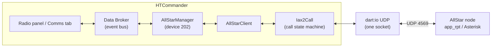
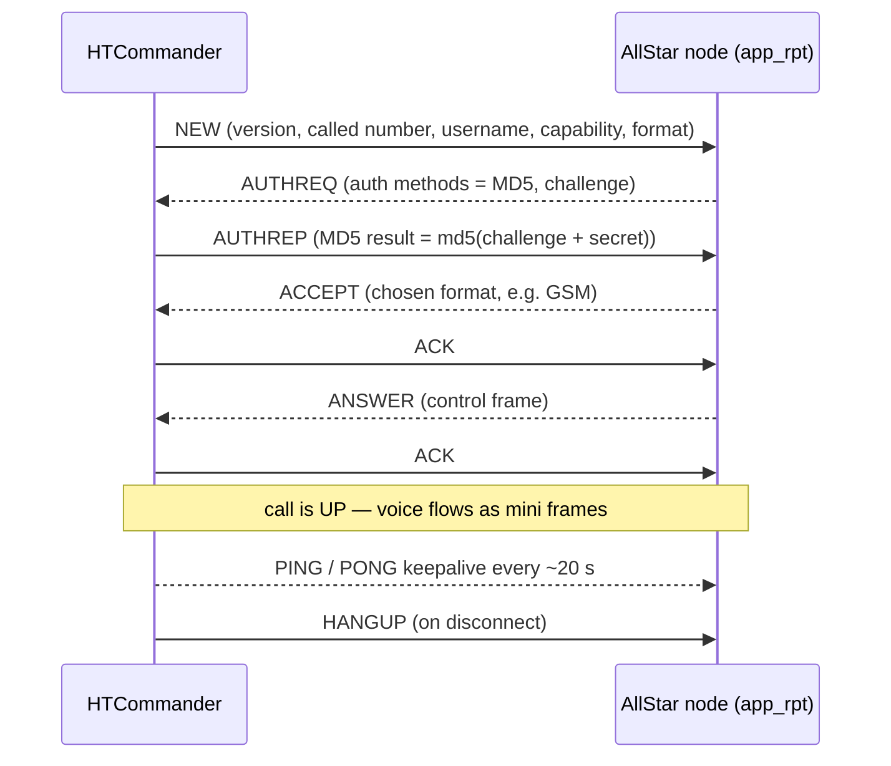
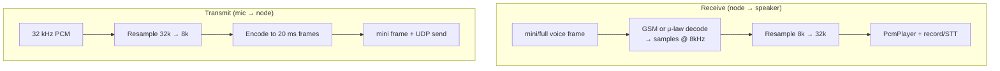

# Dialing In: Adding AllStarLink Support to HTCommander

*AllStarLink links amateur repeaters and hotspots over the internet using
Asterisk — the same open-source PBX that runs call centers — and its native
**IAX2** protocol. Unlike EchoLink's simple UDP scheme, IAX2 is a full VoIP
signaling stack: a single UDP port, binary full/mini frames, MD5
challenge-response auth, sequence-numbered reliability, and a proper call state
machine. This post walks how we spoke IAX2 from pure Dart, why we connect the way
a phone app does, how GSM and μ-law voice ride the wire, and the handful of
protocol details that make IAX2 pleasantly NAT-friendly and mildly annoying to
implement.*

---

## What AllStarLink is, and why add it

[AllStarLink](https://www.allstarlink.org) (ASL) is a network of amateur radio
repeaters, remote bases, and hotspots tied together over the internet. Under the
hood every AllStar node is an [Asterisk](https://www.asterisk.org) PBX running
the `app_rpt` application — the software that turns a telephone switch into a
repeater controller. Nodes link to each other by placing **calls**: node 2000
"dials" node 1998, Asterisk bridges the audio, and now two repeaters (and
everyone listening on them) share a conversation. There are thousands of nodes
online, many bridged to busy hubs and reflectors.

HTCommander already treats the internet as just another place audio comes from
and goes to. It decodes Bluetooth SBC audio from Benshi handhelds, resamples,
records, transcribes — and, since [EchoLink](echolink-support.md), it speaks one
internet-linking protocol already. AllStarLink is the natural next one. So we
added it as a first-class **radio you can switch to**, sitting right next to your
Bluetooth handhelds and EchoLink.

There's a catch that shapes the whole design: **AllStarLink doesn't have its own
protocol.** It uses **IAX2** — the Inter-Asterisk eXchange protocol, version 2
([RFC 5456](https://www.rfc-editor.org/rfc/rfc5456)) — which is a complete,
general-purpose VoIP signaling and media protocol. Where EchoLink is a couple of
UDP packet formats you can implement in an afternoon, IAX2 is a call-control
protocol with authentication, reliability, keepalives, codec negotiation, and a
state machine. That's the interesting part, and it's what most of this post is
about.

---

## Two ways to join AllStar (and the one we picked)

Before any code, a product decision. There are two established ways for software
to participate in AllStarLink:

- **Full node participation.** You register with AllStarLink's servers, get your
  own node number, resolve other nodes' addresses through ASL's HTTP/DNS
  directory, and can dial *any* public node by number. This is what a real ASL
  node does. It's heavy: registration keepalives, a node database, and you have
  to *be* a node.
- **Client-to-node**, the way phone apps like **DVSwitch Mobile** and desktop
  **iaxRPT** work. You point the app at *one specific node* you're allowed to use
  — host, port, an IAX username and secret, and the node number to connect to —
  and place a single IAX2 call into it. `app_rpt` on the far end answers and
  bridges you onto its system. No registration infrastructure required.

We went with **client-to-node** for the first release. It's how most operators
actually connect a mobile client, and it avoids reimplementing ASL's registration
and node-lookup machinery. The heavy lifting — the IAX2 protocol itself — is
identical either way, so full node participation can be layered on later without
touching the protocol core.

---

## The shape of it: a radio that isn't a radio

Inside HTCommander every connected radio has a numeric **device ID**. Physical
Benshi handhelds start at 1; EchoLink is device 200; APRS-IS is 201. AllStarLink
is registered as **device 202** — another *pseudo-radio*. It never joins the real
radio stack (no Bluetooth, no transmit-lock arbitration, no hardware channels),
but it publishes the same kind of state onto the app's internal event bus (the
"Data Broker") so the rest of the UI can treat it like any other radio: a display
panel, an RSSI/TX bar, a node grid, and the Comms tab all light up for it.



The layering, top to bottom, deliberately mirrors the EchoLink stack so the two
share the app's audio pipeline:

- **`AllStarManager`** — the bridge to the app. It turns UI commands (*go
  online*, *connect*, *disconnect*, *transmit*) into client calls, re-emits
  received audio as recordable/transcribable events, resamples between the app's
  engine and the node, and reads/writes the saved node list.
- **`AllStarClient`** — orchestration. Opens the transport and manages the
  lifecycle: `offline → online → connecting → inCall`.
- **`Iax2Call`** — the IAX2 call state machine for a single call. Transport- and
  timer-injectable so it can be unit-tested without real sockets.
- **`DartIoIax2Network`** — the actual `dart:io` UDP socket.

The whole thing is **pure Dart**. There is no `libiax` or Asterisk code
underneath — the subset of IAX2 needed to place an outbound `app_rpt` call is
small enough to implement directly, and it keeps the protocol layer
dependency-free and unit-testable.

---

## IAX2 in one breath: one port, two frame shapes

The single best thing about IAX2 — and the reason Mark Spencer invented it —
is that **everything goes over one UDP port (4569)**: signaling *and* media, both
directions. Compare that to SIP+RTP (separate signaling and media, on separate
ports, often separate addresses) or EchoLink (two UDP ports plus a TCP
directory). One port means one NAT pinhole. Place an outbound call and the return
audio flows back through the same hole your first packet opened. For a client
behind a home router, that's close to magic — no port forwarding required.

Everything on that port is a **frame**, and there are two kinds:

| Frame | Header | Reliable? | Carries |
|---|---|---|---|
| **Full frame** | 12 bytes | Yes (ACKed) | Signaling — and occasionally media |
| **Mini frame** | 4 bytes | No | Media only (voice) |

A **full frame** is the workhorse of call setup. Its 12-byte header packs the
source and destination call numbers (15 bits each), a 32-bit millisecond
timestamp, outbound/inbound sequence numbers, a frame type, and a subclass:

```
 0                   1                   2                   3
 0 1 2 3 4 5 6 7 8 9 0 1 2 3 4 5 6 7 8 9 0 1 2 3 4 5 6 7 8 9 0 1
+-+-+-+-+-+-+-+-+-+-+-+-+-+-+-+-+-+-+-+-+-+-+-+-+-+-+-+-+-+-+-+-+
|F|     Source Call Number      |R|  Destination Call Number    |
+-+-+-+-+-+-+-+-+-+-+-+-+-+-+-+-+-+-+-+-+-+-+-+-+-+-+-+-+-+-+-+-+
|                            timestamp                          |
+-+-+-+-+-+-+-+-+-+-+-+-+-+-+-+-+-+-+-+-+-+-+-+-+-+-+-+-+-+-+-+-+
|   OSeqno      |    ISeqno     |   Frame Type  |C|  Subclass    |
+-+-+-+-+-+-+-+-+-+-+-+-+-+-+-+-+-+-+-+-+-+-+-+-+-+-+-+-+-+-+-+-+
|          Information Elements (type/length/value) ...         |
```

The top bit (`F`) is set to mark a full frame. A **mini frame** clears that bit
and shrinks the header to four bytes: the source call number and the *low 16
bits* of the timestamp, followed straight by codec payload. Once a call is up,
voice mostly travels as mini frames — four bytes of overhead per packet instead
of twelve — and that's the bandwidth win IAX2 is designed around.

A small implementation wrinkle lives in that last header byte. The subclass is
seven bits, but media formats are a 32-bit bitmask (GSM is `0x2`, μ-law is `0x4`,
…). IAX2 squares that circle with a flag bit (`C`): when set, the subclass value
is a *power of two*, transmitted as its exponent. So GSM (`0x2 = 2¹`) goes on the
wire as `0x81`. Our frame codec handles that encode/decode in one place so the
rest of the code just deals with plain format constants.

---

## The call: NEW → AUTHREQ → AUTHREP → ACCEPT → ANSWER

Placing a call is a short conversation of full frames. Every reliable frame
carries a sequence number and must be acknowledged; the diagram omits the bare
ACKs for clarity.



Walking it:

1. **NEW** kicks off the call. It carries a set of **information elements** (IEs)
   — type/length/value triples appended to the frame. The `VERSION` IE must come
   first; then the `CALLED NUMBER` (the node you're dialing), your `USERNAME`, and
   the codec negotiation IEs (`CAPABILITY` = the codecs you can do, `FORMAT` = the
   one you'd prefer).
2. **AUTHREQ** is the node saying *prove it*. It names the authentication methods
   it accepts and includes a random **challenge** string.
3. **AUTHREP** answers with the MD5 response — more on that below.
4. **ACCEPT** means you're in. It names the codec the node actually chose (which
   must be one you offered).
5. **ANSWER** — a *control* frame, a different frame type from the IAX signaling
   frames — means the far end has picked up. Now the call is **up** and media
   flows.

If anything goes wrong you get a **REJECT** or **HANGUP** (with a Q.931 cause
code lifted straight from the telephone world — *user busy*, *call rejected*,
*normal clearing*), and the call tears down.

---

## Authentication: MD5 challenge-response

IAX2's common authentication is an MD5 challenge-response, and it's refreshingly
simple: the node sends a random challenge string, and you reply with the
hex-encoded MD5 digest of the **challenge concatenated with your shared secret**:

```
MD5 RESULT = md5( challenge + secret )
```

The secret never crosses the wire — only the digest does — and because the
challenge is fresh every call, a captured digest can't be replayed. (IAX2 also
defines RSA auth and AES call encryption; `app_rpt` client links use MD5 in
practice, so that's what we implement.) We compute the digest with the app's
existing `crypto` package, and a couple of unit tests pin it against known MD5
vectors so an accidental change to the concatenation order can't slip through.

---

## The codecs: GSM (again) and μ-law

Here's where the EchoLink work paid a dividend. IAX2 negotiates a codec, and
`app_rpt` links speak **GSM 06.10 Full Rate** — the *exact same* 8 kHz codec
HTCommander already implemented for EchoLink. So the receive and transmit codec
was, quite literally, already in the repo.

We added one more for breadth: **G.711 μ-law** (PCMU), the classic telephone
codec — one byte per sample, table-driven companding, effectively free to run. It
gives us a fallback when a node insists on μ-law.

| Codec | Rate | Frame | On the wire |
|---|---|---|---|
| GSM 06.10 | 8 kHz mono | 160 samples → **33 bytes** | one GSM frame per packet |
| G.711 μ-law | 8 kHz mono | 1 byte per sample | raw μ-law bytes |

One subtlety worth calling out: EchoLink packs **80 ms** (four GSM frames) into
each voice packet; IAX2/`app_rpt` uses **20 ms** frames — a single 160-sample GSM
frame per packet. Lower latency, more packets. And unlike EchoLink, IAX2 voice
payload has *no* RTP-style header of its own — the mini-frame header *is* the
framing, and the codec is implied by the last full voice frame's subclass.

The rest of the audio path is shared with EchoLink and the radios. HTCommander's
engine runs at **32 kHz**; the node runs at **8 kHz**; the same linear resampler
(with cross-chunk continuity, so no clicks at frame boundaries) bridges the two.
Received audio is played through the shared `PcmPlayer` *and* re-emitted onto the
Data Broker as `AudioData*` events, so the existing recorder and speech-to-text
engine pick up AllStar audio with zero extra work.



---

## Reliability without TCP: sequence numbers, ACKs, and a resync trick

IAX2 rides on UDP, but call setup can't afford to lose a NEW or an AUTHREP. So it
builds *just enough* reliability on top: every full frame carries an **outbound
sequence number** (`OSeqno`) and the **inbound** number it's acknowledging
(`ISeqno`). Signaling frames must be ACKed; if an ACK doesn't come, the sender
retransmits (with a "this is a retransmit" bit set) a few times before giving up
and tearing the call down. Media mini frames are deliberately *un*reliable —
a lost 20 ms of audio is better re-sent as silence than arriving late.

Our `Iax2Call` tracks pending reliable frames in a small map keyed by sequence
number, clears them as the peer's `ISeqno` advances, and retransmits the rest on
a timer. Bare ACKs, PONGs, and a couple of other frame types deliberately *don't*
advance the counters (per the RFC), which is the kind of detail that's invisible
until it isn't — get it wrong and the peer starts NAKing.

Two timers keep a live call healthy:

- **PING/PONG** every ~20 seconds of idle proves the link is still there; a node's
  PING is answered with a PONG, and its LAGRQ (lag request) with a LAGRP.
- A **connect timeout** fails the call if ACCEPT/ANSWER never arrive.

And a genuinely clever bit from the spec: mini frames only carry the *low 16 bits*
of the timestamp, which wraps every 65.536 seconds. To keep both ends' clocks in
step across that wrap, IAX2 requires a **full** voice frame whenever the timestamp
crosses a multiple of `0x8000` (32.768 s). Our sender watches for that boundary
and promotes the next voice packet from a mini frame to a full frame
automatically — and always sends a full frame *first*, to establish the codec
before the minis (which have no codec field of their own) start flowing.

---

## Using it

Configuration lives in **Settings → AllStarLink**. Add a node with the details
from that node's `iax.conf`:

| Field | Where it comes from |
|---|---|
| **Name** | Anything you like — shown on the tile |
| **Host / Port** | The node's address (port defaults to 4569) |
| **IAX Username / Secret** | The user entry configured for you in `iax.conf` |
| **Node Number** | The AllStarLink node you want to connect to |

Once at least one node is saved, **AllStarLink** appears in the radio connection
dialog (as an *Internet* radio, right below EchoLink). Connect to go *online* —
which, for AllStar, just means opening the UDP socket and appearing in the radio
switcher — then tap a node tile in the panel to place the call. The display shows
`Disconnected → Connecting → Connected`, the node number, and an *Internet* tag;
tap the connected tile again to hang up. From there it behaves like any other
radio: PTT transmits, received audio plays and is recorded/transcribed, and it
shows up in the switcher for one-tap source changes.

If you close the app mid-call, it remembers (a `WasOnline` flag plus the last
node) and reconnects on the next launch — the same auto-reconnect behavior the
Bluetooth radios and EchoLink already have.

---

## Testing a protocol with no radio in the room

IAX2 is a state machine, and state machines are a joy to unit-test *if* you keep
the sockets and clocks out of the core. `Iax2Call` emits datagrams through a
callback and receives them through a plain method, so a test can play the part of
the node: feed it a crafted AUTHREQ and assert the AUTHREP carries the right MD5;
feed it ACCEPT + ANSWER and assert the call goes *up*; feed it a GSM voice frame
and assert PCM comes out; feed it a HANGUP and assert a clean teardown. The
`AllStarClient` gets the same treatment over a fake in-memory transport.

Twenty-six tests cover the frame and IE round-trips, the μ-law and GSM codecs,
the MD5 vectors, and the full handshake — none of which need a live node, a real
socket, or a repeater across town. That's the payoff of keeping the protocol pure
and the I/O at the edges.

---

## What's next

The first release is deliberately scoped to *place an outbound call to a node you
own or are permitted to use*. Some IAX2 corners are intentionally left for later:

- **DTMF control.** On a real AllStar system you connect and disconnect *other*
  nodes by sending `app_rpt` DTMF commands (e.g. `*3<node>`). IAX2 carries DTMF as
  its own frame type; wiring the app's keypad to it is a natural follow-up.
- **Full node participation** — ASL registration and node-number lookup — so you
  can dial any public node by number rather than configuring each one.
- **Native AES encryption**, RSA auth, and IAX2 trunking — none of which a
  single client link needs, but all of which the protocol supports.

For now, HTCommander speaks enough IAX2 to walk up to an AllStarLink node, prove
who it is, and start talking — all in pure Dart, sharing the same audio pipeline
that already drives your handheld.

---

*See also: [Radio Over the Internet: Adding EchoLink to HTCommander](echolink-support.md)
· [Planning APRS-IS for HTCommander](aprs-is-integration.md)*
