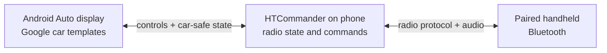

# Your Radio on the Dashboard: Android Auto Support in HTCommander

*HTCommander can now put the controls you need most on an Android Auto display:
connect to a paired radio, change channels and regions, manage scan and
dual-watch, and glance at recent messages without navigating the full phone
app. Here is what Android Auto is, how HTCommander fits into it, and the limits
that keep the experience deliberately focused.*

---

## What Android Auto is

[Android Auto](https://www.android.com/auto/) projects a driving-friendly
experience from an Android phone onto a compatible vehicle display. The phone
still runs HTCommander, talks to the radio over Bluetooth, and holds the app's
state; the car provides the larger screen and its touch, rotary, or other input
controls.

This is different from **Android Automotive OS**, where Android is built into
the vehicle and apps run directly on the car. HTCommander's integration is for
phone-projected Android Auto. You need an Android phone with HTCommander
installed and a vehicle or aftermarket head unit that supports Android Auto.

It is also not ordinary screen mirroring. Google only permits approved,
task-focused interfaces in the car. HTCommander appears as an IoT/device-control
app and uses the standard templates supplied by the Android for Cars App
Library. Those templates keep controls large, navigation shallow, and the
amount of information on screen within the limits chosen by Android Auto and
the vehicle.

## Connecting a radio from the car

If HTCommander already has a preferred radio connected, the Android Auto screen
opens directly to that radio. Its friendly name appears at the top and the car
interface follows its current state.

If no radio is connected, HTCommander looks for compatible radios that have
already been paired with the phone. You can refresh the list, choose a radio,
and connect without first opening the full phone interface. Connection progress
and failures are shown in the list, and larger lists are split across pages to
respect the head unit's item limit.

Pairing a new radio and granting Android permissions still belong on the phone.
The car screen can reconnect a known radio, but it is not a replacement for the
initial setup flow.

## Radio controls on the dashboard

Once connected, the main screen mirrors a small, live slice of the preferred
radio's state. It offers:

- **VFO A channel selection.** The current channel name is shown with its
  receive frequency. Open the row to browse named channels and assign one to
  VFO A with a tap.
- **VFO B channel selection.** When scan or dual-watch makes the second VFO
  relevant, its channel appears as a separate row with the same picker.
- **Scan.** A native switch starts or stops channel scanning.
- **Dual-watch.** A second switch enables or disables monitoring both VFOs.
- **Regions.** The active radio region is shown on the main screen and can be
  changed from a short picker.

The channel picker marks the active choice as **Current**, displays frequencies
for the other channels, and paginates long channel lists according to the
capacity reported by the particular head unit. A selection is sent back to the
radio through the same internal command path used by the phone app, so the car
display updates as the radio state changes.

The important boundary is in the middle: Android Auto never connects directly
to the handheld. HTCommander on the phone remains the bridge between the car
and the radio.

## Messages without opening the phone

The **Messages** action opens a read-only, newest-first view of recent traffic
addressed to your station. It combines:

- APRS and other decoded on-air text directed to your callsign; and
- Winlink Inbox mail, represented by sender and subject.

Each row identifies the sender, message type, and arrival time. HTCommander
keeps the car-side snapshot deliberately small: at most the 25 most recent
matching items are mirrored, and the head unit may show fewer at once if its
template limit is lower.

New directed on-air messages can also be read aloud while an Android Auto
session is active. The announcement includes the sender when one is available,
and back-to-back messages are queued instead of interrupting each other. Speech
stops when the car session disconnects. Winlink subjects appear in the list but
are not announced as incoming on-air messages.

The destination filter matters. The car view is not a firehose of every packet
HTCommander has decoded; it shows received messages addressed to your configured
callsign (including its station ID/SSID forms), plus mail in the Winlink Inbox.

## The deliberate limits

Android Auto is designed to reduce visual and manual distraction, and that
shapes this feature more than screen size does.

**It is a focused remote, not the whole HTCommander app.** The dashboard does
not expose maps, packet inspection, channel editing, firmware updates, audio
tools, settings, or the rest of the phone and desktop interface. It also does
not provide push-to-talk or voice controls.

**Messages are read-only.** You can review recent addressed text and Winlink
subjects, and incoming on-air text can be spoken, but composing, replying,
acknowledging, or opening a full Winlink message is not offered on the car
screen. Those tasks require the phone app when safely parked.

**One preferred radio drives the display.** HTCommander can know about multiple
radios, but the car controls the currently preferred connected radio. Choosing
a paired radio while disconnected makes that connection the active one.

**A phone and Bluetooth connection are still required.** Android Auto does not
turn the head unit into a standalone radio controller. The phone must run
HTCommander, have the required Bluetooth access, and remain close enough to the
handheld. Initial radio pairing and permission prompts must be handled on the
phone.

**The vehicle controls presentation and interaction limits.** Exact colors,
spacing, list capacity, navigation chrome, and which controls are available
while moving can vary by Android Auto version and head unit. HTCommander asks
for standard list, row, action, and toggle templates; Android Auto decides how
to render them and may restrict interaction while driving.

**Android only.** This integration is for Android Auto. It does not add Apple
CarPlay support, and it is not an Android Automotive OS app installed directly
on the vehicle.

## Why this shape works

The goal is not to transplant a complex radio application onto a dashboard. It
is to make the few actions that matter during a drive predictable: connect the
radio you already paired, see what channel it is on, change that channel,
control scanning, and receive a short directed message without reaching for the
phone.

That narrow scope is what makes Android Auto useful here. The full HTCommander
interface remains available when parked; on the road, the dashboard gets a
small control surface built around quick choices and current state.

---

**Related:** [Testing HTCommander with Android Auto](../Android-Auto-Testing.md) ·
[Two Modems Are Better Than One: Running a Software APRS Modem Alongside the Radio's](aprs-dual-modem.md)