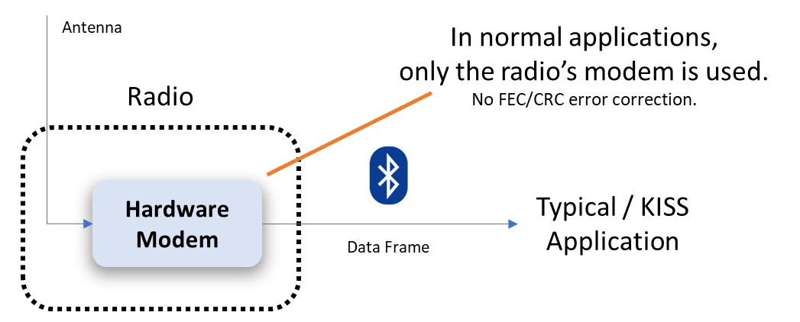
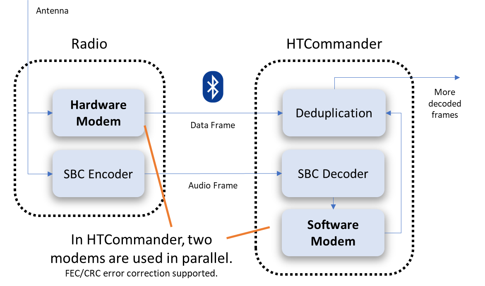
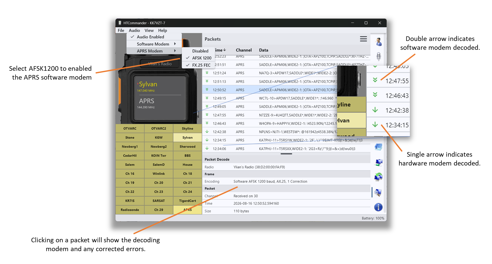

# Two Modems Are Better Than One: Running a Software APRS Modem Alongside the Radio's

*How HTCommander decodes APRS twice — once with the radio's built-in hardware TNC
and once with a software modem that adds FEC and CRC error recovery — and quietly
pulls in the packets the radio alone would have thrown away.*

---

## The problem: the radio's TNC drops packets

Most APRS apps talk to a handheld the same way: over KISS. The radio's built-in
hardware modem (its TNC) listens to the air, decodes every AX.25 packet it can,
and hands the finished data frames to the app over Bluetooth. The app never
touches the raw audio — it only ever sees the packets the radio already decoded.

That works, but the radio's TNC isn't a great modem. It has two real
limitations:

- **No forward error correction.** It doesn't understand FX.25, so a packet sent
  with FEC is decoded as if the FEC bytes were just noise — and if the payload
  took a hit, it's gone.
- **No CRC error recovery.** AX.25 frames carry a CRC. The radio's TNC treats it
  as pass/fail: if a single bit is wrong, the CRC fails and the whole packet is
  discarded. It never tries to work out *which* bit flipped and put it back.

On top of that, a small hardware modem simply *misses* packets — weak signals,
timing edges, a bit of fading — and every miss is a position report or message
you never see. Over an afternoon of listening, the lost-packet count adds up
fast.

## The idea: decode the same signal twice

The radio is already sending HTCommander something the KISS world ignores: the
**audio**. When you enable the audio channel, the radio streams the received
audio to the app over Bluetooth (compressed with SBC). HTCommander was built to
run its own **software modem** on that audio stream — the same DSP pipeline it
uses for DART and PSK — and it can run a full **AFSK 1200** APRS demodulator
there too.

So the same over-the-air signal gets decoded twice, in parallel:

- The **hardware modem** in the radio decodes the packet and sends the finished
  data frame over Bluetooth, exactly as before.
- The **software modem** in HTCommander decodes the SBC audio stream itself — and
  because it's a real software modem, it can do the two things the radio can't:
  **FX.25 forward error correction** and **CRC-based single/multi-bit recovery**.

The hardware modem is almost always faster — it's decoding in real time on
dedicated silicon — so when it succeeds, its packet arrives first and wins. But
when the radio's TNC comes up empty (no FEC, a failed CRC, or a missed packet
entirely), the software modem gets its shot at the same audio and often pulls the
packet out anyway.

## Making the two agree: deduplication

Running two decoders on one signal means the *same* packet can be decoded twice —
once by each modem. HTCommander wraps both sources behind a small
**deduplicator** so you never see doubles. It keys each finished frame by its raw
bytes and suppresses any identical frame seen again inside a short window (a few
seconds); the first copy through wins and the rest are dropped. Because the
hardware modem is faster, it usually gets there first — and only the packets it
*couldn't* decode fall through to be filled in by the software modem.

The net effect: you get the union of what both modems can hear, with none of the
duplicates.

## Turning it on

Two settings enable the feature. Both live under the **Audio** menu:

1. **Audio Enabled** — the software modem needs the audio stream. Enabling audio
   is enough; the channel does *not* have to be un-muted. Even when the channel
   is marked muted, HTCommander still receives the audio data (it just doesn't
   play it out your speakers), which is exactly what the modem needs.
2. **APRS Modem → AFSK 1200** — this switches on the software APRS demodulator.
   Leave **FX.25 FEC** enabled too, so the software modem can use forward error
   correction on packets that carry it.

That's it. From now on both modems are running, and the deduplicator quietly
merges their output.

## Seeing it work: the Packets tab

The proof is in the **Packets** tab, and it's designed so you can tell the two
modems apart at a glance:

- A **single arrow** next to a packet means the **hardware modem** decoded it —
  the radio's TNC got there first.
- A **double arrow** means the **software modem** decoded it — a packet you would
  *not* have seen with a KISS app.

Click any packet to open its decode details. The **Encoding** line tells you
which modem handled it and how much repair it took — for example
`Software AFSK 1200 baud, AX.25, 1 Correction` means the software modem decoded
it and had to flip one bit to make the CRC check out. If FX.25 forward error
correction was in play, you'll see that too, along with how many symbols it
recovered.

Leave the feature running for a while, then scan the Packets tab and count the
double arrows. Every one of them is a packet the radio's own modem missed or
rejected — a position, a message, or a beacon you'd have lost with a normal
setup. In practice it's a surprising number, and it costs you nothing but a
setting: a real boost in how much your radio actually hears.
