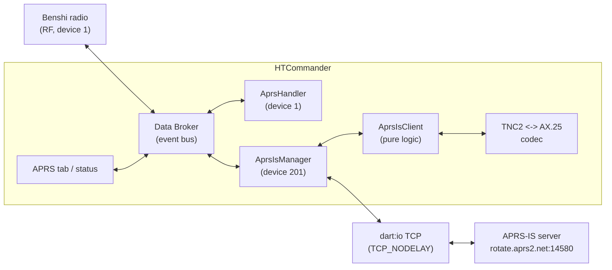
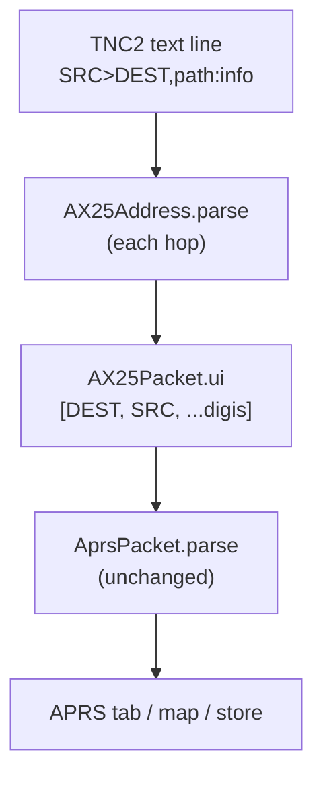
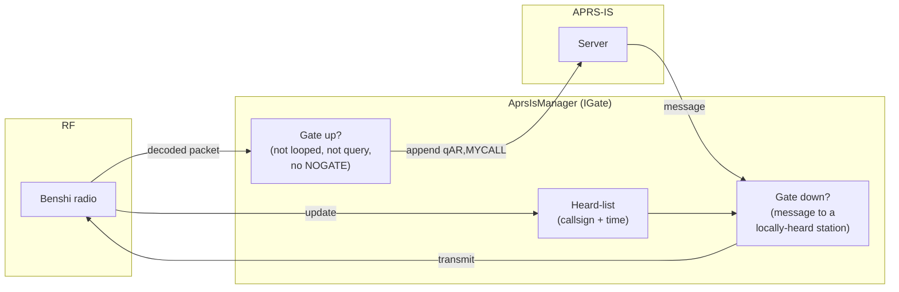

# Radio and Internet, Two Ways: Planning APRS-IS for HTCommander

*A design note — written before we cut the first line of code — on how
HTCommander will join **APRS-IS**, the global internet backbone that carries
APRS traffic between millions of stations. This post lays out what APRS-IS is,
how a client logs in and moves packets, what a full **IGate** actually has to do,
how it maps onto HTCommander's existing plumbing, and the one piece of glue we
have to build from scratch: turning the internet's plain-text packets into the
same AX.25 frames the app already understands.*

---

## What APRS-IS is, and why put it in a radio app

[APRS-IS](https://www.aprs-is.net/) (the APRS **I**nternet **S**ervice) is the
worldwide network of servers that ties the APRS world together over IP. Every
position beacon, weather report, telemetry frame, and text message that a
gateway hears on the air can be injected into APRS-IS, and from there it fans out
to every other connected client on the planet — the map on
[aprs.fi](https://aprs.fi), the app on someone's phone, a home weather dashboard,
or another gateway a thousand kilometres away. It is, in effect, the internet
side of APRS: a firehose of amateur telemetry you can both **drink from** and
**pour into**.

HTCommander already speaks APRS fluently on the RF side. It parses incoming
packets into structured positions, symbols, messages, telemetry, and weather;
it builds and sends messages with authentication; it knows callsigns, SSIDs, and
paths. What it *doesn't* do yet is reach the internet half of that world. Adding
APRS-IS turns the app from a station that only hears what's on 2 m into one that
can see the whole network — and, as a gateway, contribute what its radio hears
back to it.

Crucially, we already did the hardest research for free. APRS-IS logins require a
**passcode** computed from your callsign, and the algorithm that generates it is
deliberately *not* published on the APRS-IS site — you're supposed to email the
author for it. HTCommander already carries a working port of that algorithm
(`AprsUtil.aprsValidationCode`), left over from earlier APRS work. That removes
the one gatekept dependency that usually trips up new APRS-IS clients.

---

## The shape of it: another pseudo-radio

We're following a pattern the app already uses. When we added
[EchoLink](echolink-support.md), we didn't bolt it onto the physical radio stack —
we registered it as a **pseudo-radio** with its own numeric device ID (200) that
publishes state onto the app's internal event bus (the "Data Broker") without
touching Bluetooth or the transmit-lock arbitration. APRS-IS gets the same
treatment: a self-contained internet service on its **own device ID (201)**,
wired into the app through the Data Broker, with a clean web stub so browser
builds compile even though raw TCP sockets don't exist there.



The layering mirrors EchoLink almost one-for-one:

- **`AprsIsClient`** — pure, testable logic with no `dart:io` in sight: the login
  handshake, line framing, and the gating rules that decide what crosses between
  RF and the internet.
- **`AprsIsNetworkIo`** — the thin `dart:io` layer: open the TCP socket, turn off
  Nagle's algorithm (more on that below), stream lines in and out, and reconnect
  with backoff when the link drops.
- **`AprsIsManager`** — the bridge to the app: read settings, subscribe to RF
  packets to gate them upward, inject internet packets so they appear in the APRS
  tab, and ask the radio to transmit the messages we gate downward.
- **`tnc2_codec`** — the one genuinely new piece: translating between the
  internet's text format and the app's binary frames.

---

## Logging in: a single line of text

Connecting to APRS-IS is refreshingly old-school. You open a TCP socket to a
server — the community-recommended round-robin pool is `rotate.aprs2.net`, and
port **14580** is the user-defined *filter* port — and send a single login line:

```
user N0CALL-10 pass 12345 vers HTCommander 0.1.21 filter r/47.6/-122.3/50
```

That's the whole authentication handshake. The pieces:

- **`user N0CALL-10`** — your callsign and SSID.
- **`pass 12345`** — the passcode from `aprsValidationCode()`. The special value
  **`-1`** means *receive-only*: you can listen but never transmit. That's the
  perfect first-run mode for testing.
- **`vers HTCommander 0.1.21`** — software name and version, so sysops can see
  what's connecting.
- **`filter …`** — an optional server-side filter (here, everything within 50 km
  of a point). Since we chose a **user-configurable filter string**, this is
  whatever the operator types in settings.

The server answers with lines that start with `#` — a banner, a login
acknowledgement, and periodic keep-alives. Our line parser treats every
`#`-prefixed line as a comment and ignores it. Everything else is a **packet** in
TNC2 format, terminated by CR/LF, never longer than 512 bytes. One socket
convention matters for a two-way client: **turn off Nagle's algorithm**
(`TCP_NODELAY`), or the small message packets we send can get buffered and
delayed by seconds.

---

## The one thing we have to build: TNC2 ⟷ AX.25

Here's the impedance mismatch at the heart of the project. APRS-IS speaks
**TNC2**, a flat text line that looks like this:

```
N0CALL-9>APRS,WIDE1-1,WIDE2-1:!4737.14N/12220.09W>Testing
```

That reads as *source* `>` *destination* `,` *digipeater path* `:` *information
field*. HTCommander, on the other hand, works internally in **`AX25Packet`**
objects — the same structured frames it decodes off the air. Everything
downstream (the parser, the APRS tab, the packet store) expects that object, not
a string.

So the bridge is small but load-bearing. We confirmed the app stores addresses in
AX.25 wire order — `addresses[0]` is the destination, `addresses[1]` is the
source, and the rest are digipeaters — which lines up exactly with how TNC2
writes `SRC>DEST,digis`. The codec becomes almost mechanical:

- **Inbound** (internet → app): split the line on `>`, `,`, and `:`; parse each
  hop with `AX25Address.parse`; build `AX25Packet.ui([DEST, SRC, …digis], info)`;
  and hand it to the existing `AprsPacket.parse` — which now needs *zero* changes.
- **Outbound** (app → internet): reverse it —
  `addresses[1] > addresses[0] , digis : dataStr`.



Because the codec funnels internet packets into the *same* `AprsPacket` pipeline
the radio already feeds, an internet position beacon and an over-the-air one land
in the app looking identical — which is exactly what we want.

---

## Being a good IGate: the rules of the gate

We opted for a **full IGate** — a bidirectional gateway — rather than a
listen-only client. An IGate has two jobs, and the second one is where the etiquette
lives.

**RF → Internet (gating up).** When the radio hears a valid packet, we forward it
to APRS-IS. But not blindly — the community rules are specific:

- Only gate genuine UI frames (AX.25 control `0x03`, PID `0xF0`) that *didn't*
  originate on the internet in the first place, and that aren't generic queries
  (which could trigger a flood of responses).
- **Skip anything with `TCPIP`, `TCPXX`, `NOGATE`, or `RFONLY` in its path** —
  those markers mean "don't send me back to the internet," and honouring them is
  what prevents packets looping forever between RF and IP.
- Third-party packets (data type `}`) get special handling: if the third-party
  header already contains `TCPIP`/`TCPXX`, they came *from* the internet and must
  not go back; otherwise we strip the RF header and gate the inner packet.
- The one edit we're allowed to make is appending **`,qAR,MYCALL`** to the path.
  The `qAR` "q-construct" tells every downstream server *"this entered APRS-IS
  from RF via this gateway."* The data portion is never touched.

**Internet → RF (gating down).** This is where a careless gateway floods the local
frequency and makes enemies. The rule is restraint: only **message** packets, and
only when they're addressed to a station we've *actually heard on RF recently*
(the convention is within the last hour). To do that we keep a small
**heard-list** — callsign plus timestamp — updated every time the radio decodes a
packet. When a message for one of those stations arrives from the internet, we
gate it down and also forward that station's *next* position report so the
recipient has context. Generic queries never get gated to RF, and we keep the
transmit path to the minimum hops needed.



Being a full IGate means we need a **verified** login (a real passcode, not
`-1`), because only verified connections may inject packets. We'll ship
receive-only as the safe default and let the operator opt into gating once
they've entered a valid callsign and confirmed their coverage.

---

## Where it plugs into the app

Almost everything we need already exists:

- **Settings** live on the Data Broker's device-0 store (persisted via
  `SharedPreferences`), surfaced in the **Servers** tab of the settings dialog —
  right where EchoLink, Home Assistant, and AGWPE already sit. We'll add: enabled
  flag, server, port, filter string, a gate-to-RF toggle, and a read-only
  passcode field derived automatically from the callsign.
- **The APRS tab** needs no rework: injected internet packets ride the same
  `UniqueDataFrame` events the `AprsHandler` already consumes, so they show up in
  the message list and on the map with no new UI code. (An open question we'll
  settle during implementation: whether to visually distinguish internet-sourced
  packets from RF ones, or let them blend in.)
- **Registration** in `main.dart` uses the same conditional-import trick as
  EchoLink — the real `dart:io` manager on desktop and mobile, a no-op stub on
  web — so the browser build keeps compiling.

---

## What we'll test, and in what order

The plan has a deliberately gentle on-ramp:

1. **Receive-only first.** Connect to `rotate.aprs2.net:14580` with passcode
   `-1`, apply a local filter, and confirm internet packets appear in the APRS
   tab. This exercises the socket, the login, the line framing, and the TNC2
   codec end-to-end without transmitting a single byte.
2. **Send a message.** With a verified login, send a text message and watch it
   appear on [aprs.fi](https://aprs.fi). Now the outbound codec and the verified
   connection are proven.
3. **Gate up.** Confirm a packet the radio hears shows up on aprs.fi tagged
   `qAR,MYCALL`.
4. **Gate down.** Confirm a message from the internet, addressed to a station the
   radio just heard, gets transmitted on RF.

Unit tests cover the parts that don't need a radio at all: TNC2 round-tripping and
the login/gating decision logic in `AprsIsClient`, mirroring the existing EchoLink
tests.

---

## What we already know, and what's left to decide

The encouraging finding from this investigation is that **we don't need any more
documentation to start.** The protocol, the filter syntax, the IGate etiquette,
and the q-construct semantics are all published on
[aprs-is.net](https://www.aprs-is.net/), and the one normally-gatekept piece — the
passcode algorithm — is already in the codebase. The architecture is a known
quantity too, because EchoLink blazed the pseudo-radio trail we're following.

A few choices remain open, and they're the kind we'll firm up as the code takes
shape rather than up front: the exact default server, how strict the
"recently heard" window should be for down-gating, and whether internet packets
deserve their own visual treatment in the APRS tab. None of them block the first
receive-only milestone — which is exactly where we'll begin.

*Next post: the implementation itself, with the parts of the plan that survived
contact with a live server — and the parts that didn't.*
