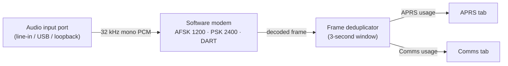

# Any Audio In Is a Radio: Audio Receive Devices in HTCommander

*How HTCommander turns any sound-card input on your computer into a data
receiver — point it at a line-in from a legacy radio or a clean Bluetooth audio
tap, tell it whether the traffic is APRS or Comms, pick a modem, and it decodes
AFSK 1200, PSK 2400, or DART straight off that wire. Optionally pair it to a
radio you already control, and the packets it pulls out are treated as if that
radio heard them — de-duplicated against the radio's own decode, for free.*

---

## The problem: the data is in the audio, but the app can't reach it

HTCommander is built around Benshi handhelds it drives over Bluetooth — control,
audio, and data all ride the same link. That's great when the radio in front of
you is one it knows how to talk to. But amateur radio is full of radios it
*doesn't*:

- An old mobile or base rig with nothing but a speaker jack and a mic input.
- A scanner or SDR feeding a fixed frequency into your sound card.
- Even a Benshi handheld whose **audio** you'd rather decode from a cleaner path
  than the compressed stream its own onboard modem works from.

In every one of these cases the useful thing — the AFSK, PSK, or DART data — is
sitting right there in an **audio signal**. All that's missing is a way to point
HTCommander's software modem at an ordinary computer audio input and let it
listen.

That's what an **Audio Receive Device** is.

## The idea: an input port with a modem bolted on

HTCommander already has a full software modem — the same DSP pipeline that
decodes DART, PSK 2400, and AFSK 1200 off the Bluetooth SBC audio stream. It
wants nothing more exotic than a run of 32 kHz, mono, 16-bit PCM samples. A
computer's microphone / line-in framework produces exactly that.

So an Audio Receive Device is a small piece of configuration that ties three
things together:

1. **An audio input port** — any capture device the operating system exposes
   (line-in, USB sound card, a virtual/loopback cable, a Bluetooth headset
   profile).
2. **A usage** — is this **APRS** traffic, or general **Comms** traffic?
3. **A modem** — for Comms, which demodulator to run: **AFSK 1200**, **PSK
   2400**, or **DART**. (APRS is always AFSK 1200, so there's nothing to pick.)

Capture the port, hand its samples to a modem instance, and route whatever
decodes into the same place the radio's packets already go.

It is deliberately **receive-only** for now. There are no controls to transmit,
no channels to program, no PTT. Because it has nothing to *drive*, an Audio
Receive Device never shows up as a switchable radio in the app — it's a quiet
background decoder, not another radio in the list.

## Setting one up

Audio Receive Devices are configured from their own dialog, opened from the
**Audio** menu. You can create as many as you like; each one is independent and
runs its own capture and its own modem, all at the same time.

For each device you choose:

- **Input port** — the sound-card input to listen on.
- **Usage** — **APRS** or **Comms**.
- **Modem** (Comms only) — AFSK 1200, PSK 2400, or DART, with FX.25 forward
  error correction on by default.
- **Pair to a radio** (optional) — more on that below.

One rule the dialog enforces: **the same input port can't be used twice.** Two
capture streams fighting over one device don't share nicely — on desktop they
tend to fail outright — so a port that's already assigned to another Audio
Receive Device, or to the microphone the Audio tab is using, is off-limits. The
dialog won't let you save a device that reuses a port.

## Giving it a name — and a channel

If a device is **not** paired to a radio, the dialog asks you to **name** it.
That name isn't just a label in a list: for a Comms device it becomes the
**received channel** shown against every message it decodes in the Comms tab. So
a device named `Shack Base` or `Loopback` shows up as exactly that next to the
traffic it pulled off the air, and you can tell at a glance which input a message
came in on when several are running.

## Pairing to a radio you already control

Here's where it gets interesting. Suppose you're already connected to a Benshi
handheld over Bluetooth, and you also run an **audio cable** from that radio's
speaker output into your computer's line-in. You can **pair** the Audio Receive
Device to that radio by picking it from a list of your connected radios.

When a device is paired:

- **Attribution follows the radio.** Anything the audio path decodes is treated
  as if it came from that radio — same identity, same place in the Comms and APRS
  history. (That's also why a paired device doesn't need its own name.)
- **It only listens while the radio is connected.** If the radio drops, the
  paired audio decoder goes quiet too, so you don't get phantom packets from a
  radio that isn't there. Reconnect, and it comes back on its own.

Why bother running a second decode of a radio you already hear? **Audio
quality.** The path a handheld's onboard modem works from is bandwidth-limited
and compressed; a direct audio tap — or a good Bluetooth audio profile — can be
cleaner. A cleaner signal decodes packets the radio's own modem drops. Pairing
lets you feed that better audio into HTCommander's more capable software modem
and pick up the difference, all still filed under the right radio.

## Two ears, one packet: deduplication

The moment you can decode the same signal twice — once by the radio, once off its
audio — you invite **duplicates**. HTCommander already solved this for its
[dual APRS modem](aprs-dual-modem.md), and Audio Receive Devices ride the same
machinery.

Every finished frame, no matter which source produced it, passes through a shared
**deduplicator**. It keys each frame by its raw bytes and drops any identical
frame it has already seen inside a short window — **three seconds**. Whichever
copy arrives first wins; the rest are silently discarded. So a packet heard by
both the radio's onboard modem and a paired Audio Receive Device shows up
**once**, and the second decoder only ever *adds* packets the first one missed —
never doubles them.

That's the whole payoff in one sentence: **you get the union of everything your
inputs can hear, with none of the duplicates.**

## What it is, and what it isn't (yet)

Audio Receive Devices are intentionally small and honest about their scope:

- **Receive-only.** No transmit, no controls, no channel programming.
- **Not a radio in the list.** Nothing to switch to; it decodes in the
  background.
- **Desktop and Android.** The software modem's audio path isn't available on
  the web or iOS builds, so neither are Audio Receive Devices there.
- **One port per device.** Distinct inputs, never shared with the Audio tab
  microphone.

The result is a surprisingly powerful little feature: any audio you can get into
your computer — from a decades-old rig on a cable, a scanner, an SDR, or a
cleaner tap on a radio you already own — becomes another data receiver, feeding
the same APRS and Comms pipelines you already use, and de-duplicated so it only
ever helps.
