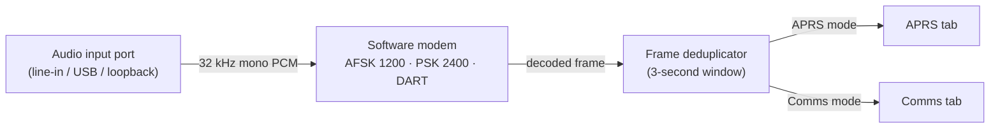
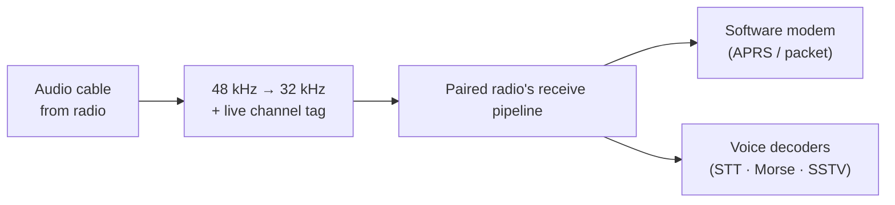

# Any Audio In Is a Radio: Audio Receive Devices in HTCommander

*How HTCommander turns any sound-card input on your computer into a data
receiver. Point it at a line-in from a legacy radio, a scanner, an SDR, or a
clean audio tap, choose one of three modes — **APRS**, **Comms**, or **Paired**
— and it decodes AFSK 1200, PSK 2400, or DART straight off that wire. A live
level meter helps you dial in the channel and gain. Pair it to a radio you
already control and it does something better still: it replays the audio through
that radio's **own** receive pipeline, so everything the radio can do — packet,
APRS, speech-to-text, Morse, SSTV — runs on the cleaner audio, filed under the
right radio and de-duplicated for free.*

---

## The problem: the data is in the audio, but the app can't reach it

HTCommander is built around Benshi handhelds it drives over Bluetooth — control,
audio, and data all ride the same link. That's great when the radio in front of
you is one it knows how to talk to. But amateur radio is full of radios it
*doesn't*:

- An old mobile or base rig with nothing but a speaker jack and a mic input.
- A scanner or SDR feeding a fixed frequency into your sound card.
- Even a Benshi handheld whose **audio** you'd rather decode from a cleaner path
  than the compressed stream its own onboard modem works from.

In every one of these cases the useful thing — the AFSK, PSK, or DART data — is
sitting right there in an **audio signal**. All that's missing is a way to point
HTCommander's software modem at an ordinary computer audio input and let it
listen.

That's what an **Audio Receive Device** is.

## The idea: an input port with a modem bolted on

HTCommander already has a full software modem — the same DSP pipeline that
decodes DART, PSK 2400, and AFSK 1200 off the Bluetooth SBC audio stream. It
wants nothing more exotic than a run of 32 kHz, mono, 16-bit PCM samples. A
computer's microphone / line-in framework produces exactly that.

So an Audio Receive Device ties an audio input port to one of three **modes**:

1. **APRS** — decode the input as APRS (always AFSK 1200) and file every packet
   on the `APRS` channel.
2. **Comms** — decode general packet with a modem you choose (**AFSK 1200**,
   **PSK 2400**, or **DART**), filed on a channel you name.
3. **Paired** — attach the input to a radio you already control and let *that
   radio's* configuration decide everything: which modem, which channel, and
   even its voice decoders (more on that below).

For APRS and Comms, the recipe is simple: capture the port, hand its samples to a
modem instance, and route whatever decodes into the same place the radio's
packets already go.

It is deliberately **receive-only** for now. There are no controls to transmit,
no channels to program, no PTT. Because it has nothing to *drive*, an Audio
Receive Device never shows up as a switchable radio in the app — it's a quiet
background decoder, not another radio in the list.

## Setting one up

Audio Receive Devices are configured from their own dialog, opened from the
**Audio** menu. You can create as many as you like; each one is independent and
runs its own capture and its own modem, all at the same time.

For each device you choose:

- **Input port** — the sound-card input to listen on.
- **Audio channel** — for a stereo cable, which side carries the radio audio:
  **Auto** (loudest channel), **Left**, **Right**, or **Mix** (average both).
  Stereo TNC cables often put the receive audio on one channel only, so **Auto**
  is the sensible default.
- **Input gain** — a clean digital boost (0 to +24 dB) for a quiet line-in that
  has no analog gain of its own.
- **Mode** — **APRS**, **Comms**, or **Paired**.
- **Modem** (Comms only) — AFSK 1200, PSK 2400, or DART, with FX.25 forward
  error correction on by default.
- **Channel name** (Comms only) — see below.
- **Paired radio** (Paired only) — which connected radio to attach to.

One rule the dialog enforces: **the same input port can't be used twice.** Two
capture streams fighting over one device don't share nicely — on desktop they
tend to fail outright — so a port that's already assigned to another Audio
Receive Device, or to the microphone the Audio tab is using, is off-limits. The
dialog won't let you save a device that reuses a port.

## Giving a Comms device its channel name

A **Comms** device asks you for a **channel name**. That name isn't just a label
in a list: it becomes the **received channel** shown against every message the
device decodes in the Comms tab. So a device named `Shack Base` or `Loopback`
shows up as exactly that next to the traffic it pulled off the air, and you can
tell at a glance which input a message came in on when several are running.
(APRS devices always file on the `APRS` channel; Paired devices inherit the
radio's channel, so neither needs a name.)

## Seeing the level: the input meter

Getting clean data off an audio cable lives or dies on **level**. Too quiet and
the modem starves; too loud and the signal clips and smears — and a clipped
packet is a lost packet. So while you set a device up, the editor shows a live
**input-level meter** driven by the audio actually arriving on the port, with the
**channel** and **gain** you've chosen already applied.

The meter has green, amber, and **red** zones. Speech or a data burst should push
the bar up into green and amber; if it slams into the **red**, the input is too
hot — turn the device's own volume down, drop the input gain, or pick a different
channel until the loud parts stay out of the red. It's the quickest way to set a
cable up correctly without guessing.

The meter opens a temporary recorder on the selected port, and two recorders on
one device don't coexist — so it only appears when it can run **safely**. If the
port is already in use by another device or the Audio tab, is already being
captured, or isn't currently connected, the meter simply isn't shown.

## Paired mode: borrow the radio's whole pipeline

Here's where it gets interesting. Suppose you're already connected to a Benshi
handheld over Bluetooth, and you also run an **audio cable** from that radio's
speaker or data output into your computer's line-in. Put the device in **Paired**
mode and pick that radio from the list of your connected radios.

A paired device doesn't ask you to choose a modem at all. Instead it **replays
the captured audio as if it were the radio's own receive audio**, and hands it to
that radio's *entire* receive pipeline. Two things fall out of that for free:

- **Everything the radio can do runs on the audio.** Not just packet — the same
  path that decodes AFSK/PSK/DART data *and* the voice-side decoders:
  **speech-to-text**, **Morse (CW)**, **SSTV**, and the rest. Whatever the radio
  is configured to decode, it now decodes off the cleaner cable audio.
- **Attribution follows the radio's current channel.** A decoded frame is filed
  under whatever channel the radio is tuned to **at that moment** — its real
  channel id *and* name. Spin the radio to channel 15 and packets show up on
  channel 15; move to the `APRS` channel and they're treated as APRS.

That last point also settles the APRS question automatically. Because the audio
is tagged with the radio's live channel, when the radio sits on its `APRS`
channel the software modem routes it to the APRS decoder and the voice decoders
step aside — exactly as if the radio had heard it directly. No separate APRS
switch to remember.

Two details make this behave:

- **It only runs while the radio's Bluetooth audio path is off.** If the radio is
  already streaming its own audio over Bluetooth, it's already decoding it —
  replaying the cable on top would just double everything. So a paired device
  stays silent whenever the radio's audio path is on, and wakes up when it's off.
  It also only runs while the radio is **connected**; drop the radio and the
  paired decoder goes quiet, reconnect and it returns on its own.
- **The sample rates are reconciled.** Sound cards capture at 48 kHz; the radio
  pipeline runs at 32 kHz, so the audio is resampled on the way in.

Why bother? **Audio quality.** The path a handheld's onboard modem works from is
bandwidth-limited and compressed; a direct audio tap can be cleaner, and a
cleaner signal decodes packets — and words, and images — the radio's own modem
drops.

### The signal meter comes along too

Because a paired device is standing in for the radio's audio, HTCommander also
lets it stand in for the radio's **signal meter**. While the audio path is
active, the RSSI bar on the radio panel (and in the status bar) is driven by the
**amplitude of the incoming audio** instead of the radio's reported RSSI — rising
green as audio arrives, the same way EchoLink and AllStarLink already light that
bar. It's immediate confirmation that the cable is alive and carrying signal.

## Two ears, one packet: deduplication

The moment you can decode the same signal twice — once by the radio, once off its
audio — you invite **duplicates**. HTCommander already solved this for its
[dual APRS modem](aprs-dual-modem.md), and Audio Receive Devices ride the same
machinery.

Every finished frame, no matter which source produced it, passes through a shared
**deduplicator**. It keys each frame by its raw bytes and drops any identical
frame it has already seen inside a short window — **three seconds**. Whichever
copy arrives first wins; the rest are silently discarded. So a packet heard by
both the radio's onboard modem and a paired Audio Receive Device shows up
**once**, and the second decoder only ever *adds* packets the first one missed —
never doubles them.

That's the whole payoff in one sentence: **you get the union of everything your
inputs can hear, with none of the duplicates.**

## What it is, and what it isn't (yet)

Audio Receive Devices are intentionally small and honest about their scope:

- **Receive-only.** No transmit, no controls, no channel programming.
- **Not a radio in the list.** Nothing to switch to; it decodes in the
  background.
- **Desktop and Android.** The software modem's audio path isn't available on
  the web or iOS builds, so neither are Audio Receive Devices there.
- **One port per device.** Distinct inputs, never shared with the Audio tab
  microphone.
- **Paired mode complements the radio, it doesn't fight it.** It only runs while
  the radio's own Bluetooth audio path is off, so the two never decode the same
  stream at once.

The result is a surprisingly powerful little feature: any audio you can get into
your computer — from a decades-old rig on a cable, a scanner, an SDR, or a
cleaner tap on a radio you already own — becomes another data receiver. In APRS
and Comms modes it feeds the same pipelines you already use; in Paired mode it
lends the radio a cleaner set of ears for everything it decodes, from packet to
speech to pictures — all de-duplicated so it only ever helps.
