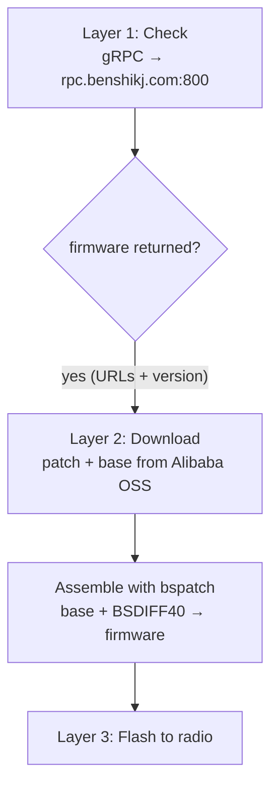

# Where Does the Firmware Come From? Inside the Benshi Update Server

*A companion to [How a Benshi Radio Updates Its Firmware, Step by Step](benshi-firmware-update.md).
That post followed the bytes into the radio over Bluetooth. This one looks the
other direction — up at the cloud — and documents exactly how the online update
service works: the call that returns the latest firmware, the wire format, and
how the pieces fit together.*

---

## The three layers, and which one this is about

A full update has three layers:

1. **Check** — ask a server "is there newer firmware?"
2. **Download + assemble** — fetch it and reconstruct the image.
3. **Flash** — stream it into the radio (covered in the [companion post](benshi-firmware-update.md)).

This post is about **layers 1 and 2** — everything that happens on the network
before a single byte reaches the radio.



---

## Layer 1: the check — the method that actually works

The update check is a single **gRPC-over-TLS** call. The important lesson here is
*which method you call.*

There is an **older** method, `/benshikj.APP/CheckUpdate`, that takes a model
string plus a `V0.0.0` version. The current backend **no longer honors it** — it
always replies `haveUpdate=false` (a zero-byte proto3 response), regardless of
the model, version, or device serial you send. Chasing that method is a dead end.

The **working** method is `/benshikj.DeviceManagement/CheckFirmwareUpdate`. It
keys off a numeric **product ID**, not a model string or serial, and returns the
latest firmware URLs when you ask for version `0`.

- **Endpoint:** `rpc.benshikj.com:800` — TLS, but on port **800**, not 443.
- **Method:** `/benshikj.DeviceManagement/CheckFirmwareUpdate`.

### The request

`CheckFirmwareUpdateRequest` is a proto3 message:

| Field # | Name | Type | Notes |
| --- | --- | --- | --- |
| 1 | `productId` | int32 | The radio's numeric product ID |
| 2 | `firmwareVersion` | int32 | Send `0` to get the latest |
| 3 | `beta` | bool | Opt into beta builds |
| 4 | `userId` | int64 | Optional |
| 5 | `inviteCode` | int32 | Optional |

To get the latest firmware you only need to send **`productId`** and
**`firmwareVersion = 0`**. Because this is proto3, any field left at its default
value (`0` / `false`) is **omitted from the wire entirely**, so a minimal request
is just `productId` (with `firmwareVersion = 0`, even that field is elided).

### The response

`CheckFirmwareUpdateResult` carries two firmware descriptors:

| Field # | Name | Type |
| --- | --- | --- |
| 1 | `firmware` | `FirmwareInfo` (the patch) |
| 2 | `base` | `FirmwareInfo` (the shared base) |

Each `FirmwareInfo` is:

| Field # | Name | Type | Example |
| --- | --- | --- | --- |
| 1 | `version` | int | `147` |
| 2 | `url` | string | OSS patch/base URL |
| 3 | `md5` | string | checksum |
| 4 | `releaseNotes` | string | |
| 5 | `releaseDate` | string | |

Decoding the reply is the same wire format in reverse — walk the fields:
`version` is a varint int (e.g. `147`), and `url`/`md5` are length-delimited
strings.

---

## Where the product ID comes from

The old method used a hardcoded model string (`"VR_N7600"`). The new method
doesn't use a model string at all — it keys on the numeric **`productId`**, which
you read **from the radio** via `GET_DEV_INFO` (`DevInfo.product_id`, a 16-bit
int). So it's pulled live from the connected radio, not baked into the code.

> **Don't assume a fixed value.** The example below was verified with
> `productId = 259`, but you should read *your* radio's product ID from
> `GET_DEV_INFO` rather than hardcoding one.

### What about the device serial (DID)?

The old request also carried a `did` — the factory serial from the radio's
Status-menu S/N field. That serial is **not** returned by `GET_DEV_INFO`, so
there was no clean way to read it over the air. The good news: the new
`CheckFirmwareUpdate` method **has no DID field at all**. You can drop the whole
serial puzzle — the server returns the latest URLs keyed purely on `productId`.

---

## Encoding the request in C# — raw proto3, no generated stubs

Because the message is so small, HTCommander hand-rolls the protobuf wire format
instead of pulling in a code generator. Every field is either a varint
(wire-type 0) or a length-delimited string (wire-type 2), encoded as
`tag · value` or `tag · length · bytes`.

```csharp
using System.IO;
using System.Text;
using Grpc.Core;
using Grpc.Net.Client;

static void WriteVarint(Stream s, ulong v) {
    do {
        byte b = (byte)(v & 0x7F);
        v >>= 7;
        if (v != 0) b |= 0x80;
        s.WriteByte(b);
    } while (v != 0);
}

// wire-type-0 (varint) field
static void WriteVarintField(Stream s, int fieldNum, ulong value) {
    WriteVarint(s, ((ulong)fieldNum << 3) | 0);
    WriteVarint(s, value);
}

// wire-type-2 (length-delimited) field — for string fields
static void WriteStringField(Stream s, int fieldNum, string value) {
    var b = Encoding.UTF8.GetBytes(value);
    WriteVarint(s, ((ulong)fieldNum << 3) | 2);
    WriteVarint(s, (ulong)b.Length);
    s.Write(b, 0, b.Length);
}

// CheckFirmwareUpdateRequest { productId=1, firmwareVersion=2, beta=3, userId=4, inviteCode=5 }
static byte[] EncodeCheckFirmwareUpdateRequest(
        int productId, int firmwareVersion = 0, bool beta = false,
        long userId = 0, int inviteCode = 0) {
    using var ms = new MemoryStream();
    if (productId != 0) WriteVarintField(ms, 1, (ulong)productId);
    if (firmwareVersion != 0) WriteVarintField(ms, 2, (ulong)firmwareVersion);
    if (beta) WriteVarintField(ms, 3, 1);
    if (userId != 0) WriteVarintField(ms, 4, (ulong)userId);
    if (inviteCode != 0) WriteVarintField(ms, 5, (ulong)inviteCode);
    return ms.ToArray();
}

// Send raw bytes over gRPC with a pass-through marshaller
static async Task<byte[]> CheckFirmwareUpdate(int productId) {
    var pass = Marshallers.Create<byte[]>(b => b, b => b);
    var method = new Method<byte[], byte[]>(
        MethodType.Unary, "benshikj.DeviceManagement", "CheckFirmwareUpdate", pass, pass);
    using var channel = GrpcChannel.ForAddress("https://rpc.benshikj.com:800");
    byte[] req = EncodeCheckFirmwareUpdateRequest(productId, firmwareVersion: 0);
    var call = channel.CreateCallInvoker().AsyncUnaryCall(method, null, new CallOptions(), req);
    return await call.ResponseAsync;
}
```

The pass-through marshaller lets us push raw bytes through gRPC without any
generated message classes — we own both the encoding and the decoding.

---

## Layer 2: download + assemble

Once the check hands back URLs, the rest of the pipeline is straightforward:

- The response carries **two** `FirmwareInfo` entries pointing at Alibaba Cloud
  OSS: a **patch** (`firmware`) and a **base** (`base`).
- The download is a **binary diff**, not a whole image:
  - **base** — a large, *shared* blob (`upgrade_base_v1.bin.zip`), the same
    across many firmware releases.
  - **patch** — a small `BSDIFF40` diff (e.g. `patch_base_to_vr_n76.bin`).
- The client unzips the base, then applies the patch with **bspatch** to
  reconstruct the real firmware image. (HTCommander implements `BSDIFF40` in
  pure Dart, decompressing the three bzip2 streams and running the classic
  patch loop.)

Rough sizes for a typical release:

- Patch: ~87 KB
- Base zip: ~659 KB
- Reassembled into a complete, flashable firmware image whose MD5 matches the
  value the server returns in the `FirmwareInfo.md5` field.

---

## Confirming it works

This isn't theory — it was verified live against the production server:

- Sent `productId = 259`, `firmwareVersion = 0`.
- Server returned `version = 147`, plus the **patch** and **base** OSS URLs.
- The two blobs `bsdiff4`-assemble into a valid, flashable firmware image.

That closes the loop end to end: query by product ID, get the newest version and
its URLs, download, reassemble, and flash.

---

## Takeaways

1. **Call the right method.** `/benshikj.DeviceManagement/CheckFirmwareUpdate`
   works; the legacy `/benshikj.APP/CheckUpdate` always returns "no update" on
   the current backend.
2. **Key off `productId`, not a model string or serial.** Read it live from the
   radio via `GET_DEV_INFO` (`DevInfo.product_id`) — don't hardcode it.
3. **Ask for version `0`** to get the latest firmware; proto3 omits zero/false
   fields, so the request is tiny.
4. **No DID required.** The new method has no serial field — the whole "device
   serial" puzzle from the old API is gone.
5. **Download and assembly are a shared base plus a tiny `BSDIFF40` patch**,
   reconstructed in pure Dart, with the server-supplied MD5 to verify the result.
