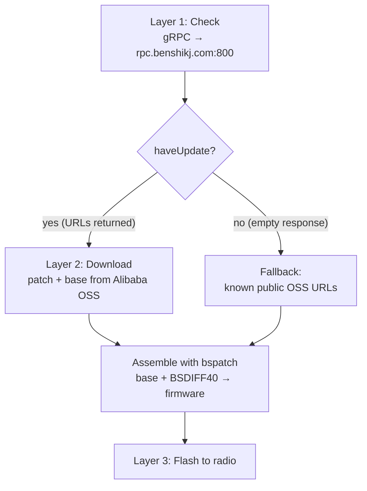

# Where Does the Firmware Come From? Inside the Benshi Update Server

*A companion to [How a Benshi Radio Updates Its Firmware, Step by Step](benshi-firmware-update.md).
That post followed the bytes into the radio over Bluetooth. This one looks the
other direction — up at the cloud — and is as much a **field report** as a
walkthrough: here's exactly how the online update service works, what we proved,
and the wall we hit that we still can't get past.*

---

## The three layers, and which one this is about

A full update has three layers:

1. **Check** — ask a server "is there newer firmware?"
2. **Download + assemble** — fetch it and reconstruct the image.
3. **Flash** — stream it into the radio (covered in the [companion post](benshi-firmware-update.md)).

This post is about **layers 1 and 2** — everything that happens on the network
before a single byte reaches the radio.



---

## Layer 1: the check — what we know

The update check is a single **gRPC-over-TLS** call. Everything about it is now
confirmed:

- **Endpoint:** `rpc.benshikj.com:800` — TLS, but on port **800**, not 443.
- **Method:** `/benshikj.APP/CheckUpdate`.
- **Request:** a protobuf message with three string fields:

  | Field # | Name | Example |
  | --- | --- | --- |
  | 1 | `did` (device serial) | `""` (empty) |
  | 2 | `firmwareVersion` | `V0.0.0` |
  | 3 | `model` | `VR_N7600` |

Because the message is so simple, HTCommander hand-rolls the protobuf wire
format instead of pulling in a code generator — three length-delimited string
fields, each encoded as `tag · length · bytes`. For the request HTCommander
sends by default, the bytes on the wire are:

```
0a00 1206 56302e302e30 1a08 56525f4e37363030
└─┬┘ └────────┬──────┘ └────────┬─────────┘
 did=""    version="V0.0.0"   model="VR_N7600"
```

We verified this encoding is correct by reproducing it with the reference
`benlink` Python client (grpcio) — it produces **byte-identical** request bytes.
So there is no doubt the request is well-formed and reaches the server.

**The response** is where it gets interesting.

---

## The wall: the server answers "nothing"

Here's the actual log from HTCommander asking for an update:

```
[Firmware] Firmware check request -> rpc.benshikj.com:800/benshikj.APP/CheckUpdate
           model="VR_N7600" version="V0.0.0" did="(empty)"
[Firmware] Firmware check response (0 bytes): (empty)
```

A **zero-byte response**. And here's the subtle part: that is *not* an error.

In proto3, fields set to their default value — `false`, `0`, empty string —
are **omitted from the wire entirely**. So a response of `haveUpdate=false` with
no URLs serializes to… nothing. Zero bytes. The server successfully received our
request, processed it, and replied "**no update**" in the most compact way
possible.

We didn't just take one data point. We drove the reference Python client against
the live server with a spread of inputs:

| did | version | model | response |
| --- | --- | --- | --- |
| `""` | `V0.0.0` | `VR_N7600` | 0 bytes |
| `""` | `V0.9.2-7` | `VR_N7600` | 0 bytes |
| `""` | `V0.0.0` | `VR_N76` | 0 bytes |
| `""` | `V0.0.0` | `UV-PRO` | 0 bytes |
| `"test"` | `V0.0.0` | `VR_N7600` | 0 bytes |

**Every single one came back empty.** Different versions, different model
strings, a dummy serial — the server reports no update for all of them.

This directly contradicts a comment in the reference code claiming that
`V0.0.0` "triggers an update response." It doesn't. And tellingly, the
reference's *own* test script already worked around this: when the check returns
nothing, it falls back to hardcoded URLs with the note *"expected if the DID is
unrecognised by the server."*

---

## Layer 2: download + assemble — what we know

When the server *does* hand back URLs (or when we use the known ones), the rest
of the pipeline is fully understood and working:

- The server returns **two** URLs on Alibaba Cloud OSS: a **patch** and a
  **base**.
- The download is a **binary diff**, not a whole image:
  - **base** — a large, *shared* blob (`upgrade_base_v1.bin.zip`), the same
    across many firmware releases.
  - **patch** — a small `BSDIFF40` diff (`patch_base_to_vr_n76.bin`).
- The client unzips the base, then applies the patch with **bspatch** to
  reconstruct the real firmware image. (HTCommander implements `BSDIFF40` in
  pure Dart, decompressing the three bzip2 streams and running the classic
  patch loop.)

We confirmed the known public URLs are live and the math works end to end:

- Patch: ~87 KB
- Base zip: ~659 KB
- Reassembled into a complete, flashable firmware image whose MD5 matches the
  reference's known-good value.

So **layer 2 is not the problem.** Given URLs, we can fetch and rebuild firmware
reliably. The only question is how to *legitimately* get those URLs from the
server for *your* radio and *your* current version.

---

## The DID mystery — what we don't know

The one field that plausibly unlocks a real server response is `did`, the
device serial. The reference describes it as "the factory device ID from the
radio's Status menu (S/N field)." We don't have that string programmatically, so
we went looking.

The radio exposes a `GET_DEV_ID` command. We called it and logged the reply:

```
GET_DEV_ID reply:
  00 02 | 80 01 | 00 | 7D 8B FC 2C … AD 9A   (64 bytes)
  group   cmd+rep status  └── opaque token ──┘
```

That 64-byte payload is high-entropy and non-ASCII — almost certainly an
**encrypted or opaque identity token**, not a human-readable serial. It's very
likely tied to the unimplemented `DEV_REGISTRATION` (extended command 1825)
authentication handshake. We tried sending it to the server as the `did`, both
**hex-encoded** and **base64-encoded** — the server still returned zero bytes.

So here is the honest ledger:

**What we know**
- The exact gRPC endpoint, method, request schema, and wire encoding.
- Our request is byte-for-byte correct (verified against the reference client).
- A 0-byte response is a valid "no update," not a bug.
- The server returns nothing for empty, dummy, and token-based `did` values, and
  for every model/version combination we tried.
- Given URLs, download + `BSDIFF40` assembly works perfectly.
- `GET_DEV_ID` returns a stable-looking 64-byte opaque token that is **not** the
  plaintext serial and is **not** accepted as the `did` (in hex or base64).

**What we don't know**
- What value the server actually wants in `did` to return an update. The most
  likely answer is the **human-readable S/N** printed in the radio's Status
  menu — which no known tool reads over the air; the reference expects you to
  type it in.
- Whether the 64-byte `GET_DEV_ID` token must first be **decrypted** (with a key
  hidden in the official app) or **registered** via `DEV_REGISTRATION` before
  the server recognizes the device.
- Whether the server needs an exact version string format (e.g. the `-7` build
  suffix) *combined with* a valid serial to report an update.
- Whether the check is gated on something else entirely — an app token, a signed
  request, an account.

The place those answers live is almost certainly **inside the official app**:
decompiling it and finding where the `did` field gets populated (and whether any
`Cipher`/`Base64` calls sit between `GET_DEV_ID` and the network request) would
settle it. Capturing the official app's real request with a btsnoop HCI log plus
an HTTPS proxy would settle it even faster.

---

## The pragmatic answer: skip the check

Here's the good news, and it's the same conclusion the reference reached: **you
don't actually need the server.** The firmware images live at stable, public OSS
URLs that require no serial, no token, and no gRPC call:

```
https://pubdatas.oss-cn-shenzhen.aliyuncs.com/firmware/v147/patch_base_to_vr_n76.bin
https://pubdatas.oss-cn-shenzhen.aliyuncs.com/upgrade_base_v1.bin.zip
```

HTCommander ships these as a **"Download Latest"** fallback. When the server
says nothing, you can still fetch the known-latest patch, reassemble it locally,
compare it against your current version, and flash it. This is *more* private
than the serial-based path, too — it contacts only the public file host and
sends nothing identifying.

The trade-off is that a fixed URL is a snapshot in time: it points at whatever
version was last confirmed (currently `v147`), and bumping it is a code change
rather than an automatic discovery. Until the `did` puzzle is solved, that's the
honest state of things — **we can build and flash firmware; we just can't yet
ask the server what's newest.**

---

## Takeaways

1. **The check is fully mapped** — endpoint, method, schema, and encoding are all
   confirmed correct.
2. **The server withholds updates without a valid `did`**, and we haven't cracked
   what a valid `did` is. The 64-byte `GET_DEV_ID` token isn't it.
3. **Download and assembly are solved** — a shared base plus a tiny `BSDIFF40`
   patch, reconstructed in pure Dart.
4. **The public OSS URLs make the feature usable today**, cloud check or not.

If you know how the official app fills in that `did` field, that's the missing
piece — and it would turn "download the version we hardcoded" into "ask the
server what's newest" for everyone.
