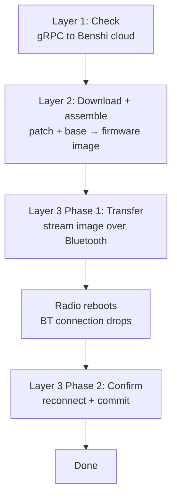
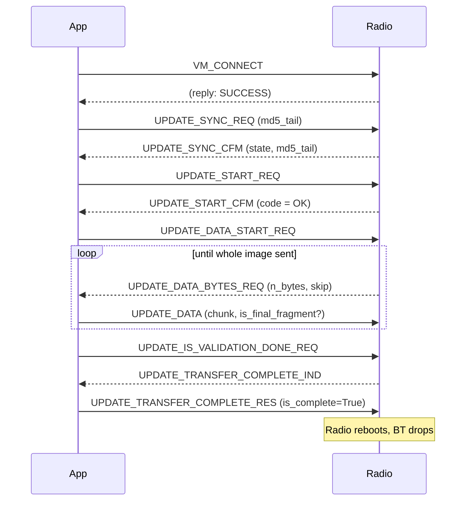
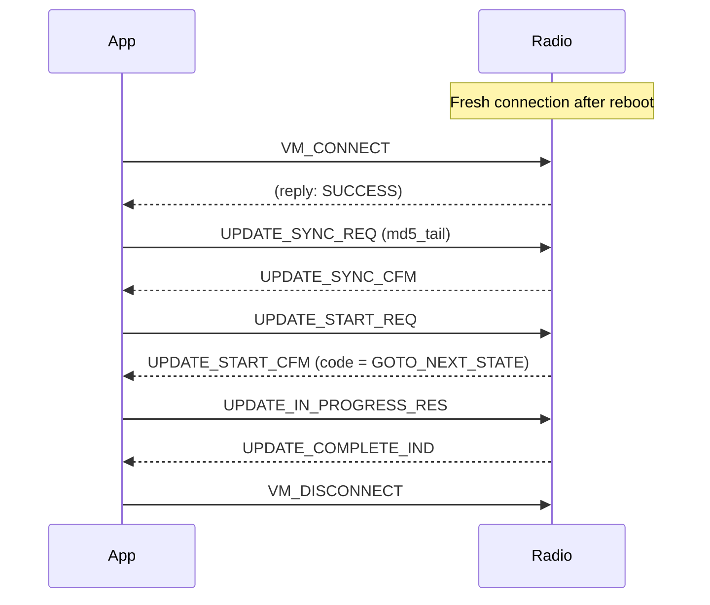

# How a Benshi Radio Updates Its Firmware, Step by Step

*A walk through the firmware-update path that the `benlink-firmware-update`
fork adds on top of stock `benlink` — from asking a cloud server "is there an
update?" all the way down to the byte-by-byte handshake that streams a new image
into the radio over Bluetooth.*


## The 30,000-foot view

A full update happens in three layers, and the third layer is itself split into
two phases separated by a **radio reboot**:



Let's take them one at a time.

---

## Layer 1 — Asking the cloud "is there an update?"

The radio doesn't know whether newer firmware exists. A server does. The check is
a single **gRPC-over-TLS** call:

- **Host:** `rpc.benshikj.com:800` (note: TLS on port **800**, not 443)
- **Service / method:** `benshikj.APP` / `CheckUpdate`
- **Request fields:** the device's factory ID (`did`, the serial number from the
  radio's Status menu), the current `firmwareVersion` string (e.g. `V0.9.2-7`),
  and a hard-coded `model` (`VR_N7600`).

A neat implementation detail: rather than depend on `grpcio-tools`/`protoc`, the
fork hand-rolls a tiny protobuf wire encoder/decoder (`_varint`,
`_encode_string_field`, `_decode_proto_fields`). It only needs to write three
string fields and read a couple back, so a full protobuf toolchain would be
overkill.

The server answers with two things:

1. A boolean **`haveUpdate`**.
2. Two download URLs on Alibaba Cloud OSS — a **patch** URL and a **base** URL.

```python
from benlink.firmware import check_update

info = check_update(did="", fw_version="V0.0.0")
# info.patch_url, info.base_url
```

A couple of observations baked into the code and its comments:

- Passing `fw_version="V0.0.0"` always makes the server think you're out of date,
  which is a handy way to *force* an update response for testing.
- The server returns URLs even when it doesn't recognize your `did`. It only says
  `haveUpdate=False` when the model+version combination genuinely has nothing
  newer.

---

## Layer 2 — Download and assemble the image

Here's the clever bit: the radio doesn't download a complete firmware image.
Instead it downloads:

- a **base image** — a large, *shared* blob (`upgrade_base_v{N}.bin.zip`) that is
  the same across many firmware releases, and
- a small **binary patch** (`patch_base_to_vr_n76.bin`).

The patch is a standard `BSDIFF40` diff. The client extracts the `.bin` from the
base zip and applies the patch with `bsdiff4` to reconstruct the *actual* target
firmware:

```
base image  +  BSDIFF40 patch   ──►   assembled firmware image
(shared, large)  (tiny, per-release)
```

Because the base is shared, each new firmware release only ships a small patch —
much less bandwidth than a fresh multi-megabyte image every time. The code
verifies the patch really starts with the `BSDIFF40` magic before applying it, so
a truncated or wrong download fails loudly instead of bricking a radio.

The result is wrapped in a `FirmwareBundle`, which also computes the image's MD5.
One field matters a lot in Layer 3:

```python
@property
def md5_tail(self) -> bytes:
    """Last 4 bytes of md5 digest — used in UPDATE_SYNC_REQ."""
    return bytes.fromhex(self.base_md5)[-4:]
```

Those **last 4 bytes of the MD5** become the radio's fingerprint for "the image
we are updating to." The radio echoes them back and uses them to detect a
resumed-vs-mismatched update.

`fetch_firmware()` bundles Layers 1 and 2 into one call:

```python
bundle = fetch_firmware(fw_version="V0.9.2-7")
if bundle:
    print(f"Update available: {bundle.size} bytes, md5={bundle.md5}")
```

---

## Layer 3 — Flashing over Bluetooth

Now the interesting part. The assembled image is delivered to the radio over the
**same RFCOMM command channel** that normal radio control uses — there's no
separate socket. The app *sends* `VM_CONNECT` / `VM_CONTROL` / `VM_DISCONNECT`
extended commands, and the radio *replies* asynchronously by wrapping its answers
inside `BT_EVENT_NOTIFICATION` events of type **`VMU_PACKET`**.

So there are two message directions with two different shapes:

- **App → radio:** `VM_CONTROL` messages, tagged by a `VmControlType`
  (e.g. `UPDATE_SYNC_REQ`, `UPDATE_DATA`).
- **Radio → app:** `VMU_PACKET` notifications, tagged by a `VmuPacketType`
  (e.g. `UPDATE_SYNC_CFM`, `UPDATE_DATA_BYTES_REQ`).

Each carries a small header — an 8-bit type, a 16-bit payload length, then the
body — defined in `vm.py`.

The whole exchange is a two-phase state machine with a reboot in the middle.

### Phase 1 — Transfer



Step by step:

1. **`VM_CONNECT`** — open a VM update session on the command channel. Wait for
   the `is_reply=True` acknowledgement.

2. **`UPDATE_SYNC_REQ` → `UPDATE_SYNC_CFM`** — the app sends the 4-byte
   `md5_tail`. The radio replies with its current `update_state` and echoes the
   tail. This is how the radio decides whether this is a brand-new update, a
   resume of the same image, or a mismatch. (A wrong image surfaces later as the
   `SYNC_IS_DIFFERENT` error, code 129.)

3. **`UPDATE_START_REQ` → `UPDATE_START_CFM`** — the reply carries a `cfm_code`:
   - **`OK` (0)** — proceed with a fresh transfer.
   - **`GOTO_NEXT_STATE` (9)** — the radio has *already* received this image and
     is waiting to be confirmed. During Phase 1 this is an error ("power-cycle and
     retry"); during Phase 2 it's exactly what we want to see (more below).

4. **`UPDATE_DATA_START_REQ`** — tell the radio to enter the data-transfer state.
   There's no direct reply; instead the radio starts *pulling* data.

5. **The device-driven chunk loop** — this is the heart of the transfer, and the
   design is worth pausing on. The app does **not** blast the image at the radio.
   Instead the radio sends an **`UPDATE_DATA_BYTES_REQ`** each time it's ready,
   saying "give me `n_bytes_requested` bytes, skipping `n_bytes_skip`." The app
   answers with a single **`UPDATE_DATA`** carrying exactly that many bytes:

   ```python
   req = await self._wait_vmu(VmuPacketType.UPDATE_DATA_BYTES_REQ)
   n    = req.n_bytes_requested      # device chooses the chunk size (≤ 250)
   skip = req.n_bytes_skip           # non-zero only when resuming
   chunk = fw[offset : offset + n]
   is_last = (offset + len(chunk) >= total)
   await self._send(UPDATE_DATA(is_final_fragment=is_last, data=chunk))
   ```

   This pull model is flow control: the radio requests the next slice only when
   it has finished writing the previous one into its serial flash (SQIF). The
   chunk size is **device-driven** (commonly 145 bytes, capped at 250) rather than
   hard-coded, and `n_bytes_skip` allows a mid-transfer **resume** — the app just
   advances its offset by the skip the radio asks for. The very last chunk sets
   `is_final_fragment=True`.

6. **`UPDATE_IS_VALIDATION_DONE_REQ` → `UPDATE_TRANSFER_COMPLETE_IND`** — once
   every byte is delivered, the app asks the radio to validate. The radio checks
   the image (CRC/MD5) and, when it passes, sends `UPDATE_TRANSFER_COMPLETE_IND`.
   Validation can take a while, so this step gets a generous timeout.

7. **`UPDATE_TRANSFER_COMPLETE_RES (is_complete=True)`** — the app confirms. This
   is the trigger: the radio **reboots** into the newly-staged image, and the
   Bluetooth connection drops.

If anything throws during Phase 1, the updater sends a best-effort
**`UPDATE_ABORT_REQ`** so the radio doesn't get stuck half-updated.

### The reboot gap

After `UPDATE_TRANSFER_COMPLETE_RES`, the caller is expected to close the
connection, wait for the radio to reboot (~15–20 s), and reconnect on the same
RFCOMM channel. The new image is *staged* but not yet *committed* — the radio has
booted into it provisionally and is waiting to be told it's good.

### Phase 2 — Confirm



8. **`VM_CONNECT`** again, on the fresh post-reboot connection.

9. **`UPDATE_SYNC_REQ` → `UPDATE_SYNC_CFM`** — same `md5_tail` as before, so the
   radio recognizes we're finishing the same update.

10. **`UPDATE_START_REQ` → `UPDATE_START_CFM`** — this time the code **must** be
    `GOTO_NEXT_STATE`. That's the radio saying "I've booted the new image and I'm
    ready to commit." If it isn't `GOTO_NEXT_STATE`, the radio probably hasn't
    finished rebooting yet.

11. **`UPDATE_IN_PROGRESS_RES` → `UPDATE_COMPLETE_IND`** — the app tells the radio
    to finalize; the radio commits the image permanently and answers with
    `UPDATE_COMPLETE_IND`.

12. **`VM_DISCONNECT`** — close the VM session. The radio is now running the new
    firmware.

That transfer-then-reboot-then-commit shape is the classic GAIA upgrade pattern:
the image is written to a secondary bank, the device reboots into it, and only an
explicit confirm makes it permanent. If the reboot had failed, the radio would
still have its old, working firmware — the update is fail-safe by construction.

---

## Putting it together

The full public API is small:

```python
import asyncio
from benlink.firmware import fetch_firmware
from benlink.firmware_updater import FirmwareUpdater
from benlink.command import CommandConnection

async def update_radio(mac: str, channel: int):
    # Layers 1 + 2: check the cloud, download, assemble
    bundle = fetch_firmware(fw_version="V0.9.2-7")
    if bundle is None:
        print("No update available")
        return

    # Layer 3, Phase 1: transfer
    async with CommandConnection.new_rfcomm(mac, channel) as conn:
        updater = FirmwareUpdater(
            conn, bundle,
            progress_cb=lambda stage, done, total: print(f"{stage} {done}/{total}"),
        )
        await updater.transfer()          # returns just before the radio reboots

    print("Transfer complete — waiting for reboot…")
    await asyncio.sleep(20)

    # Layer 3, Phase 2: confirm (fresh connection)
    async with CommandConnection.new_rfcomm(mac, channel) as conn:
        await FirmwareUpdater.confirm(conn, bundle)

    print("Firmware update complete!")

asyncio.run(update_radio("38:D2:00:00:F7:F5", channel=1))
```

## Failure and abort paths

The protocol has explicit escape hatches, all defined in `vm.py`:

- **`UPDATE_ABORT_REQ` → `UPDATE_ABORT_CFM`** — clean cancel. The updater fires
  this automatically on any exception during transfer.
- **`UPDATE_ABORT_WITH_CODE_1_REQ` / `_2_REQ`** — abort while reporting a specific
  error code (the app appears to send both back-to-back with the same code).
- **`UPDATE_ERROR`** — the radio reporting a problem, with codes including
  `BATTERY_LOW` (33) and `SYNC_IS_DIFFERENT` (129, a wrong/mismatched image).

There are also `UPDATE_COMMIT_CFM` and `UPDATE_ERASE_SQIF_CFM` control types that
don't appear in normal update logs — likely reachable only from a hidden debug
firmware UI in the official app.

---

## Why this matters

The two takeaways worth remembering:

1. **The download is a patch, not a whole image** — a shared base plus a tiny
   `BSDIFF40` diff, reassembled on the client.
2. **The flash is device-paced and fail-safe** — the radio pulls each chunk when
   it's ready, validates, reboots into the staged image, and only commits after
   an explicit second-phase confirmation.
