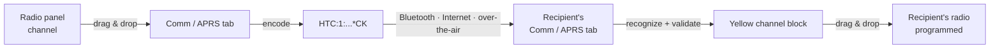

# A Channel You Can Text: The HTCommander Channel-Share String

*How we turned a radio channel — frequency, offset, tones, bandwidth,
modulation, and all the little flags — into one short line of text you can drag,
drop, paste, or send over the air to another operator.*

---

## The idea

Programming a repeater or a simplex channel by hand is fiddly: receive
frequency, transmit offset, CTCSS/DCS tones on both ends, wide vs. narrow,
FM vs. AM, de-emphasis, mute. Get one digit wrong and you're transmitting into
the void. Meanwhile the operator standing next to you already has that channel
working perfectly.

So why not just **hand them the channel**?

The goal for HTCommander is simple and tactile:

- **Drag a channel** out of the radio panel and drop it into the Comm or APRS
  tab. HTCommander turns it into a compact text token and sends it to whoever
  you're talking to — over Bluetooth, over the internet, or **over the air**.
- On the other end, the incoming token is recognized and rendered as a
  **yellow channel block**, exactly like the ones in the radio tab.
- The receiving operator **drags that block into their radio** to program the
  channel in one motion.

For any of that to work, we first need a way to write a whole channel as a
short, unambiguous, human-friendly string. This post documents that string —
what it's for, how it's laid out, and how HTCommander will use it.

## Design goals

A channel-share string has to survive some hostile environments — an APRS
message field, a copy-paste, a marginal over-the-air packet — so the format is
built around five rules:

1. **Instantly recognizable.** A receiver scanning a stream of chat text must be
   able to spot a channel with a simple pattern match. That means a distinctive
   magic prefix.
2. **Self-contained on one line, no spaces.** The whole channel is a single
   whitespace-free token, so you can locate it by scanning for the prefix and
   reading to the next space or newline. This also makes drag-select trivial.
3. **Human-readable where it matters.** Frequencies and tones are written the
   way a ham reads them — `146.520`, `-5`, `88.5` — not as opaque hex. Only the
   dense pile of boolean flags is packed.
4. **Compact.** It has to fit comfortably in an APRS message (a few dozen
   characters) and ideally in a single short data frame.
5. **Integrity-checked.** A trailing checksum catches truncation and typos, so a
   half-copied token is rejected instead of programming a wrong frequency.

## The format at a glance

```
HTC:1:NAME:RXFREQ:OFFSET:TXTONE:RXTONE:FLAGS*CK
```

Fields are separated by colons. A worked example — the 2 m calling frequency:

```
HTC:1:Calling:146.52:0:::G1*4A
```

Read left to right: it's an HTCommander channel (`HTC`), format version `1`,
named *Calling*, receiving on **146.52 MHz**, **simplex** (offset `0`), **no
tones** (two empty tone fields), flags `G1`, checksum `4A`.

Here is each field in order.

### `HTC` — magic prefix

The literal characters `HTC`. This is the fingerprint the receiver looks for.
A message scanner can find candidate channels with a pattern as simple as
`HTC:` and then validate the checksum. Because the token contains no spaces, the
end is just "the next whitespace."

### `1` — format version

A single digit. Version `1` is the analog-channel format described here. Bumping
this lets us extend the format later (DMR color codes, extra fields) without
older clients silently misreading a newer string.

### `NAME` — channel name

The channel's display name (up to 10 characters on Benshi radios). Because the
name is free text and could contain a colon, a space, or other reserved
characters, it is **percent-encoded**: any character that isn't an unreserved
ASCII letter, digit, `-`, `_`, or `.` is written as `%HH`. A space becomes
`%20`. So *Air Guard* travels as `Air%20Guard`. This keeps the token
whitespace-free and delimiter-safe.

### `RXFREQ` — receive frequency (MHz)

The receive frequency in **megahertz**, as a decimal string with trailing zeros
trimmed: `146.52`, `446.00625`, `27.185`. Internally HTCommander stores
frequency in whole hertz (a 30-bit field good to ~1073 MHz), and MHz with up to
six decimal places reproduces every hertz exactly.

### `OFFSET` — transmit offset (MHz)

How the **transmit** frequency relates to the receive frequency:

| Written as | Meaning |
|---|---|
| `0` | Simplex — transmit equals receive |
| `+0.6` | Transmit 600 kHz **above** receive (2 m repeater) |
| `-5` | Transmit 5 MHz **below** receive (70 cm repeater) |
| `=147.315` | Odd split — transmit on this **absolute** frequency in MHz |

Almost every real channel is simplex or a clean ± offset, so the common cases
stay short and readable. The `=` form is the escape hatch for a full split where
transmit isn't a tidy offset from receive.

### `TXTONE` and `RXTONE` — sub-audio squelch

Two independent fields: the **transmit** tone and the **receive** tone. Handling
them separately is what lets the format express plain tone, tone squelch (TSQL),
and cross-tone setups. Each field is one of:

| Field value | Meaning |
|---|---|
| *(empty)* | No sub-audio |
| `88.5` | **CTCSS** tone in Hz |
| `D023` | **DCS** code (the numeric code as printed on radios, zero-padded) |

The two ranges never collide: a CTCSS value is always a decimal frequency, and a
DCS value always carries the `D` prefix. Some common combinations:

- `:::` &nbsp;→&nbsp; carrier squelch, no tones (both fields empty)
- `100:100` &nbsp;→&nbsp; **TSQL** — 100.0 Hz encode and decode
- `88.5:` &nbsp;→&nbsp; **tone** on transmit only (open receive)
- `:D023` &nbsp;→&nbsp; DCS-023 required to open the receiver

Internally, HTCommander (like the radios) stores CTCSS as `round(Hz × 100)`
and DCS as its bare numeric code; CTCSS values land at ≥ 1000 and DCS codes stay
below it, so the ranges are unambiguous on the wire too.

### `FLAGS` — the packed bit field

Everything that's a yes/no switch is bundled into a **10-bit flag word** and
written as **two [Crockford Base32](https://www.crockford.com/base32.html)
characters** (alphabet `0-9 A-Z` minus the ambiguous `I L O U`). This is the
"letter of the alphabet for bitflags" idea, just widened to two characters so
there's room to grow. High five bits first, low five bits second.

| Bit | Mask | Meaning when set |
|---|---|---|
| 0 | `0x001` | Bandwidth **WIDE** (clear = narrow / 12.5 kHz) |
| 1 | `0x002` | Receive modulation **AM** (clear = FM) |
| 2 | `0x004` | Transmit modulation **AM** (clear = FM) |
| 3 | `0x008` | **Mute** — speaker muted on this channel |
| 4 | `0x010` | **De-emphasis / pre-emphasis bypass** (flat audio) |
| 5 | `0x020` | **TX disabled** — receive-only channel |
| 6 | `0x040` | **Scan** — include in the scan list |
| 7 | `0x080` | **Talk-around** — transmit on the receive frequency |
| 8 | `0x100` | **TX medium power** |
| 9 | `0x200` | **TX high power** (neither 8 nor 9 set = low power) |

The five flags the sharing feature cares about most — bandwidth, AM/FM, mute,
de-emphasis, and TX power — are all here, alongside a few extras (scan,
talk-around, receive-only) that come free once you have a bit field.

Worked example: a **wide FM, high-power** simplex channel sets bit 0 (`0x001`)
and bit 9 (`0x200`) → `0x201` → `513`. Splitting into two five-bit groups gives
`16` and `1`, which Crockford Base32 renders as `G` and `1` → **`G1`**. That's
the `G1` in the *Calling* example above.

> **Note on DMR.** Version 1 is an analog format (FM/AM). A DMR channel carries
> color codes and time-slot data that don't fit these fields, so it is out of
> scope for v1 — a future version bump can add them.

### `*CK` — checksum

An asterisk followed by a **two-digit uppercase hex checksum**: the XOR of every
character *before* the `*`. This is the same lightweight scheme NMEA and APRS
already use, and it does two jobs: it rejects a token that was truncated during
copy-paste or a bad packet, and it catches the odd fat-fingered digit before it
becomes a mis-programmed radio.

## Finding a channel inside a sentence

A shared channel almost never arrives alone — it's dropped into the middle of a
conversation: *"try this one HTC:1:Calling:146.52:0:::G1\*4A 73!"*. The format is
built so a receiver can pull the channel out of that surrounding chatter, even
when user text is glued directly to it with no spaces. Three properties make it
work:

1. **An anchored, distinctive start.** The scanner doesn't look for a loose
   `HTC`; it matches the prefix `HTC:` followed by a version digit and colon —
   in practice the regex `HTC:\d+:`. That pattern is specific enough that it
   effectively never occurs by accident inside ordinary words, and if it ever
   did, the checksum would reject it.
2. **A self-defining end.** The token finishes with `*` and **exactly two hex
   digits**. So the parser doesn't need a trailing space to know where the
   channel stops: it sees the `*`, reads two characters, and is done.
   `...G1*4Aand more text` still yields exactly `...G1*4A`.
3. **No spaces in between.** Because the name is percent-encoded and every other
   field is numeric, the whole token is one unbroken run of non-space
   characters. So "the channel" is always the text between the `HTC:\d+:` anchor
   and the end of the `*HH` checksum.

The upshot: leading text, trailing text, or even two channels on one line all
parse cleanly.

```
"see HTC:1:Calling:146.52:0:::G1*4A works"          -> one channel, spaces around it
"ch:HTC:1:Calling:146.52:0:::G1*4Ahere"             -> glued both sides, still recovered
"HTC:1:Calling:146.52:0:::G1*4A HTC:1:W1AW:...:G0*62" -> two channels, both extracted
```

The only thing that would break extraction is a literal space *inside* a
token — which is precisely why the channel name is percent-encoded (`Air Guard`
→ `Air%20Guard`) so a channel is always a single whitespace-free unit.

## A field guide of examples

Every token below is complete and checksum-valid.

**2 m simplex calling frequency** — 146.520, wide FM, high power, no tones:

```
HTC:1:Calling:146.52:0:::G1*4A
```

**70 cm repeater with tone squelch** — 449.925 receive, −5 MHz transmit,
100.0 Hz TSQL, narrow FM, high power:

```
HTC:1:W1AW:449.925:-5:100:100:G0*62
```

**GMRS repeater** — 462.650 receive, +5 MHz transmit, 141.3 Hz TSQL:

```
HTC:1:GMRS-19:462.65:+5:141.3:141.3:G0*0E
```

**Airband monitor** — 121.500 AM, receive-only, both modulation bits + TX-disable
set (`0x002|0x004|0x020` = `16`):

```
HTC:1:Air%20Guard:121.5:0:::16*72
```

**Packet / data channel** — 144.390 simplex, wide FM, muted speaker, flat audio
(de-emphasis bypass), high power (`0x001|0x008|0x010|0x200` = `GS`):

```
HTC:1:Packet:144.39:0:::GS*4D
```

## How HTCommander uses it

The string is the wire format; the experience wrapped around it is the point.



1. **Sending.** Drag a channel from the radio panel into the Comm or APRS
   message box. HTCommander encodes the `RadioChannelInfo` into the token and
   inserts it into the outgoing message, so it rides whatever transport that
   conversation uses — including an over-the-air APRS or DART frame.
2. **Recognizing.** The message renderer scans incoming text for `HTC:` tokens
   and validates the checksum. A valid token is drawn as a **yellow channel
   block** showing the name and frequency, just like the blocks in the radio
   tab.
3. **Receiving.** The recipient drags that yellow block onto a channel slot in
   their radio panel. HTCommander decodes the token back into a
   `RadioChannelInfo` and writes it to the radio — no manual entry, no
   transcription errors.

Because the entire channel is one short, self-checking line of printable ASCII,
the same token works whether it's typed into a chat, pasted into an email, or
bounced off a repeater as an APRS message. A channel becomes something you can
simply *hand to someone*.

## What's next

This post defines and freezes the version 1 string. The implementation follows:
an `encode(RadioChannelInfo)` / `decode(String)` pair, the drag-and-drop hooks in
the Comm and APRS tabs, and the yellow-block renderer that makes a shared channel
feel like an object you can pick up and drop into a radio.

---

*Part of the [HTCommander technology blog](README.md).*
