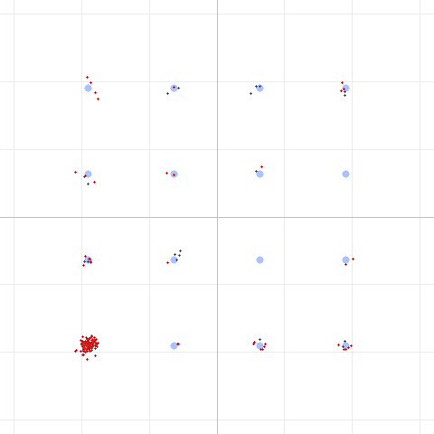

# The Bits You Already Know: Code Shortening for Short Frames

*Fifth in our series on building the DART FM data modem. A stray detail in a
constellation plot — one corner used far more than the others — led to a change
that buys **5+ dB** of link margin on short frames, essentially for free.*

---

## A clue in the corner

While staring at 16QAM constellations, we noticed something odd: one corner point
was used *far* more than the other fifteen. Here it is on a short message — the
lower-left `0000` point is a dense cloud, the rest are nearly empty:



That lopsidedness is not a channel effect. It's **zero-padding**. DART's LDPC code
works on fixed-size blocks (e.g., 540 information bits for the fastest 16QAM mode).
A short message — a two-byte "Hi", an ACK, a beacon — fills only a small fraction
of that block; the encoder **zero-fills the rest**. Because the code is systematic
(the information bits appear verbatim in the transmitted codeword), those padding
zeros map straight onto the `0000` constellation point, over and over.

The natural first reaction is: *should we scramble the bits so all symbols are used
equally?* It's a reasonable instinct — but it's the wrong lever, and chasing why
led us to a much better one.

## Why "scramble for uniform symbols" doesn't help

For a linear channel (noise, phase, fading), an error-correcting decoder's
performance depends only on the **code and the per-bit SNR** — *not* on which
constellation points you happen to land on. Sending the `0000` corner a thousand
times gives every bit the same distances, the same noise, the same reliability as
sending random symbols. Making the symbol histogram uniform is cosmetically nicer
and slightly better for spectral flatness, but it delivers **zero coding gain**.
It will not lower the SNR you need to decode.

So equalizing the symbols is a dead end. But the observation was still pointing at
something real: **those padding bits are wasted effort.** The transmitter spends
airtime sending them, and the receiver spends decoding effort trying to *figure
out* bits whose value we already know is zero.

## The right lever: code shortening

**Code shortening** is the classic technique for exactly this situation. Instead of
asking the decoder to recover the padding bits, we simply *tell* it: "these bits
are known to be zero." In a belief-propagation LDPC decoder that means pinning
those bits' log-likelihood ratios to a large, confident value before decoding.

Known bits are not passengers — they're **constraints**. Every known bit tightens
the web of parity checks around the *unknown* bits, so the decoder recovers the
real payload from far noisier input. In effect, the code rate collapses: a two-byte
payload in a 648-bit codeword is only ~7% real data, so it's protected as if by a
rate-0.07 code instead of the nominal 5/6.

The change is tiny — a few lines in the decoder that mark the padding region as
known. Nothing about the transmitted signal changes; it's purely a smarter
receiver. And as a bonus, it also strengthens the **frame header**, which is a
144-bit field inside a 324-bit block — 180 known padding bits that now help every
single frame decode.

## What we measured

We A/B-tested a 2-byte message at the most aggressive mode (16QAM, rate 5/6)
through the SBC codec, sweeping the channel down to the decode cliff:

| | Decode holds down to | What finally breaks |
|---|:---:|---|
| **Without shortening** | ~+3 dB channel SNR | the LDPC code gives up |
| **With shortening** | **−2 dB channel SNR** | the **preamble detector**, not the code |

That's a **> 5 dB improvement** on a short frame — and notice the failure mode
changed: with shortening the decoder is no longer the bottleneck at all. The frame
stops decoding only because, at those noise levels, the receiver can't *find* the
preamble anymore. The error correction has more margin than the rest of the link.

Crucially, this is **free and self-scaling**:

- The gain is proportional to how much of the block is padding, so it's **largest
  for the shortest frames** — ACKs, control messages, beacons, keystrokes — which
  is exactly the traffic that most needs to punch through a weak link.
- For large payloads there's little padding, so the effect fades to nothing — no
  downside.
- It costs no bandwidth, no airtime, and no transmit changes. Existing signals
  decode better on a receiver that knows to do it.
- No regression across the full automated test suite.

## Which modes actually benefit?

A natural follow-up: does this help the robust modes (BPSK, QPSK) too, or only the
aggressive ones? We measured it — a 2-byte frame at the decode cliff, with and
without shortening:

| Mode | Without shortening | With shortening |
|---|:---:|:---:|
| **QPSK rate-1/2** | fails at −4 dB (preamble detection) | fails at −4 dB (preamble detection) |
| **16QAM rate-5/6** | fails at +3 dB (the code) | ~−3 dB (preamble detection) |

This is a clean illustration of *what shortening does and doesn't touch*.
Shortening only helps when the **error-correcting code is the bottleneck**. For the
robust rate-1/2 modes, the code is already stronger than the **preamble detector**:
a short frame decodes down to about −3 dB whether or not we shorten, because below
that the receiver can no longer *find* the preamble at all. The shortening still
runs — it just has nothing left to save, because detection gives out first.

For the aggressive modes it's the opposite. The code fails first (16QAM rate-5/6
gives up at +3 dB, far above the detection floor), so shortening's extra margin
slides the decode cliff all the way down to the detection limit — the full 5+ dB.

The takeaways:

- **Shortening helps exactly where the code is working hardest** — the high-rate
  modes and the shortest frames. It's invisible on the robust modes not because it
  fails, but because they were never code-limited to begin with.
- It **never hurts** and costs nothing, so it simply stays on.
- It also exposes a *different* lever for the future: the robust modes are now
  **detection-limited**, so extending *their* short-frame range would mean
  improving the preamble/sync, not the code.

## The takeaway

The constellation clump wasn't a problem to *hide* (by scrambling) — it was a
signpost saying *"you're transmitting and decoding bits you already know."* The
useful response wasn't to make the known bits look random; it was to **exploit
that we know them.** Code shortening turns wasted padding into free error-correction
margin, and it helps most precisely where a marginal link hurts most: the short
control frames that keep a link alive.

There's even a further step we haven't taken yet — **puncturing** the known
padding, i.e., not transmitting it at all, to save airtime on short frames. That's
a story for another day.

## Reproduce this

The behavior is in the standard decode path — short frames simply decode at lower
SNR now. To see the padding clump that started it all:

```
dart run test/dart_modem_test.dart pipeline -m 4 --sbc --noise 20 \
    --png clump.png "Hi"
```

...and watch a tiny payload survive absurd noise levels that a full-rate codeword
never could.

---

*Method: DART software pipeline (encode → SBC codec → AWGN → decode), 16QAM, 2-byte
payload, controlled A/B on the LDPC shortening step. Fifth in a series; companions
cover the [real-world findings](dart-over-the-air-findings.md),
[SBC bitpool](dart-sbc-bitpool.md), [SBC bit allocation](dart-sbc-allocation.md),
and [phase noise & pilots](dart-phase-noise-and-pilots.md).*
