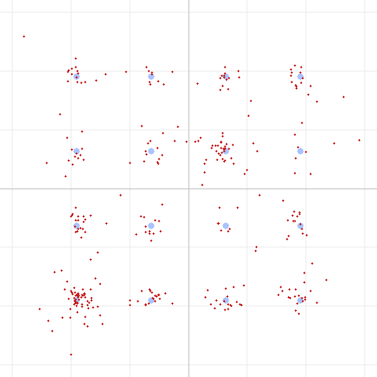

# Is 125 Microseconds Enough? A Look at Inter-Symbol Interference

*Sixth in our series on the DART FM data modem. A reader asked for an
inter-symbol-interference (ISI) analysis — so we built a multipath channel into
the simulator, found the cliff, and checked whether our deliberately-short cyclic
prefix is actually big enough. Good news: it is.*

---

## ISI in one paragraph

OFDM chops data into many slow subcarriers and prepends each symbol with a
**cyclic prefix (CP)** — a copy of the symbol's tail. The CP is a guard buffer: as
long as the channel's echoes (its *delay spread*) die out within the CP, every
OFDM symbol stays clean and its subcarriers stay orthogonal. Push an echo *past*
the CP, though, and energy from one symbol spills into the next — **inter-symbol
interference** — and the subcarriers start to smear into each other too.

DART's CP is deliberately short: **4 samples at 32 kHz = 125 µs.** That was a bet
— that a 2 m/70 cm FM link at close range has almost no RF multipath, so a long CP
would just waste airtime. The reader's question is really: *was that bet safe?*

## Building a multipath channel

To test it we added a two-tap echo channel to the simulator — `y[n] = x[n] +
a·x[n−d]` — with a knob for echo delay `d` and amplitude `a`. Then we swept the
delay against a strong (half-amplitude) echo on 16QAM and watched the EVM:

| Echo delay | In time | EVM | |
|:---:|:---:|:---:|:---|
| 0–1 samples | 0–31 µs | 0.1% | clean |
| 2 samples | 63 µs | 3.5% | |
| 4 samples | **125 µs (= CP)** | 4.2% | still absorbed |
| **5 samples** | **156 µs (> CP)** | **7.9%** | **ISI kicks in** |
| 8 samples | 250 µs | 11.3% | |
| 16 samples | 500 µs | 14.9% | |
| 24 samples | 750 µs | 19.9% | |

There's the classic ISI signature: EVM stays low while the echo fits inside the CP
(≤ 4 samples), then **roughly doubles the moment the echo crosses the CP boundary**
and climbs steadily from there. You can see it in the constellation — a strong echo
well beyond the CP smears every one of the 16 points:



(By contrast an echo *within* the CP, [isi-within-cp.png](images/isi-within-cp.png),
stays tight — the equalizer folds it into the channel estimate and removes it.)

## Confirming the cause: grow the CP, cure the ISI

If that degradation is really ISI, then *lengthening the CP* to cover the echo
should fix it. We fixed the echo at 8 samples and grew the CP:

| CP length | EVM |
|:---:|:---:|
| 4 samples | 11.3% |
| 6 samples | 9.0% |
| **8 samples (= echo)** | **8.9%** |
| 12 / 16 samples | 9.1% (flat) |

Exactly as expected: EVM drops as the CP grows and **plateaus once the CP covers
the echo** (8 samples). The part that a bigger CP removes *is* the ISI; the residual
~9% is the echo's frequency-selective fading (a different effect the CP doesn't
address). This cleanly separates ISI from everything else.

## The question that actually matters: is *our* CP big enough?

A synthetic echo proves the mechanism, but the practical question is whether
DART's real channel — the **SBC codec and radio audio path** — disperses energy
past 125 µs. Both have impulse responses longer than a single sample, so it's a
fair worry. We swept the CP through the real SBC codec with no artificial echo at
all:

| CP length | EVM |
|:---:|:---:|
| 4 samples | 0.4% |
| 6 / 8 / 12 / 16 samples | 0.4% (unchanged) |

**Flat.** Growing the CP buys *nothing* through the SBC path — so the codec
introduces **no dispersion beyond the existing 4-sample CP.** (It adds a fixed
~73-sample *delay*, but that's absorbed by the guard interval between the preamble
and payload; delay is not the same as delay *spread*.)

## Verdict: the short CP was a safe bet

- **The CP works exactly as designed** — echoes up to 125 µs are absorbed
  invisibly; only beyond that does ISI appear, with a sharp, well-behaved knee.
- **The real SBC/audio path has no dispersion the CP misses** — a longer CP would
  be pure wasted airtime.
- **RF multipath at these ranges is orders of magnitude smaller than 125 µs** (a
  reflection would need a ~37 km path-length difference to fill the CP), so DART
  has enormous margin against real over-the-air echoes.

So ISI is *not* a limiter for DART — the earlier findings stand: the ceiling is
raw SNR, and phase noise is handled by the pilots. The one scenario where you'd
revisit the CP is a genuinely dispersive path — long-range tropo, heavy urban
multipath, or a repeater with significant group-delay ripple — and now we have the
tool to measure exactly how much CP that would need.

## Reproduce this

The multipath channel and CP override are in the test tool:

```
# Delay-spread sweep — watch the knee at the CP (4 samples):
dart run test/dart_modem_test.dart pipeline -m 4 --echo 8 --echoamp 0.5 -o out.wav "message"

# Grow the CP to cure a fixed echo:
dart run test/dart_modem_test.dart pipeline -m 4 --echo 8 --cp 8 -o out.wav "message"

# Check the real SBC path for hidden dispersion:
dart run test/dart_modem_test.dart pipeline -m 4 --bitpool 40 --cp 16 -o out.wav "message"
```

---

*Method: DART software pipeline with an added two-tap echo channel and a
cyclic-prefix override, 16QAM, half-amplitude echo. Constellation diagrams from the
DART test tool. Sixth in a series; companions cover the
[real-world findings](dart-over-the-air-findings.md),
[SBC bitpool](dart-sbc-bitpool.md), [SBC bit allocation](dart-sbc-allocation.md),
[phase noise & pilots](dart-phase-noise-and-pilots.md), and
[code shortening](dart-code-shortening.md).*
