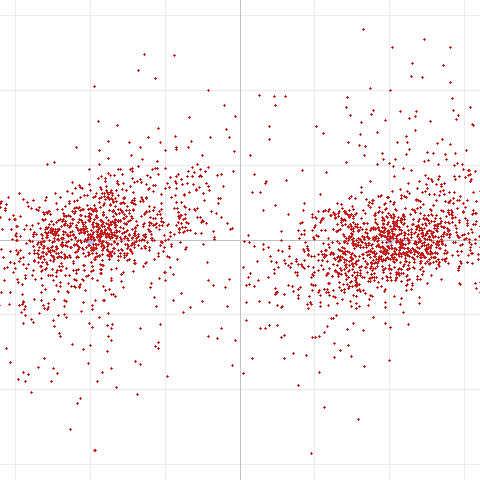
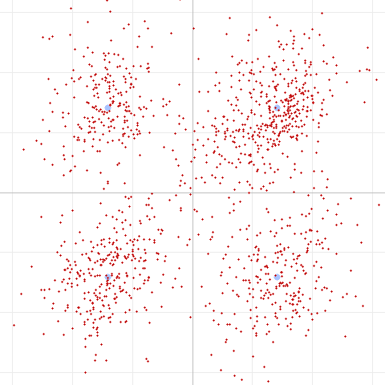
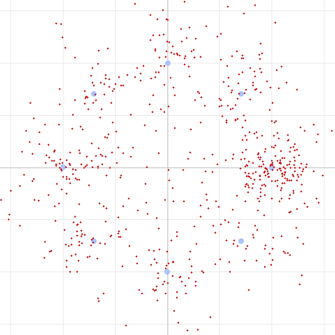
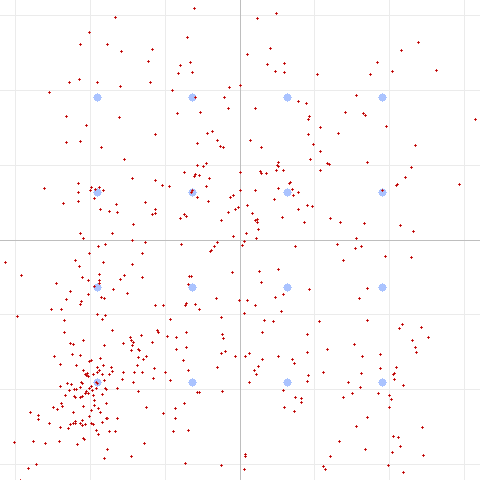
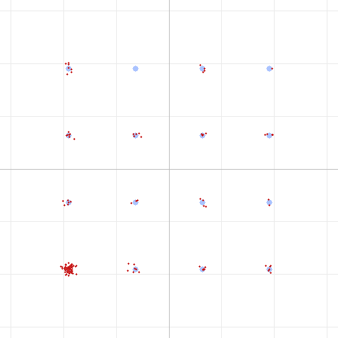
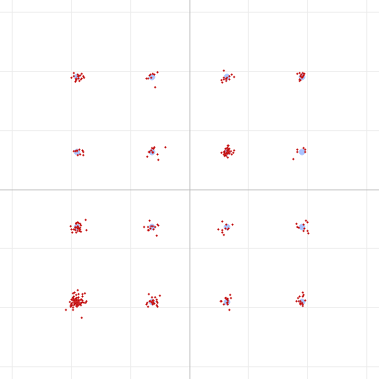

# Pushing Data Through FM Voice Radios: Real-World Findings from the DART Modem

*A field report from testing an adaptive OFDM modem over two UV-Pro
handhelds — what worked, what didn't, and an open invitation to reproduce our
results.*

---

## Background

**DART** (Data Adaptive Rate Transport) is an experimental modem built into
HTCommander for moving data over ordinary 2 m / 70 cm **FM voice** radios. It is
an adaptive **OFDM** waveform (DFT-spread / SC-FDMA) that packs 9 subcarriers
into the ~500–2500 Hz audio passband, protected by **LDPC** forward error
correction. It offers a ladder of speeds so it can trade throughput for
robustness depending on the link:

| Level | Modulation | LDPC rate | Approx. throughput |
|:---:|:---|:---:|:---:|
| 0 | BPSK | 1/2 | ~1 kbps |
| 1 | QPSK | 1/2 | ~2 kbps |
| 2 | QPSK | 2/3 | ~3 kbps |
| 3 | 8PSK | 2/3 | ~4 kbps |
| 4 | 16QAM | 3/4 | ~5 kbps |
| 5 | 16QAM | 5/6 | ~6 kbps |
| F | 4-FSK (constant envelope) | 1/2 | fallback |

Level F is a special constant-envelope 4-FSK fallback for amplitude-hostile
radios — it sacrifices speed for immunity to the amplitude distortion that FM
audio paths often introduce.

The question we set out to answer: **on a real radio link, which of these
actually work, and what limits the rest?**

---

## Test setup

Everyone should be able to picture (and rebuild) our bench, so here it is in
full:

- **Two UV-Pro handheld radios**, one transmitting and one receiving.
- **Bluetooth audio on both ends.** The data never touches a cable — the app
  streams PCM to the transmit radio over Bluetooth (SBC codec), and the receive
  radio streams audio back to the app over Bluetooth (SBC codec) as well. So
  **every frame passes through the lossy SBC codec twice**, once on each hop.
- The two radios sat **about 50 feet (15 m) apart** indoors — a strong,
  short-range signal with no fading to speak of.
- 32 kHz / 16-bit / mono audio throughout.

We transmitted a fixed test message at each DART level, captured the received
audio to a WAV file, and ran the decoder with a constellation-diagram export so
we could *see* the signal quality, not just pass/fail.

> Constellation diagrams below: **blue dots** are the ideal constellation points
> the transmitter aimed for; **red dots** are what actually came out of the
> radio link after equalization. Tight red clusters on the blue points = a clean
> link. A smeared cloud = trouble.

---

## Results: the rate ladder over the air

Here is the full scorecard from the 50-foot UV-Pro link:

| Level | Mode | EVM* | SNR* | Preamble corr. | LDPC corrections | **Decoded (CRC)** |
|:---:|:---|:---:|:---:|:---:|:---:|:---:|
| 0 | BPSK R1/2 | 48% | 6.4 dB | 0.80 | 28 | ✅ **OK** |
| 1 | QPSK R1/2 | 44% | 7.2 dB | 0.80 | 87 | ✅ **OK** |
| 2 | QPSK R2/3 | 46% | 6.8 dB | 0.80 | 89 | ❌ fail |
| 3 | 8PSK R2/3 | 34% | 9.3 dB | 0.80 | 110 | ❌ fail |
| 4 | 16QAM R3/4 | 29% | 10.9 dB | 0.79 | 107 | ❌ fail |
| 5 | 16QAM R5/6 | 29% | 10.9 dB | 0.79 | 55 | ❌ fail |
| F | 4-FSK R1/2 | 3% | 34 dB | 0.75 | 0 | ✅ **OK** |

\* *A note on EVM/SNR: these are measured to the nearest constellation point, so
they are **not** directly comparable across modulation orders — a noisy 16QAM
symbol always has a nearby (wrong) point, making its EVM look artificially
better than QPSK's. The **CRC column is the real verdict.***

**What worked:** BPSK (Level 0), QPSK R1/2 (Level 1), and the 4-FSK fallback
(Level F) all decoded cleanly. **What failed:** everything faster than Level 1 —
QPSK R2/3, 8PSK, and both 16QAM modes.

This is **textbook graceful degradation**: the robust modes deliver, the
aggressive modes don't, and the preamble was detected in every single case
(correlation ~0.80, well above our 0.6 threshold). An adaptive link would simply
settle at Level 1.

### The constellations tell the story

**Level 0 — BPSK (decoded ✅)**



Two heavily-smeared clusters, but they stay cleanly separated left/right of the
axis. BPSK only cares about *sign*, so even a very noisy link recovers the bits.

**Level 1 — QPSK (decoded ✅)**



Four clusters, one per quadrant. Spread and overlapping toward the center, but
the rate-1/2 FEC has enough margin to clean up the residual errors. **This is the
fastest mode that reliably worked.**

**Level 3 — 8PSK (failed ❌)**



Eight phase points need 45° of resolution. Instead we get a smeared ring that
never resolves into eight clusters — the phase precision simply isn't there.

**Level 4 — 16QAM (failed ❌)**



16QAM needs precise **amplitude *and* phase**. The received symbols land nowhere
near the 4×4 grid of ideal points — a diffuse cloud that the decoder can't
resolve.

---

## Chasing the ceiling: what *doesn't* fix it

The obvious next question was *why* the higher modes fail, and whether we could
tune our way out of it. We ran a systematic sweep of radio settings, always on
Level 3 (8PSK) as our sensitive canary. Every metric stayed pinned at roughly
**34% EVM / 9 dB SNR** no matter what we changed:

| We changed… | Result |
|:---|:---|
| **Transmit level 0.5 → 0.8 → 1.0** (a 6 dB sweep) | No change. The receiver's AGC just re-scaled; EVM/SNR flat. The link is **level-independent**. |
| **Over-driving the audio** (very hot) | **Worse** — over-deviation distortion pushed EVM to 42%. |
| **Companding / narrow audio processing** | **Broke decode entirely** — it strangled the upper subcarriers so even the robust header failed. |
| **FM wide vs. narrow band** (matched and mismatched) | No change. DART fits inside the narrowband audio passband, and its per-subcarrier equalizer flattens the response. |
| **2 m vs. 70 cm** | Identical. |
| **Repositioning the radios** (introduced a multipath notch) | The equalizer flattened a 25 dB null at 2200 Hz — EVM unchanged. |

That last row is worth dwelling on: moving the radios created a deep,
frequency-selective **null** in the passband — classic multipath — and DART's
OFDM structure simply equalized it away on a per-subcarrier basis. This is
exactly what multi-carrier modems are supposed to do, and it held up beautifully
in the real world.

So: **not level, not band, not RF frequency, not multipath.** The ceiling is
fixed somewhere in the **audio/baseband chain common to every configuration** —
which points squarely at the **Bluetooth SBC codec and the radio's audio
processing.**

---

## The control experiment: proving it's phase noise, not additive noise

To confirm the culprit, we built an end-to-end **simulation** of the same chain
in software: encode a DART-5 (the hardest 16QAM mode) frame, push it through the
**SBC codec**, add **channel noise**, then decode. If SBC + noise were the
problem, 16QAM should fail here too.

It didn't. Not even close:

**Level 5 — 16QAM through simulated SBC + 25 dB noise (decoded ✅, 0 corrections)**



Sixteen tight, perfectly-resolved clusters on the ideal grid. EVM **2.9%** versus
**~29%** over the air. We even **doubled the noise** (down to 22 dB SNR) and it
still decoded flawlessly with zero LDPC corrections.

The conclusion is unavoidable: **neither the SBC codec nor additive noise is what
kills the high-order modes.** 16QAM survives both easily in isolation. The real
over-the-air failure is specifically **phase noise / distortion introduced by
the FM radio audio path** — something additive-noise simulation doesn't capture.

### A fun aside: why one corner gets crowded

Sharp-eyed readers will notice the bottom-left of that simulated constellation is
denser than the rest:



That is **not** a channel effect — it's the **zero-padding of a short message**.
DART's LDPC block for Level 5 holds 540 information bits; our 15-byte test
message only filled ~150 of them, leaving ~72% zero-padding. Because the code is
systematic, those zeros map straight onto the single 16QAM point whose bits are
`0000` (the bottom-left corner). Send a longer, 102-byte message (above) and the
padding drops to ~21% — all sixteen points fill in evenly. A neat reminder that a
constellation plot shows you your *data statistics*, not just your channel.

---

## So what's the realistic best encoding?

Out of everything we tried on this real UV-Pro-to-UV-Pro Bluetooth link at 50
feet:

> **QPSK at rate 1/2 (Level 1, ~2 kbps) is the sweet spot** — the fastest mode
> that decoded reliably. **BPSK (Level 0)** is the robust step below it, and
> **4-FSK (Level F)** is the guaranteed-delivery fallback when the audio path
> turns hostile.

Everything above Level 1 sits just above this link's phase-noise ceiling. That
lines up neatly with decades of amateur-radio experience: **~2400 bps has long
been the practical ceiling for phase-shift keying through an FM voice channel**,
and our measurements land right on it — with DART adding modern LDPC coding,
multipath-robust OFDM, and automatic rate adaptation on top.

The one thing that *would* raise the ceiling is not a modulation trick — it's
cleaning up the **audio path**: a wired audio connection or a higher-quality
Bluetooth codec instead of SBC. That is the experiment we most want to try next.

---

## Reproduce this — we want your data

These are results from **one link, in one room, with one pair of radios.** We
would love for others to confirm, contradict, or extend them. If you have a pair
of Bluetooth-audio HTs (UV-Pro or otherwise), here is how to reproduce our
tests with the DART test tool in HTCommander:

**Transmit / capture each level over the air**, then decode a captured WAV and
export its constellation:

```
dart run test/dart_modem_test.dart decode DART-3.wav --constellation --png DART-3.png
```

**Inspect the audio itself** (levels, band energy, preamble health):

```
dart run test/dart_modem_test.dart analyze DART-3.wav
```

**Run the full software channel simulation** (encode → SBC → noise → decode →
PNG) to compare against your over-the-air captures:

```
dart run test/dart_modem_test.dart pipeline -m 5 --sbc --noise 25 -o sim.wav --png sim.png "The quick brown fox jumps over the lazy dog"
```

Things we would especially love to see from the community:

1. **Does QPSK R1/2 hold as the reliable ceiling on your radios?** Or do cleaner
   audio paths let 8PSK / 16QAM through?
2. **Wired audio vs. Bluetooth SBC** — does removing SBC lift the phase-noise
   ceiling as we predict?
3. **Different radios / SBC implementations** — is the ceiling radio-specific?
4. **Longer range and genuine fading** — does the OFDM equalizer keep winning
   against multipath outdoors?

Share your constellation PNGs and decode logs. The more links we characterize,
the better we can tune DART's rate ladder and defaults for real-world use.

---

*Test setup: 2× UV-Pro, Bluetooth audio (SBC) on transmit and receive,
~50 ft apart, 2 m and 70 cm, FM. Modem: DART adaptive OFDM (SC-FDMA) + LDPC in
HTCommander. All constellation diagrams generated by the DART test tool from
real captured audio, except the two simulated 16QAM plots as noted.*
