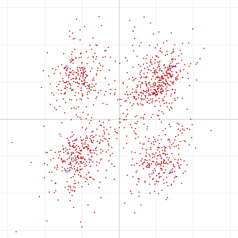
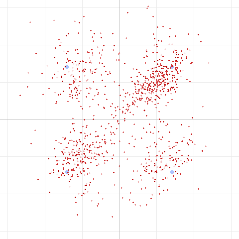
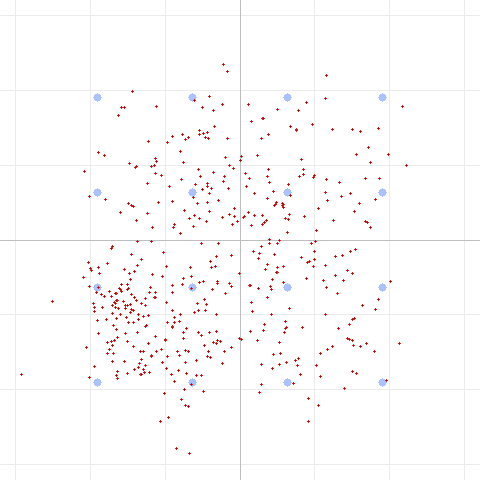

# Chasing a Ghost: How We Proved (and Fixed) the Real Limiter on an FM Data Modem

*Fourth in our series on running data over FM voice radios. Earlier we traced the
DART modem's quality ceiling to "the audio path." This time we build the tools to
find out **exactly** what in the audio path was hurting us — carrier phase noise —
fix it, and in the process gain a rung of throughput on a real radio link.*

---

## The story so far

- [Part 1](dart-over-the-air-findings.md): DART over two UV-Pro radios — robust
  modes worked, aggressive modes failed, ceiling traced to the audio path.
- [Part 2](dart-sbc-bitpool.md): the SBC **bitpool** adds a small noise floor, but
  raising it doesn't move the ceiling.
- [Part 3](dart-sbc-allocation.md): SBC's **loudness vs. SNR** bit allocation — a
  free ~2% EVM improvement for data, but still not the ceiling.

Every one of those said the same thing: the limiter is *time-varying phase*
distortion in the FM audio path, not level, band, codec bitrate, or additive
noise. But "it's probably phase noise" is a hypothesis, not a measurement. This
post is about turning it into one.

## You can't fix what you can't measure — or simulate

Our simulator had a blind spot: it modeled the SBC codec and additive noise
perfectly, and through *those* impairments 16QAM decoded fine down to 8 dB SNR.
The real radio failed 16QAM at a *better* nominal SNR. So the simulator literally
could not reproduce the failure — which means we couldn't develop a fix against
it.

So we built two things:

1. **A carrier phase-noise channel model.** The trick is that it must be
   *time-varying*: a static frequency response gets removed by the equalizer
   (which is why band shape and even multipath notches didn't matter over the
   air). We form the analytic signal and multiply it by a slowly-wandering
   random-walk phase — a knob for both **magnitude** (degrees RMS) and **speed**
   (how fast the phase drifts).

2. **A phase-drift meter in the decoder.** Using known **pilot symbols** sprinkled
   through the payload, the receiver measures the carrier phase directly —
   independent of its own decisions — and reports the drift in **degrees per
   symbol**. That single number tells us which regime we're in.

## The regime question — and why it's everything

Phase noise comes in two flavors that look identical on an EVM meter but respond
oppositely to a fix:

- **Fast phase noise** changes *within* a single OFDM symbol. That's inter-carrier
  interference — **irreducible**. No amount of tracking helps.
- **Slow phase noise** is stable within a symbol but drifts across the frame.
  It's **correctable** — and pilots, which give a decision-independent phase
  reference, are exactly the tool.

Simulating across the speed knob made the split undeniable. Here's 16QAM at a
fixed EVM, sweeping only the phase-noise speed:

| Phase drift | With pilots | Without pilots |
|:---:|:---:|:---:|
| ~12°/symbol (fast) | fail | fail |
| ~5°/symbol (moderate) | **14.5% EVM ✅** | 17.0% ✅ |
| ~2.6°/symbol (slow) | **9.6% EVM ✅** | 14.5% ✅ |

Pilots win handily when the phase is slow, do nothing when it's fast. So the whole
question of whether to add pilots (they cost ~12% throughput) came down to a
single measurement we didn't yet have: **how fast does the real link's phase
actually drift?**

## The measurement that settled it

We rebuilt both radios with the pilot decoder and captured fresh frames. The
meter read the same thing on every single capture:

> **Real-link carrier phase drift: 0.5 – 1.6° per symbol.**

That's deep in the **slow / decision-limited** regime — the one where pilots help.
Our earlier pessimism had come from a model calibrated to the *fast* regime; the
real radio is ~6× slower than that guess. Measuring beat assuming.

And you can *see* it. Here's QPSK over the real link now — the clusters are
**round and centered**, not sheared or spiraled. The phase is being tracked; the
remaining spread is just additive noise:



## The payoff: a rung of throughput

With the phase handled, a mode that used to fail came back to life. **QPSK rate
2/3 (Level 2)** — the first rung that failed in Part 1 — now decodes cleanly on
the real link, every capture:



That moved the **reliable ceiling from Level 1 to Level 2 (~2 → ~3 kbps, +50%)**,
courtesy of four stacked receive-side improvements:

- a **band-limited preamble chirp** retuned to 400–1900 Hz (over-air sync
  correlation rose 0.80 → 0.88, because the radio rolls off the top of the band);
- **decision-directed + pilot-aided phase tracking**;
- **MMSE equalization** (limits noise blow-up on weak subcarriers);
- **SBC SNR bit-allocation** for data frames.

## Where the ceiling actually is now

So why do 8PSK and 16QAM still fail? We finally have a clean answer. Here's 16QAM
over the real link:



A diffuse cloud that never resolves into the 16-point grid — but the **phase drift
is only 0.9°/symbol**. Phase is *not* the problem. This is **raw SNR**: ~28% EVM at
~11 dB, where 16QAM needs roughly 16 dB. It even matches the old pre-pilot 16QAM
EVM almost exactly, because the residual is thermal noise — which pilots correctly
don't touch.

We've cleanly separated the two impairments that were tangled at the start:

| Impairment | Status |
|---|---|
| **Carrier phase noise** | **Solved** — 0.5–1.6°/sym, tracked by pilots |
| **Raw SNR** | The remaining ceiling — 8PSK needs ~13 dB, 16QAM ~16 dB |

## The lesson

The satisfying part isn't any single fix — it's the method. "It's the audio path"
became "it's *time-varying phase noise*, specifically the *slow* kind, measuring
*1.5°/symbol*," and each refinement pointed at the next tool to build. The final
answer even tells us where **not** to spend effort: 8PSK/16QAM are now a
**link-budget** problem (antenna, range, power), not a signal-processing one. No
more DSP will conjure them out of an 11 dB link.

DART on a marginal UV-Pro-to-UV-Pro Bluetooth link now reliably delivers **QPSK
R2/3 (~3 kbps)**, degrades gracefully to BPSK and the constant-envelope 4-FSK
fallback, and — when the link is strong enough — has the headroom to climb higher.
And it knows *why* it can't climb, which is arguably the more useful result.

## Reproduce this

The phase-noise lab is in the DART test tool:

```
# Add tunable phase noise (magnitude and speed) to the channel:
dart run test/dart_modem_test.dart pipeline -m 4 --sbc --noise 20 \
    --phasenoise 40 --phaserate 0.9999 -o out.wav "message"

# A/B pilots vs no pilots on the same channel:
dart run test/dart_modem_test.dart pipeline -m 4 --phasenoise 40 --phaserate 0.9999 --nopilots ...

# Measure the phase-drift rate on any capture:
dart run test/dart_modem_test.dart decode capture.wav
#   → "Phase drift: 1.4°/symbol — slow / decision-limited (pilots help)"
```

If you have Bluetooth-audio HTs, capture a few frames and read your own link's
phase-drift number — we'd love to know whether other radios land in the same slow
regime, or whether some are fast/ICI-limited where a different approach is needed.

---

*Test setup: 2× UV-Pro, Bluetooth audio (SBC) on transmit and receive, ~50 ft
apart, 2 m / 70 cm FM. Modem: DART adaptive OFDM (SC-FDMA) + LDPC in HTCommander.
Constellation diagrams generated by the DART test tool from real captured audio.
Fourth in a series.*
