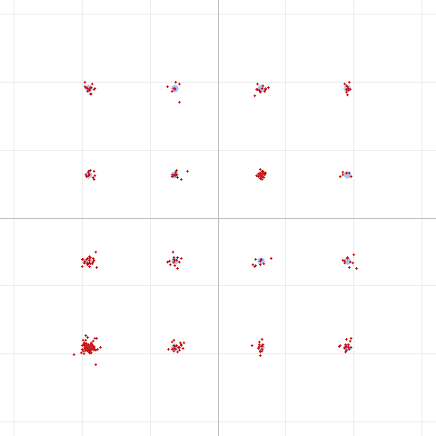
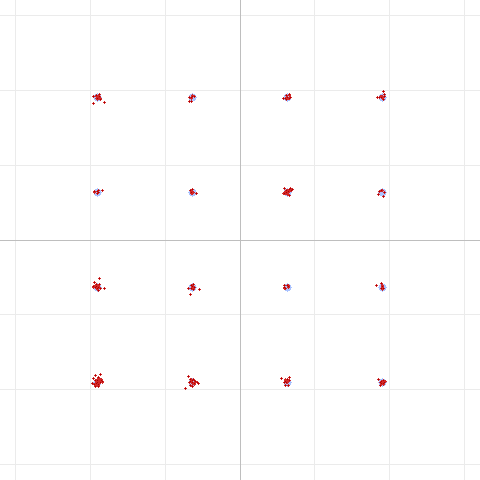

# Inside SBC: Loudness vs. SNR Bit Allocation, and Why It Matters for Data

*Third in our series on running data over FM voice radios. We've established that
the Bluetooth SBC codec adds a small but real noise floor under our DART modem
signal. This post opens up SBC to explain **how** it spends its bits — and why
one of its two allocation modes is quietly the wrong choice for data.*

---

## The story so far

- [Part 1](dart-over-the-air-findings.md) characterized the DART modem over two
  UV-Pro radios and traced the quality ceiling to the **audio path**.
- [Part 2](dart-sbc-bitpool.md) showed that SBC's **bitpool** setting adds ~3%
  EVM at the radio's default (18), but that raising it saturates fast and is
  swamped by channel noise.

This time we go one level deeper: *given* a fixed bitpool budget, **how does SBC
decide where those bits go** — and can we steer that decision to favor our data
waveform?

## A 60-second tour of how SBC works

SBC (the mandatory Bluetooth A2DP codec) is a **subband codec**. For each little
block of audio it does three things:

1. **Split into subbands.** An analysis filterbank divides the spectrum into 4 or
   8 equal-width frequency subbands. At our 32 kHz / 8-subband config, each
   subband is **2000 Hz wide** (SB0 = 0–2000 Hz, SB1 = 2000–4000 Hz, …).
2. **Measure each subband's level.** For every subband it computes a **scale
   factor** — essentially how loud that band is in this block. The scale factor
   sets the range of the quantizer.
3. **Hand out bits.** SBC has a fixed pool of bits per frame — the **bitpool** —
   and it distributes them across the subbands. A subband that gets more bits is
   quantized finely (low noise); one that gets few bits is quantized coarsely
   (audible/measurable quantization noise).

Step 3 is the interesting one. **How** SBC decides which subbands deserve more
bits is governed by its **bit-allocation method**, and the SBC standard defines
two: **Loudness** and **SNR**.

## Loudness vs. SNR allocation

Both methods start from the per-subband scale factors, but they weight them
differently:

- **SNR allocation** distributes bits to equalize the **signal-to-quantization-
  noise ratio across all subbands.** Every occupied band gets enough bits to hit
  a similar noise floor. It's flat and even-handed — it treats all frequencies as
  equally important.

- **Loudness allocation** applies a **psychoacoustic weighting** on top of that.
  It knows the human ear is more sensitive to some frequencies (roughly the
  mid-band of speech and music) and less sensitive to others, so it **steals bits
  from bands the ear cares less about and spends them where they'll be most
  audible.** For *music and voice*, this is exactly right — it makes the codec
  sound better to a human at the same bitrate. Loudness is the sensible default
  for a Bluetooth speaker or headset.

Here's the catch: **a data modem is not a human ear.**

## Why loudness is the wrong choice for data

DART's OFDM waveform packs its subcarriers into ~500–2500 Hz. Every one of those
subcarriers carries equally important bits — there is no "perceptually less
important" part of the spectrum. When loudness allocation decides some of that
band matters less (because it would matter less *to a listener*), it under-funds
those subcarriers with bits, and their quantization noise spreads the
constellation. The psychoacoustic model is optimizing for the wrong thing
entirely.

**SNR allocation, by contrast, gives every subcarrier a uniform quantization
floor** — which is precisely what a data waveform wants. Same bitpool, same
bandwidth, just spent evenly instead of by a hearing curve.

## Seeing the difference (16QAM through SBC @ bitpool 18)

We ran the hardest mode, 16QAM, through the SBC codec at the radio's bitpool 18
with each allocation method — no channel noise, so this is *purely* the codec's
contribution.

**Loudness allocation — EVM 3.5%**



**SNR allocation — EVM 1.8%**



Same codec, same bitpool, same signal — the only change is *how the bits were
distributed.* The SNR clusters are visibly tighter around their ideal points, and
the EVM is **cut roughly in half (3.5% → 1.8%)**. That improvement is free: it
costs no extra Bluetooth bandwidth.

## How the benefit holds up with real noise

Because this only helps where SBC quantization is the dominant noise, the
advantage is largest on a clean link and shrinks as channel noise takes over:

| Channel noise | Loudness EVM | SNR EVM |
|:---:|:---:|:---:|
| none (pure SBC) | 3.5% | **1.8%** |
| 25 dB | 3.9% | **2.7%** |
| 15 dB | 7.0% | **6.5%** |
| 10 dB | 11.4% | **11.2%** |

All still decode. On a clean link SNR allocation nearly halves the codec's
contribution; on a noisy link the channel dominates and the choice barely
matters.

## What we changed

We flipped DART's **transmit** SBC encoder to **SNR allocation for data frames
only** — voice transmissions keep loudness, where the psychoacoustic weighting
genuinely helps a human listener. The allocation method is signaled in each SBC
frame header, so a compliant decoder adapts automatically; the SBC standard
requires decoders to support both modes.

## The honest caveats

- **It only helps the app→radio hop.** The return path (radio→app) uses the
  radio firmware's own SBC encoder, whose allocation method we can't change.
- **It won't unlock the failed high-order modes over the air.** On the real link
  the constellation is dominated by ~29% EVM of **phase noise** from the FM audio
  path — a ~1.7% codec improvement is a rounding error against that. This is a
  clean, correct-by-design tidy-up of one avoidable noise source, not a fix for
  the phase-noise ceiling.
- **Compatibility should be verified on hardware.** It's spec-compliant and very
  likely fine, but if a specific radio's firmware misbehaves with SNR frames,
  it's a one-line revert.

## Reproduce this

The allocation method is now a switch in the DART test tool:

```
dart run test/dart_modem_test.dart pipeline -m 5 --bitpool 18 --sbcalloc loudness -o out.wav --png loud.png "message"
dart run test/dart_modem_test.dart pipeline -m 5 --bitpool 18 --sbcalloc snr      -o out.wav --png snr.png  "message"
```

Try it with channel noise (`--noise 10`) to watch the advantage fade as the link
degrades, and with different modes (`-m 3` for 8PSK) to see how the codec floor
scales with constellation density.

---

*Method: DART software pipeline (encode → SBC codec round-trip → optional AWGN →
decode), 16QAM R5/6, 32 kHz / mono SBC at 16 blocks / 8 subbands, bitpool 18.
Constellation diagrams generated by the DART test tool. Third in a series;
companions: "Pushing Data Through FM Voice Radios" and "Does SBC Bitpool
Matter?"*
