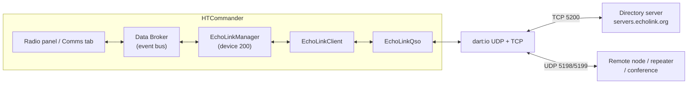
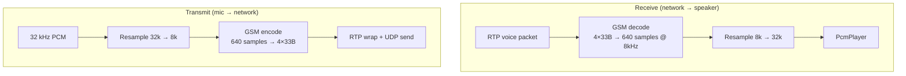
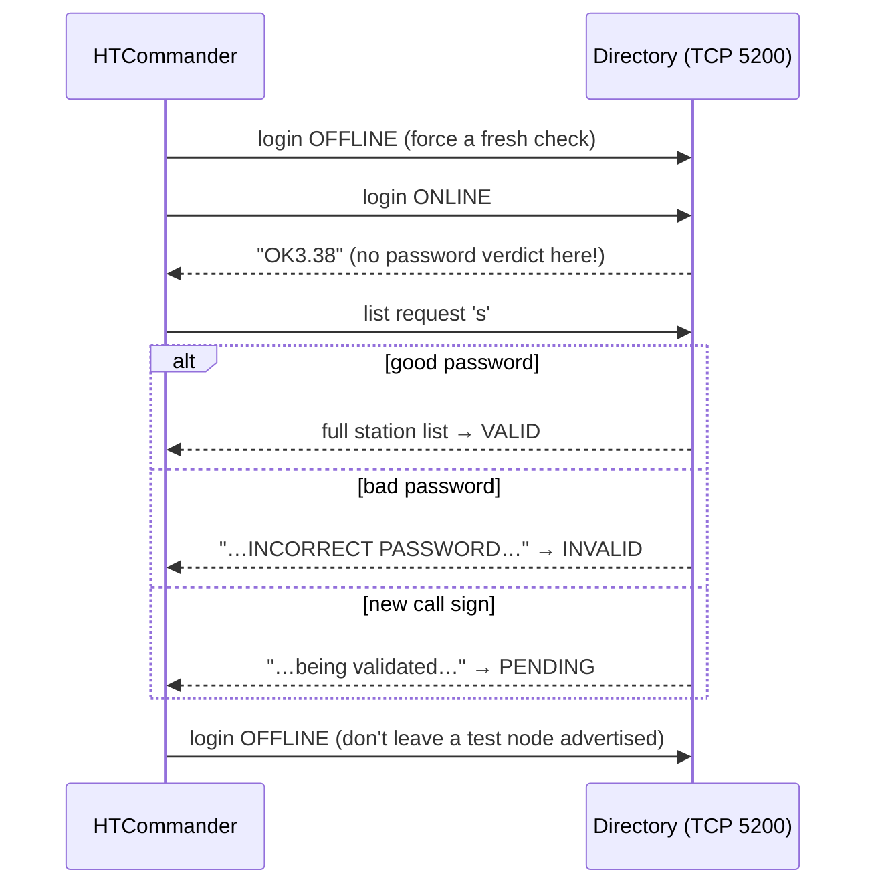
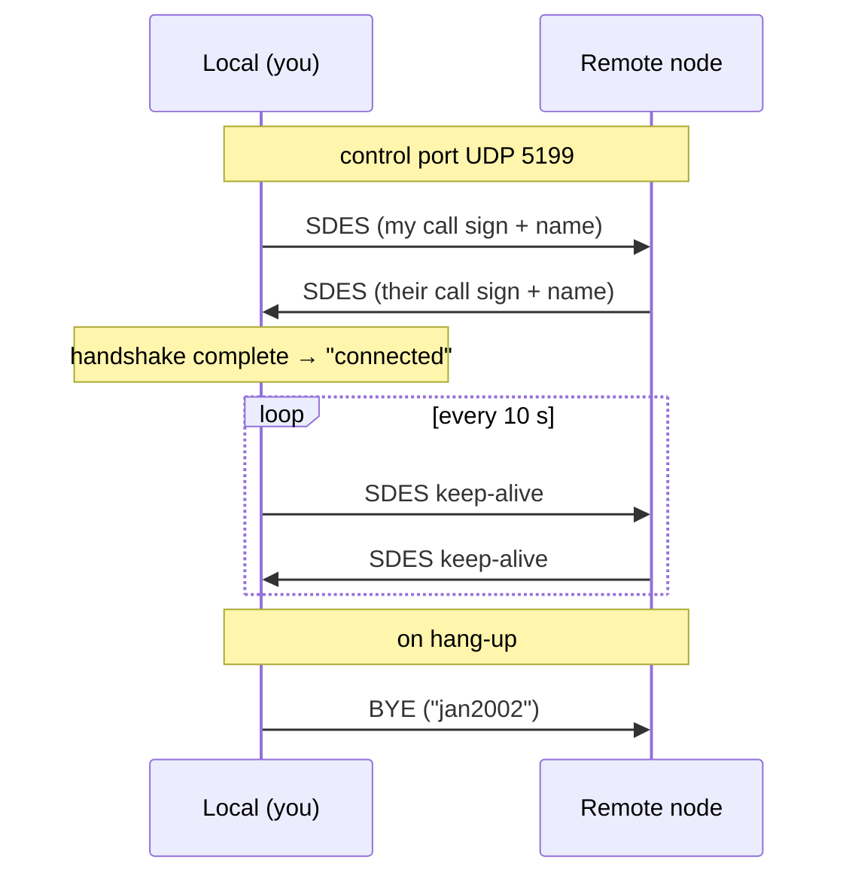

# Radio Over the Internet: Adding EchoLink to HTCommander

*How HTCommander joins the EchoLink network — the 20-year-old system that ties
repeaters, links, and operators together over the internet — without a repeater,
a soundcard interface, or a single line of C. This post walks the whole stack:
the GSM voice codec, the UDP/TCP ports, the directory login, the RTCP handshake
that opens a QSO, how voice and chat are wrapped, what the callsign suffixes and
node numbers mean, a NAT gotcha that quietly eats your audio — and how to get an
account and make your first connection.*

---

## What EchoLink is, and why put it in a radio app

[EchoLink](https://www.echolink.org) is one of amateur radio's oldest and most
widely used internet-linking systems. It lets licensed hams talk to each other
(and to internet-connected repeaters and reflectors) over ordinary IP networks:
your voice is digitized, shipped as UDP packets, and played out the other end —
which might be someone's laptop, a phone, or an RF repeater on the far side of
the planet. There are tens of thousands of nodes online at any moment.

HTCommander already knows how to move voice around: it decodes Bluetooth SBC
audio from Benshi handhelds, runs a software modem, resamples, records, and
transcribes. EchoLink is a natural fit — it's *another audio source and sink*,
just one that lives on the internet instead of on 2 metres. So we added it as a
first-class "radio" you can switch to inside the app, sitting right next to your
Bluetooth handhelds.

The whole implementation is pure Dart. There is no native EchoLink library
underneath — the protocol is simple enough (and old enough) that porting it
directly is the cleanest option. The core is a faithful port of the
[SvxLink](https://github.com/sm0svx/svxlink) project's `EchoLib`, which has been
the open-source reference for the EchoLink protocol for years.

---

## The shape of it: a radio that isn't a radio

Inside HTCommander every connected radio has a numeric **device ID**. Physical
Benshi handhelds get IDs starting at 1. EchoLink is registered as **device 200** —
a *pseudo-radio*. It never joins the real radio stack (no Bluetooth, no
transmit-lock arbitration, no channel memories on hardware), but it publishes the
same kind of state onto the app's internal event bus (the "Data Broker") so the
rest of the UI can treat it like any other radio: a display panel, an RSSI/TX
bar, a channel list, and the Comms tab all light up for it.



The layering, top to bottom:

- **`EchoLinkManager`** — the bridge to the app. It turns UI commands (*go
  online*, *connect*, *disconnect*, *transmit*) into client calls, re-emits
  received audio as recordable/transcribable events, and handles the sample-rate
  conversion between the app's engine and EchoLink.
- **`EchoLinkClient`** — orchestration. Logs into the directory, fetches the
  station list, and manages the connection lifecycle (`offline → online →
  connecting → inQso`).
- **`EchoLinkQso`** — the connection state machine for a single conversation
  ("QSO"), transport-agnostic so it can be unit-tested without real sockets.
- **`DartIoEchoLinkNetwork`** — the actual `dart:io` sockets.

---

## The codec: GSM 06.10, 8 kHz, 33 bytes at a time

EchoLink's default voice codec is **GSM 06.10 Full Rate** — the same codec that
carried early digital cellphone calls. It's ancient, it's lossy, and it's exactly
what we want here: it's tiny, cheap to run, and universally understood by every
EchoLink node in existence.

The numbers:

| Property | Value |
|---|---|
| Sample rate | 8 kHz, mono, 16-bit PCM |
| Frame size | 160 samples → **33 bytes** |
| Packet payload | 4 frames = 640 samples = **80 ms** of audio |
| Bit layout | "toast" format (the EchoLink/SvxLink convention) |

HTCommander ships its own pure-Dart GSM 06.10 encoder/decoder (a port of the
venerable `libgsm`, which also lives in the repo as a reference). Every voice
packet on the wire carries **four** GSM frames — 132 bytes of payload for 80 ms
of speech.

There's a sample-rate mismatch to bridge, though. HTCommander's internal audio
engine runs at **32 kHz**, while EchoLink is **8 kHz**. So the pipeline includes
a small linear resampler on each side:



The resampler keeps cross-chunk continuity (it remembers the last sample of the
previous block), so there are no clicks at the 80 ms packet boundaries.

---

## Ports and protocol: two UDP streams and a TCP directory

EchoLink uses three ports, and it's worth being precise about which does what:

| Port | Transport | Purpose |
|---|---|---|
| **5200** | TCP | Directory server — login, presence, station list |
| **5198** | UDP | Audio path — voice packets *and* text (info/chat) |
| **5199** | UDP | Control path — RTCP session description & keep-alives |

HTCommander binds the two UDP ports on `0.0.0.0` (all interfaces) and speaks TCP
to `servers.echolink.org:5200` for directory operations.

Notice the slightly surprising split: **text messages travel on the *audio*
port**, not the control port. The control port is purely RTCP — it carries the
session-description handshake and the periodic keep-alives that prove both ends
are still alive. Everything a human hears or reads — voice, station info, chat —
rides on 5198.

---

## Session setup, part 1: logging into the directory

Before you can call anyone you have to tell the directory server you exist. That
happens over TCP 5200 with a single `l` (login) command:

```
l<callsign><0xAC><0xAC><password><CR><status-line><CR><description><CR>
```

- The field separator is the byte `0xAC` (octal `\254`).
- The status line looks like `ONLINE3.38(HH:MM)`, `BUSY3.40(HH:MM)`, or
  `OFF-V3.40` to go offline.
- The description is your free-text location, e.g. *"Denver, CO"*.

The reply to a login is only a short `OK<version>` acknowledgement — and here's
a wrinkle that shapes the credential-check code: **a bad password is not reported
by the login itself.** The server accepts the TCP connection, sends `OK`, and
says nothing about whether your password was right.

The password check only *surfaces* on the next request. When you ask for the
station list with a bare `s` command, the server correlates the two requests by
source IP. After a good login you get the real (very large) directory; after a
bad-password login you get a small server-message block containing
`INCORRECT PASSWORD` — or, for a brand-new callsign, a *"being validated"*
message. HTCommander's credential tester leans on exactly this behaviour:



(The tester deliberately logs *off* first so an already-online session isn't
skipped by the server's IP-based cache, and logs off again at the end so a mere
credential test doesn't leave you falsely advertised as on the air.)

### The station list

The list response is a plain-text block:

```
@@@
<count> entries
callsign|status/location data|node-id|ip-address
callsign|status/location data|node-id|ip-address
...
+++
```

Each entry is tab/pipe-delimited into four fields: the **callsign**, a **data**
string that encodes online/busy status and location, the **node number**, and
the resolved **IP address**. HTCommander parses that into a `StationData` model
and sorts entries into users, links, repeaters, and conferences.

---

## Channel formats: reading a callsign

EchoLink packs a surprising amount of meaning into the callsign string itself.
HTCommander derives a station's *kind* purely from its suffix or prefix:

| Pattern | Kind | Meaning |
|---|---|---|
| `W1AW` | User | A person running EchoLink on a computer/phone |
| `W1AW-L` | Link | A simplex RF link into EchoLink |
| `W1AW-R` | Repeater | An RF repeater gateway'd to EchoLink |
| `*SOMETHING*` | Conference | A multi-user reflector (a "room") |

And every node also has a **node number** — a unique integer the directory
assigns (the third field in each list entry). That number is effectively the
node's phone number on the EchoLink network; you can dial a node by its number
even when you don't remember the callsign. HTCommander shows the node number in
the channel picker (you can search by it) and on the radio's LCD while connecting
or connected, right where a real radio prints it.

---

## Session setup, part 2: opening a QSO

Once you're online and pick a station, the actual conversation ("QSO") is set up
peer-to-peer over the two UDP ports — the directory server is out of the loop
from here on. The handshake is RTCP **SDES** (Session Description) packets on the
control port:



The state machine (`EchoLinkQso`) walks `disconnected → connecting → connected →
byeReceived → disconnected`, with two important timers:

- **Keep-alive every 10 s** — an SDES packet is re-sent as a heartbeat.
- **Connection timeout at 50 s** — if no packet arrives for 50 seconds, the
  connection is dropped as dead.

An incoming (remote-initiated) connection is the mirror image: the remote sends
SDES first, and we `accept()` by replying with our own SDES.

The **SDES** packet is RTCP, but with EchoLink's own idiosyncrasies:

- It's prefixed with a null RR (Receiver Report).
- The RTP version field is **3**, not the RFC-standard 2.
- It carries `CNAME`/`EMAIL` items that are the *literal string* `"CALLSIGN"`
  (not your actual callsign — a historical quirk), a `NAME` item that holds your
  real callsign left-justified in 15 characters followed by your name, and a
  `PHONE` item that is always `"08:30"` for reasons lost to time.

The **BYE** packet — also RTCP, also null-RR-prefixed — carries the magic
trailing string `"jan2002"` and signals a clean hang-up.

---

## Data encoding: what a voice packet looks like

Voice rides the audio port (5198) in an RTP-style packet with a 12-byte
big-endian header:

```
 byte  0      : version   0xC0     (RTP v3, EchoLink style)
 byte  1      : payload    0x03    (GSM;  0x96 = Speex)
 bytes 2-3    : sequence number    (16-bit)
 bytes 4-7    : timestamp          (32-bit)
 bytes 8-11   : SSRC               (32-bit)
 bytes 12..   : 4 × 33-byte GSM frames  = 132 bytes
```

So each datagram is 12 + 132 = 144 bytes and represents 80 ms of speech. The
transmit side buffers outgoing PCM and emits one of these every time it has 640
samples ready; a push-to-talk burst that ends mid-packet is zero-padded to a full
640 samples and flushed, so the last fraction of a word isn't clipped off.

---

## How chat (and station info) works

Text on EchoLink is not a separate protocol — it's a specially-tagged packet on
the **audio** port, distinguished from voice by its first bytes:

- **Info message**: `oNDATA\r` + the info text (newlines become `CR`) + a null
  terminator. This is how a node advertises its status/description — and, for a
  **conference**, it's the *live roster of who's connected and who's talking*.
  That roster is the only presence information EchoLink exposes for a room; it's
  free-form text, so HTCommander surfaces it verbatim behind an info button in the
  Comms tab.
- **Chat message**: `oNDATA<CALLSIGN>><message>\r\n` + a null terminator. It's
  parsed back into a callsign and a message body.

On the receive side these are routed to callbacks and, in HTCommander, dispatched
as `EchoLinkChat` events. That's important for one subtle reason we learned the
hard way: chat has to flow through the same `CommsHandler` path that records and
persists other text traffic. An early version dispatched the message straight to
the live UI — so you'd *see* the message, but it was never written to disk and
vanished on restart. Routing it as a proper `EchoLinkChat` event means the Comms
tab shows it **and** the history is saved.

---

## A NAT gotcha: "connected, but no audio"

Here's a finding worth its own paragraph, because it bites people on the real
hardware too. EchoLink needs inbound UDP on both 5198 and 5199. On the control
port, that's fine — you send SDES keep-alives every 10 s, which punches and holds
a NAT pinhole so the remote's SDES replies get back in. But a **receive-only**
listener never transmits voice, so it never sends anything on the *audio* port
(5198) — and the inbound NAT mapping for 5198 is never opened. The result:
control packets arrive, the QSO looks "connected"… and no audio is ever heard.

HTCommander does two things about this:

1. **Diagnostics.** The Debug tab logs when the first voice packet and the first
   control packet arrive from the remote, and warns (once per host) when packets
   show up from an *unexpected* IP — the classic NAT symptom where a node behind a
   router replies from a different address than the directory listed.
2. **An audio-port keep-alive.** On connect and on every 10 s keep-alive tick, the
   QSO sends a small *info* packet on the audio port. Because a listener now emits
   *something* on 5198, the inbound pinhole gets opened and held — so passive
   listening works even without port-forwarding, in many networks.

There's a matching UI nicety: HTCommander stays in the **"Connecting"** state (not
"Connected") until it has actually seen an inbound datagram on the audio port. The
control-port handshake can complete while audio is still blocked; gating the
"Connected" indication on real audio-port traffic means the UI only claims success
when audio can actually flow. For proper operation behind NAT the honest advice is
still to forward UDP **5198–5199** — but the info keep-alive makes casual
listening work without it more often than not.

---

## Setting up a new account

To use EchoLink you need a validated EchoLink account tied to your amateur
callsign. Here's the flow, entirely inside HTCommander's **Settings → EchoLink**
tab.

1. **Set your callsign.** EchoLink is keyed to your license. Enter your callsign
   on the license/settings tab first; the EchoLink account name follows it
   automatically. (No callsign, no EchoLink — the tab tells you so.)

2. **Have an account? Just add the password.** If you already have an EchoLink
   account, type its password into the **Password** field, optionally set your
   **Location** (this is the description other users see), and press **Test**. The
   test runs the login-then-list dance described above and reports back *valid*,
   *incorrect password*, or *being validated*.

3. **No account yet? Create one in-app.** Press **Create Account**. HTCommander
   asks for an **email address** and a **new password** (twice). It registers the
   callsign with the directory and stores the password for you.

4. **Validate on the web.** A newly created callsign still has to be validated by
   EchoLink — they verify you're really the license holder, which can take up to a
   day. HTCommander offers to open the validation page for you with your callsign
   and email pre-filled:

   ```
   https://www.echolink.org/validation/?callsign=<YOURCALL>&email=<youremail>
   ```

   Until validation completes, a credential test comes back as *"being
   validated"* rather than *valid* — that's expected, not an error.

5. **Go online and connect.** Once validated, switch the app's active radio to
   **EchoLink**, press **Go Online**, and you'll get the live directory. Search by
   callsign, location, **or node number**, pick a station, and connect. The LCD
   shows *Connecting…* with the node number, then the station once audio is
   flowing. Tap the lit channel again to disconnect (or to cancel a connection
   that's taking too long).

> **One account, one place at a time.** EchoLink ties a session to your callsign.
> If you're logged in elsewhere (say the official EchoLink app), logging in from
> HTCommander will take over the session. That's also why the credential test
> politely logs itself back *off* when it's done.

---

## Wrapping up

EchoLink is a lovely example of a protocol that's simple enough to port cleanly
and old enough to be rock-solid: GSM frames in RTP-ish packets on one UDP port,
RTCP SDES/BYE on another, a plain-text TCP directory in front, and text tucked in
alongside the audio. The interesting engineering wasn't any single piece — it was
making an *internet* audio source behave like just another radio in the app
(device 200, same event bus, same Comms tab, same recording and transcription),
and handling the real-world rough edges: the sample-rate bridge, the NAT pinhole
that silently eats receive audio, persisting chat the same way as everything else,
and only saying "Connected" when audio genuinely arrives.

If you've got a validated callsign, it's a couple of fields in Settings away.
73!

---

**Related:** [Voice pipeline](../Voice.md) ·
[GSM codec reference](../../reference/libgsm/)
