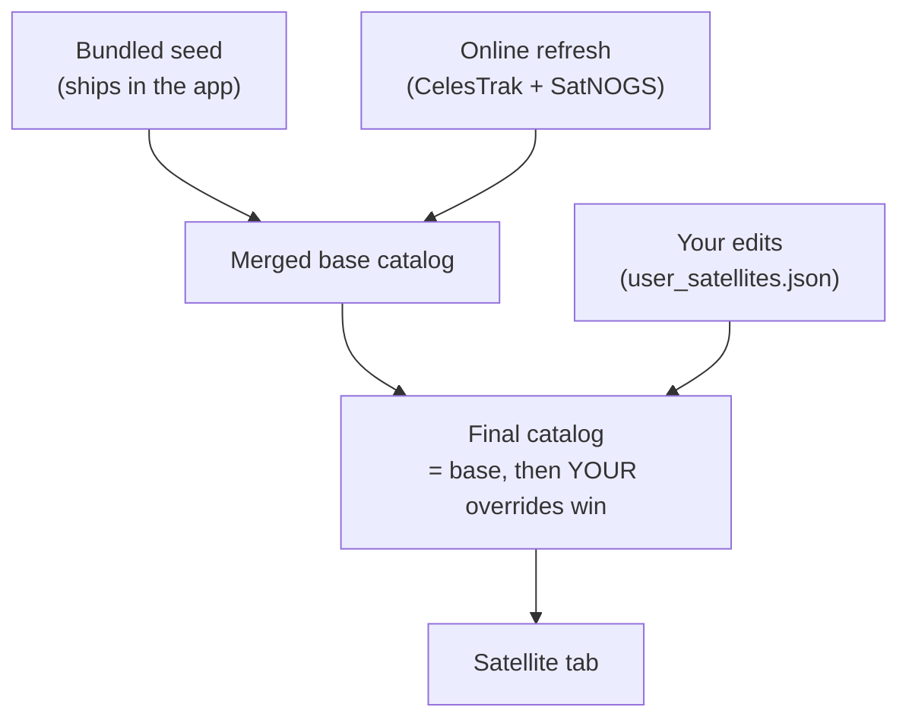

# Bring Your Own Birds: Editing, Importing and Exporting Satellite Data

*HTCommander's Satellite tab ships with a curated catalog of FM "easy sats" that
refreshes itself from the internet. But sometimes you want your own: a bird that
isn't in the list yet, a corrected frequency, an extra usage, or a private
working set you can share with a club. This post covers the new **editing**
features — add, edit and delete satellites and their frequencies — the
precedence rules that keep your changes safe across online refreshes, and the
JSON **import/export** format so you can back up or share a whole catalog.*

---

## What you can do now

Open the **Satellite** tab and every bird is now editable:

- **Add a satellite** — paste a Two-Line Element set (TLE) and add one or more
  usages (frequencies).
- **Edit a satellite** — change its name, its orbit, or any of its usages.
- **Delete a satellite** — hide a bird you never work.
- **Add / edit / delete usages** — a single satellite can carry several
  frequencies (an FM repeater, an APRS digipeater, an SSTV downlink, a crew-voice
  channel…). Each is editable on its own.
- **Restore to default** — throw away your edits for a bird and go back to the
  online/seed data.
- **Import / Export** — save the whole catalog to a JSON file, or load one.

All of this lives behind the tab's header **menu** (Add / Import / Export) and
the selected satellite's **detail header** (an *Edit* pencil and a "⋮" overflow
with *Restore to default* and *Delete*). The edit dialogs are **responsive**:
they open as a comfortable centered box on the desktop and expand to fill the
screen on a phone, so the same forms work well with a mouse or a thumb.

---

## The shape of a satellite

A satellite in HTCommander is two things bolted together:

1. **An orbit** — a standard **TLE** (Two-Line Element set): a name plus two
   fixed-format lines that encode the orbit. This is what the SGP4 propagator
   turns into a live position, and it's what you paste from CelesTrak or AMSAT.

2. **A list of usages** — each usage is one way to *use* the bird, with its own
   frequencies. A usage carries:

   | Field | Meaning |
   |---|---|
   | `usage` | What it's for: `Repeater`, `APRS`, `SSTV`, `Voice`, `Beacon`, … |
   | `downlinkHz` | Satellite → ground, the frequency you **receive** on |
   | `uplinkHz` | Ground → satellite, the frequency you **transmit** on (blank = receive-only) |
   | `mode` | Modulation, normally `FM` |
   | `ctcssHz` | The sub-audible CTCSS tone the uplink needs, or none |
   | `inverting` | Linear-transponder inversion (leave off for FM repeaters) |
   | `status` | `active` / `inactive` |
   | `infoUrl` | An optional helpful link, shown as an open-in-browser button |

In the app you type frequencies in **MHz** (e.g. `437.800`); they're stored
internally in **Hz**. A usage with no uplink is treated as **receive-only** — the
tab labels it "Receive only" and the tracker won't try to transmit.

---

## Editing in the app

### Add a satellite

Header **menu → Add satellite…**. Give it a name, paste the two TLE lines, and
add at least one usage:

- The dialog validates the TLE as you type — line 1 must start with `1 `, line 2
  with `2 `, and the pair must parse to a NORAD catalog number (shown live under
  the fields).
- **Add** opens the usage editor; repeat it for each frequency the bird offers.
- **Save** puts the bird in your list immediately.

> **Where do I get a TLE?** From [CelesTrak](https://celestrak.org/NORAD/elements/)
> (the *amateur* group is a good start) or [AMSAT](https://www.amsat.org/). Copy
> the two `1 …` / `2 …` lines exactly — they're column-sensitive.

### Edit an existing bird

Select it, tap the **Edit** pencil in the detail header. Change the name, correct
a frequency, add an SSTV downlink, delete a usage you don't care about — then
**Save**.

### Delete / Restore

The **⋮** overflow menu in the detail header has **Delete satellite** (with a
confirmation) and **Restore to default**. Deleting hides the bird; restoring
throws away your edits *and* un-hides it, bringing back whatever the online
catalog and bundled seed provide.

---

## Why your edits don't get clobbered

The catalog has three sources, and they're layered by precedence. The important
promise: **your edits always win, and an online refresh never overwrites them.**



Concretely:

- A satellite you've **edited or added** replaces the online/seed usages entirely
  and **always appears** — even a receive-only bird the radio can't transmit to.
- Its **orbit** is *pinned* to your pasted TLE only when you added the bird or
  actually changed the TLE lines. If you edited *only* frequencies, the orbit
  keeps **auto-updating** from the live CelesTrak TLE, so your bird doesn't drift
  out of date.
- A satellite you **deleted** stays hidden, even after a refresh brings it back
  from SatNOGS.
- **Restore to default** drops your override so that bird follows the online data
  again.

This is why a background refresh — which pulls fresh orbital elements and
transponders every couple of hours / day — can safely run without touching your
customizations.

---

## The import / export format

**Export satellites…** writes your entire current catalog to a JSON file;
**Import satellites…** reads one back and applies every satellite in it as your
own override. It works everywhere: on the desktop you pick a path, on the web or
a phone you get a normal save/share sheet.

The file is plain, human-readable JSON. The top level is a version tag and a list
of satellites; each satellite is a `tle` block plus a `transponders` list:

```json
{
  "version": 1,
  "satellites": [
    {
      "tle": {
        "name": "ISS (ZARYA)",
        "noradId": 25544,
        "line1": "1 25544U 98067A   26209.15252568  .00010831  00000+0  20282-3 0  9992",
        "line2": "2 25544  51.6320  97.3682 0007093 345.6120  14.4666 15.49220842578109"
      },
      "transponders": [
        {
          "noradId": 25544,
          "name": "ISS Cross-band FM Repeater",
          "usage": "Repeater",
          "uplinkHz": 145990000,
          "downlinkHz": 437800000,
          "mode": "FM",
          "ctcssHz": 67.0,
          "inverting": false,
          "status": "active",
          "infoUrl": "https://www.ariss.org/contact-the-iss.html"
        },
        {
          "noradId": 25544,
          "name": "ISS SSTV",
          "usage": "SSTV",
          "uplinkHz": null,
          "downlinkHz": 437550000,
          "mode": "FM",
          "ctcssHz": null,
          "inverting": false,
          "status": "active",
          "infoUrl": "https://www.ariss.org/upcoming-sstv-events.html"
        }
      ]
    }
  ]
}
```

A few notes on the fields:

- **Frequencies are in Hz** in the file (`145990000` = 145.990 MHz). The app does
  the MHz⇄Hz conversion for you in the editor; the file stores Hz.
- `uplinkHz: null` marks a **receive-only** usage (SSTV, beacons).
- `ctcssHz: null` means **no tone**.
- Every transponder repeats its `noradId` so a usage is self-describing; the app
  re-keys them to the satellite's TLE on save, so you don't have to keep them in
  sync by hand.

### The on-disk store (advanced)

Behind the scenes your edits live in a file called **`user_satellites.json`**, in
HTCommander's application-support folder under `HTCommander/Satellites/`. It's the
same shape as an export, with two extra bits the app uses to enforce precedence:

```json
{
  "version": 1,
  "satellites": [
    { "tle": { … }, "transponders": [ … ], "orbitPinned": true }
  ],
  "hidden": [43678]
}
```

- **`orbitPinned`** — `true` when your pasted TLE is authoritative; `false` when
  only the frequencies are yours and the orbit should keep tracking CelesTrak.
- **`hidden`** — NORAD ids you deleted, suppressed from the catalog across
  refreshes.

You can edit an exported file by hand and import it — it's just JSON. An import
merges its satellites in as overrides and honors any `hidden` list, so it's a
tidy way to share a **club working set**: export on one machine, send the file,
import on another.

---

## Tips

- **Only changing a frequency?** Don't touch the TLE lines. Leaving them as-is
  keeps the orbit auto-updating while your frequency correction sticks.
- **Adding a brand-new bird?** Grab a fresh TLE — orbital elements go stale in
  weeks, and an old TLE means the pass times will be wrong.
- **Sharing a catalog?** Export, hand-check the JSON if you like, and import on
  the other end. The format is stable and versioned.
- **Made a mess?** *Restore to default* on a bird, or delete
  `user_satellites.json` to reset every customization back to the shipped seed and
  online data.

---

*Related:*
[Working the Birds: Amateur Satellite Support in HTCommander](satellite-tracking.md)
