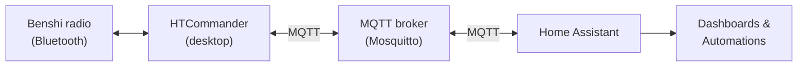
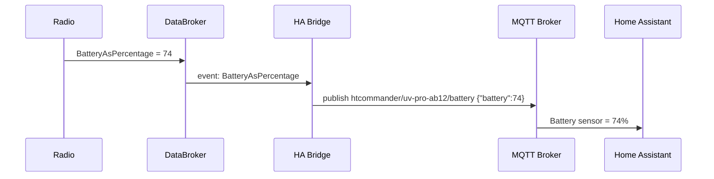
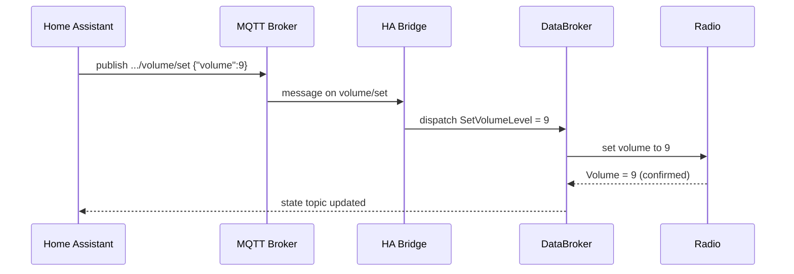

# Your Radio, on the Dashboard: Home Assistant Integration over MQTT

*How HTCommander turns a Benshi handheld into a first-class Home Assistant
device — battery, GPS, volume, squelch, scan, channels, and incoming APRS
messages — using nothing but an MQTT broker and Home Assistant's own
auto-discovery. And how to set it up in a couple of minutes.*

---

## The idea

Home Assistant is the hub a lot of people already run for everything else in
their shack and their house — lights, sensors, automations, dashboards. A radio
sitting on the desk is just another device worth watching: *What's the battery
at? Is GPS locked? Which channel is it on? Did an APRS message just come in for
me?* And, when you want it, worth **controlling**: nudge the volume, change the
squelch, flip on scan, switch channels — from a dashboard, a phone, or an
automation.

HTCommander already talks to the radio over Bluetooth and already has a tidy
internal event bus. Home Assistant already speaks MQTT and knows how to
auto-create devices from it. So the integration is mostly a **bridge**: take the
radio state HTCommander already has, publish it to MQTT in the shape Home
Assistant expects, and turn inbound MQTT commands back into radio actions.

This post explains how that bridge works and how to turn it on.

> **Desktop only.** The Home Assistant bridge runs on the desktop builds of
> HTCommander — **Windows, Linux, and macOS**. It is intentionally left out of
> the iOS and Android builds, which don't run a background MQTT client.

---

## What you get in Home Assistant

Once it's connected, **each radio you have connected in HTCommander shows up as
its own device** in Home Assistant. Connect two radios and you get two devices,
each with its own entities. The entities map straight onto the things you'd
otherwise reach for in the app:

| Entity | Home Assistant type | Direction |
|---|---|---|
| Battery | Sensor (`%`) | Monitor |
| Firmware version | Sensor | Monitor |
| GPS position (lat / lon / altitude / lock) | Sensors | Monitor |
| Incoming APRS message | Sensors | Monitor |
| Volume | Number (0–15) | **Control** |
| Squelch | Number (0–15) | **Control** |
| Scan | Switch | **Control** |
| Dual Watch | Switch | **Control** |
| GPS | Switch | **Control** |
| VFO A / VFO B channel | Select | **Control** |
| Region | Select | **Control** |

Monitor entities update live as the radio reports new state. Control entities
send the change back down to the radio the moment you flip them in Home
Assistant — the same code paths the HTCommander UI uses.

When a radio disconnects from HTCommander, its Home Assistant entities go
**unavailable** (greyed out) rather than reporting stale values; they come back
when the radio reconnects.

---

## How it works

### MQTT in one paragraph

MQTT is a lightweight publish/subscribe protocol. Clients connect to a central
**broker** (Home Assistant users almost always run the *Mosquitto* add-on) and
either **publish** messages to a *topic* (a slash-separated string like
`htcommander/uv-pro-ab12/battery`) or **subscribe** to topics to receive them.
HTCommander is one such client; Home Assistant is another. They never talk to
each other directly — the broker sits in the middle.



### Auto-discovery: no YAML required

The classic pain of MQTT integrations is hand-writing entity definitions in
Home Assistant's `configuration.yaml`. Home Assistant solved this with **MQTT
Discovery**: a device announces itself by publishing a small JSON *config*
message to a well-known `homeassistant/.../config` topic, and Home Assistant
creates the entity automatically.

HTCommander does exactly that. For each connected radio it publishes one
discovery message per entity. A battery sensor, for example, looks like this:

```jsonc
// topic: homeassistant/sensor/htcommander_ab12_battery/config
{
  "name": "Battery",
  "state_topic": "htcommander/uv-pro-ab12/battery",
  "unique_id": "htcommander_ab12_battery",
  "device": {
    "identifiers": ["htcommander_ab12"],
    "name": "UV-Pro (AB:12)",
    "manufacturer": "Benshi",
    "model": "UV-Pro"
  },
  "unit_of_measurement": "%",
  "value_template": "{{ value_json.battery }}",
  "icon": "mdi:battery"
}
```

The shared `device` block is what groups every entity under a single card in
Home Assistant. The `unique_id` and the device `identifiers` are derived from the
**radio's Bluetooth address**, so a given radio always maps to the same Home
Assistant device — even across restarts — and two radios never collide.

Discovery messages are published **retained**, so Home Assistant remembers your
radios after a reboot of either side.

### State: from the radio to the dashboard

Internally, HTCommander is built around a small pub/sub event bus called the
**DataBroker**. Every part of the app — the radio driver, the UI, the web
server, the AGWPE server — talks through it instead of calling each other
directly. When the radio reports a new battery level, GPS fix, volume, or
channel, that update is dispatched on the DataBroker as a named event.

The Home Assistant bridge is just another DataBroker subscriber. It listens for
the state events it cares about and republishes them to the matching MQTT state
topic:



The payloads are small JSON objects (`{"battery": 74}`) and the discovery
config's `value_template` pulls the field out — a convention borrowed directly
from the reference implementation, and one that keeps related values grouped on
one topic (e.g. all GPS fields on a single `gps_position` topic).

### Control: from the dashboard to the radio

Control entities carry an extra **command topic**. When you move the Volume
slider in Home Assistant, it publishes to `.../volume/set`; HTCommander is
subscribed to that topic, and on receipt it dispatches the very same DataBroker
command the app's own UI would send — which the radio driver turns into a
Bluetooth command to the handheld.



Because control flows back through the same DataBroker events the UI uses, Home
Assistant and the HTCommander window stay in sync automatically: change the
volume in the app and the dashboard follows; change it on the dashboard and the
app follows.

### Staying off mobile

The bridge relies on a background MQTT client that opens a plain TCP socket
(`dart:io`). That's fine on desktop but undesirable on phones, so the MQTT
client is wired behind a small platform facade — the real socket-backed
implementation on desktop, an inert stub elsewhere — and the bridge itself is
only ever started on Windows, Linux, and macOS. The mobile builds compile
cleanly and simply never carry the feature. It's the same pattern HTCommander
already uses for its desktop-only Web and AGWPE servers.

---

## Setting it up

### 1. Have an MQTT broker

If you already run Home Assistant, the easiest path is the **Mosquitto broker**
add-on:

1. In Home Assistant, go to **Settings → Add-ons → Add-on Store**.
2. Install **Mosquitto broker** and start it.
3. Create a Home Assistant user for the radio (e.g. under **Settings → People**,
   or a dedicated MQTT user), and note its **username and password** — that's
   what HTCommander will log in with.
4. Make sure the **MQTT integration** is added in Home Assistant (**Settings →
   Devices & Services → Add Integration → MQTT**). This is what listens for the
   auto-discovery messages.

The broker listens on TCP port **1883** by default.

> No Home Assistant yet? Any MQTT broker works for testing — a local Mosquitto
> install, or a public test broker — but auto-discovery only produces devices
> when Home Assistant's MQTT integration is watching the same broker.

### 2. Point HTCommander at the broker

1. Open HTCommander on a desktop machine.
2. Open **Settings** and select the **Servers** tab.
3. In the **Home Assistant** section:
   - Tick **Enable Home Assistant**.
   - **MQTT URL** — your broker, e.g. `mqtt://homeassistant.local:1883`
     (or the broker machine's IP, e.g. `mqtt://192.168.1.50:1883`).
   - **Username** and **Password** — the MQTT credentials from step 1.
4. Click **Test** to confirm HTCommander can reach the broker and log in. A green
   message means you're good; a red one tells you what failed (bad address,
   refused connection, wrong credentials).
5. Save.

### 3. Watch the devices appear

Connect a radio in HTCommander as usual. Within a few seconds Home Assistant
creates a device for it:

- **Settings → Devices & Services → MQTT** will list a new device named after the
  radio (e.g. *UV-Pro (AB:12)*).
- Open it to see all the entities — battery, GPS, volume, squelch, scan, channel
  selects, and the rest — ready to drop onto a dashboard or wire into an
  automation.

Connect a second radio and a second device appears alongside it.

---

## A couple of things you can do with it

- **A dashboard card** showing battery, current channel, and GPS lock for every
  radio in the shack at a glance.
- **A low-battery automation** — notify your phone when any radio drops below
  20%.
- **APRS-triggered automations** — flash a light or send a notification when an
  APRS message addressed to your station arrives.
- **Scheduled scan** — turn on scan in the evening and off in the morning.

---

## Status & caveats

- The bridge is **desktop-only** (Windows / Linux / macOS) by design.
- Credentials are stored with the rest of HTCommander's settings; treat the
  machine running it as trusted, and prefer a dedicated, least-privilege MQTT
  user.
- MQTT here is **unencrypted** by default (plain 1883). On a home LAN that's the
  norm; if you're crossing untrusted networks, front the broker with TLS.
- The entity set mirrors what the radio exposes today. As HTCommander learns to
  read or control more of the radio, new entities can be added to the bridge
  without any change on the Home Assistant side — that's the whole point of
  auto-discovery.

---

*This post describes the Home Assistant integration as it's being built. The
NodeJS proof-of-concept it grew out of lives in
[`reference/HtStation`](../../reference/HtStation); the HTCommander version folds
the same discovery-and-bridge idea into the app's DataBroker and multi-radio
model.*
