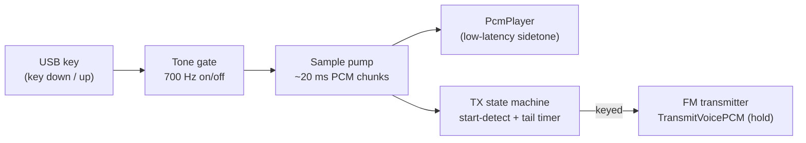

# Keying by Hand: Morse Key Support in HTCommander

*How HTCommander lets a skilled CW operator plug in a USB morse key — straight or
paddle — and send real, hand-timed Morse over an ordinary FM handheld. This post
covers why FM Morse is a different animal from classic CW, how we key an FM
carrier that has no notion of "key down," how a USB key shows up as a keyboard
and which keys we bind, the iambic keyer and sidetone, the start/stop logic that
keeps FM transmit from stuttering between your dits, and how we decode your own
sending back into a chat bubble.*

---

## Why this is not normal CW

On a traditional CW rig, "sending Morse" is almost literally what it sounds like:
your key shorts a line, the transmitter emits an unmodulated carrier at your
operating frequency, and when you lift the key the carrier stops. The dits and
dahs *are* the RF. The receiving operator's radio beats that carrier against a
local oscillator (the BFO) to produce the familiar tone in the headphones. It's
an on/off-keyed continuous wave — hence **CW**. There is no audio involved on the
transmit side at all; the shape of your fist is the shape of the emission.

A Benshi handheld (and the whole class of radios HTCommander talks to) does none
of that. It is an **FM voice** radio. It has no CW mode, no BFO, no key jack, and
no way to emit a bare carrier that switches on and off. What it *can* do is
transmit audio: you push it a stream of PCM over the Bluetooth SBC link and it
FM-modulates that audio onto the carrier.

So to send Morse through it, we don't key the carrier — we **key a tone inside
the audio**. HTCommander generates a 700 Hz sine wave, switches that tone on and
off in the Morse pattern, and transmits it as ordinary FM voice audio. On the
receiving end, anyone listening on an FM radio simply *hears* the beeping tone
directly out of their speaker — no BFO, no CW filter, no zero-beating. It sounds
exactly like whistling Morse into the microphone, except the "whistle" is a clean
computer-generated tone with textbook timing.

| | Classic CW | FM Morse in HTCommander |
|---|---|---|
| What is emitted | On/off-keyed RF carrier | Constant FM carrier + on/off-keyed **audio tone** |
| Receiver needs | BFO / CW mode to hear a tone | Nothing — plain FM, tone is audible |
| "Key down" means | Carrier on | Transmitter keyed **and** tone present in audio |
| Bandwidth | Very narrow (CW) | Full FM voice channel (~12.5–25 kHz) |
| Your fist controls | The RF directly | An audio gate feeding the modulator |

This is closer to **MCW** (Modulated CW) than to true CW, and it's the honest way
to do it on a voice-only radio.

---

## The hard part: FM has no "key up"

The interesting engineering problem isn't the tone — it's *when to transmit*.

On a CW rig the transmitter follows the key instantly and effortlessly, thousands
of times a minute, because keying the carrier is a near-instant hardware event.
An FM handheld is the opposite. Getting it to transmit means keying up the whole
FM transmitter: PLL lock, TX/RX switch, and — over Bluetooth — spinning up the
SBC audio stream and pushing it across the link with buffering. That is *far* too
slow and too abusive to do once per dit. If we tried to key the FM transmitter on
every "key down" and unkey it on every "key up," we'd machine-gun the PTT dozens
of times a second, mangle the timing, and hammer the radio.

So HTCommander decouples the two ideas:

- **Your key** controls the *tone gate* — whether the 700 Hz tone is currently
  sounding inside the audio stream.
- A separate state machine controls the *FM transmitter* — whether the radio is
  keyed up at all.

The rule is: **key up the FM transmitter once at the start of a "transmission,"
keep it keyed through the whole exchange (sending silence between elements), and
only drop it after you stop keying for a configurable idle time.** Between your
dits and dahs the carrier stays up and we simply transmit the gaps as silence —
just as if you were whistling Morse continuously into the mic.

### Starting a transmission

Because keying the FM transmitter is expensive, we don't do it the instant you
brush the key. Instead there's a deliberate **start gesture** that arms the
transmitter:

- **Straight key:** *two quick taps.* A distinct little "rat-tat" that you'd
  never do by accident. The transmitter keys up the moment the **second tap is
  released** — so you finish the gesture on an up-stroke, with the key open,
  ready to send.
- **Paddle:** *press both paddles, then release them together.* Squeeze both
  levers and let go at the same time (within ~150 ms). Nothing sounds and the
  keyer does no processing while you're holding them — the transmission starts
  cleanly on the release, so the squeeze never leaks a stray dit or dah.

The moment the start gesture completes, the transmitter keys up and the sample
pump begins streaming audio. From then on your keying produces tone, and the gaps
produce silence — all inside one continuous FM transmission. The gesture itself is
*swallowed*: it never goes out as tone, so your first real element is the first
thing on the air.

### Stopping a transmission

We can't watch for a "key up" to end things, because in Morse the key is up most
of the time. Instead there's a **tail timeout**: if you don't key anything for a
configurable number of milliseconds (your inter-word gap plus a margin), the state
machine decides you're done, finishes the audio, and drops the FM transmitter.
Set it too short and it'll unkey between words; set it too long and it'll hang on
after your last dah. It's exposed in settings so you can tune it to your fist.

---

## USB keys look like keyboards

Modern USB morse-key adapters (and many home-brew ones) don't present as a serial
device or a sound-card interface — they enumerate as a **USB HID keyboard**. When
you press the key, the adapter "types" a key down; when you release it, it sends
the matching key up. That's wonderfully convenient: HTCommander doesn't need a
driver, a COM port, or platform-specific USB code. It just listens for key
events while the Morse Key panel has focus, exactly the same way the PTT mode
already watches the space bar.

The common adapters map to one of two key groups, so those are what we bind:

| Physical input | Bound keys |
|---|---|
| Contact / lever A | **`[`** (left bracket) **or** **Left Ctrl** |
| Contact / lever B | **`]`** (right bracket) **or** **Right Ctrl** |

### Key bindings by key type

- **Straight key** — a single contact. Maps to **one** key of your choice: `[`,
  `]`, Left Ctrl, or Right Ctrl. Key down = tone on, key up = tone off. You
  supply all the timing with your hand; HTCommander just gates the tone.

- **Paddle key** — two levers (dit and dah). Rather than assign two keys
  separately, you pick the **pair** the adapter uses — **`[` and `]`** or **Left
  and Right Ctrl** — and, by convention, the left key is dits and the right key
  is dahs. A **Reverse paddles** checkbox swaps that for a left-handed layout.
  The app turns lever presses into properly-timed dits and dahs for you.

Because these are just key events, you can also test the whole feature with your
computer keyboard before any hardware arrives — press `[` and `]` and it behaves
exactly like a key plugged in.

---

## The paddle keyer

A straight key is a pass-through: the tone follows your hand. A paddle is more
interesting, because a paddle doesn't send finished elements — it sends
*intentions*. Hold the dit lever and you want a stream of dits; hold the dah lever
and you want dahs. Turning those into correctly-timed Morse is the job of a
**keyer**, and HTCommander implements an **iambic (Mode B)** keyer:

- Holding one lever repeats that element (dit or dah) with correct **1-unit**
  spacing between elements.
- Squeezing **both** levers alternates dit-dah-dit-dah… for as long as you hold.
- Mode B adds the extra element after you release a squeeze, the behaviour most
  experienced iambic ops expect.

All element timing derives from a single speed setting in **words per minute
(WPM)**, using the ITU standard where one "unit" (a dit) is `1.2 / WPM` seconds:

| Element | Length |
|---|---|
| Dit | 1 unit |
| Dah | 3 units |
| Gap between elements | 1 unit |
| Gap between letters | 3 units |
| Gap between words | 7 units |

WPM only applies to paddle keys — a straight key is timed entirely by the
operator, so there's nothing to set.

---

## Hearing yourself: the sidetone

Morse is sent by ear as much as by hand, so a responsive **sidetone** is
essential. Here's the catch: the audio path *to the radio* is deliberately
buffered. HTCommander runs its transmit stream about a second ahead of real time
to keep the SBC/Bluetooth link fed smoothly. If your only monitor was that
transmitted audio, you'd hear your own dits a beat late and it would be unusable.

So the Morse Key handler owns its **own local audio player** and feeds it the
generated tone directly, with a tiny buffer, independent of the transmit pacing.
You hear your sending in near-real time no matter how far ahead the radio stream
is running. In **Live** mode the same PCM goes two places at once: straight to
your speakers for the sidetone, and into the (buffered) transmit stream for the
radio — sent with the monitor path switched *off* on the radio side
(`playLocally: false`) precisely so the delayed copy never doubles up on your ear.

---

## Under the hood

The feature is one handler plus a small pure-Dart model, wired to the rest of the
app through HTCommander's internal event bus (the "Data Broker"):

- **`MorseKeyHandler`** ([lib/handlers/morse_key_handler.dart](../../src/lib/handlers/morse_key_handler.dart))
  — the state machine, the real-time sample pump, and the tone generator. It owns
  the sidetone `PcmPlayer` and drives the transmitter.
- **`IambicKeyer` + `MorseKeySettings` + `MorseDecoder`** ([lib/radio/morse_keyer.dart](../../src/lib/radio/morse_keyer.dart))
  — deliberately free of Flutter and `dart:io` so the keyer's timing/memory logic
  and the decoder can be unit-tested without a radio, a screen, or a sound card.
- **The Comms tab** ([lib/widgets/comms_tab.dart](../../src/lib/widgets/comms_tab.dart))
  — adds the `morseKey` mode, the bottom panel, and the keyboard capture that
  turns key events into Data Broker messages.

The messages that flow between them:

| Event | Direction | Payload |
|---|---|---|
| `MorseKeyMode` | panel → handler | `off` / `test` / `live` + the target radio id |
| `MorseKeyInput` | panel → handler | `primary` / `secondary`, `down: true/false` |
| `MorseKeySettings` | dialog → handler | the persisted key configuration |
| `MorseKeyState` | handler → panel | `transmitting`, `keyDown` (for the indicator) |
| `TransmitVoicePCM` | handler → radio | 16-bit PCM chunk + `hold` flag (Live only) |
| `MorseKeyDecoded` | handler → Comms | the decoded text, at the end of a Live run |

### Generating the tone

The pump runs on a 20 ms timer, but it doesn't just emit a fixed 20 ms of audio
each tick — timer callbacks jitter, and drift would wreck your keying. Instead it
keeps a running sample count against a stopwatch and generates *exactly* enough
samples to catch the audio clock up to the wall clock. The output is 16-bit
signed mono at 32 kHz — the format the radio audio path expects.

Two details keep it clean:

- **Phase continuity.** The 700 Hz sine keeps its phase across chunk boundaries,
  so there's no discontinuity (and no click) where one 20 ms block meets the next.
- **An envelope ramp.** Switching a full-amplitude tone on or off instantly
  produces a broadband click (a key-click, ironically). So each tone edge is
  ramped over ~5 ms with a short attack/decay envelope. The peak amplitude is
  also kept well below full scale so the tone doesn't over-deviate the FM
  transmitter.

For a paddle, the pump doesn't ask "is a key down?" every sample — it consumes
timed *segments*. When the current segment runs out it asks the `IambicKeyer` for
the next element, lays down that many samples of tone (1 unit for a dit, 3 for a
dah), then a 1-unit gap, and repeats. That's what turns lever *intentions* into
perfectly-timed elements. A straight key skips all of that: the tone simply
follows the contact, sample for sample.

---

## Off / Test / Live

The Morse Key panel sits at the bottom of the **Comms** tab and has one exclusive
mode selector plus a settings button:

- **Off** — the key does nothing. (You're just in the Comms tab.)
- **Test** — the key is live *locally only*. You hear the sidetone and can see
  the activity indicator, but **nothing is transmitted**. This is how you verify
  your key works, check your mapping, and warm up your fist without going on the
  air.
- **Live** — the real thing. Local sidetone **and** FM transmission to the
  connected radio, with the start-gesture and tail-timeout logic managing the
  transmitter.

You can only be in one of these at a time. The panel shows a live indicator that
lights up whenever a key is down and whenever the handler is actively generating
audio, and while a transmission is active the whole panel tints **light red** so
it's unmistakable that PCM is going out. The status line doubles as a coach: when
you're armed but idle it tells you how to start (*"Two quick taps to start"* or
*"Release both paddles at the same time to start"*), and once you're keying it
reads *"Testing"* or *"Transmitting."*

---

## Reading your own fist: decoding to a chat bubble

Here's a nice side effect of generating the Morse ourselves: we know exactly what
you keyed, so we can *decode it back to text*. As you send, a small decoder
watches the mark (tone-on) and space (tone-off) durations and reconstructs the
characters — a dit is about one unit, a dah three, a one-unit gap separates
elements, three units a letter, seven a word. For a paddle the timing is exact
(it comes straight from the WPM setting); for a straight key the decoder tracks
your dit length adaptively so a hand-sent fist still resolves.

When a **Live** transmission ends, if anything decoded, HTCommander drops a
send-side chat bubble into the Comms tab with the message you just sent — the same
kind of bubble the text-based Morse mode produces, recorded in history so it
persists. Test mode still decodes (handy for checking your sending), but doesn't
post a bubble, because nothing actually went on the air.

---

## The settings dialog

The gear icon on the panel opens a dialog to set the key up:

- **Key type** — Straight or Paddle.
- **Key mapping** — for a straight key, the single key your adapter sends (`[`,
  `]`, Left Ctrl, or Right Ctrl); for a paddle, the key *pair* (`[` and `]`, or
  Left and Right Ctrl) plus a **Reverse paddles** checkbox.
- **Live key indicator** — an icon that changes state as you press the physical
  key, so you can confirm the adapter and mapping are correct *right there in the
  dialog*, before you go near the radio.
- **Speed (WPM)** — paddle keyers only; sets the dit/dah timing.
- **Transmit tail** — how long to keep the FM transmitter keyed after your last
  element before dropping it. Tune this to sit comfortably above your inter-word
  gap.

---

## Putting it together

The whole point is to let people who are genuinely skilled at CW use that skill on
a modern FM handheld — no CW rig, no key jack, no soundcard interface. Plug a USB
key into the computer, pick your key type and mapping, and send. HTCommander turns
your hand-timed dits and dahs into a clean 700 Hz tone, gates it into the FM audio
stream, manages the expensive job of keying the transmitter so you don't have to
think about it, and gives you a tight local sidetone so it *feels* like a real
key — while what actually goes out is plain, everybody-can-hear-it FM Morse.

---

## What works, and what's next

Honest ledger, because this series keeps one. What's in and tested:

- The straight-key and paddle paths, the iambic (Mode B) keyer with dit/dah
  memory, the tone generator, the decoder (paddle-exact and straight-key
  adaptive), and the Off / Test / Live plumbing are all wired, and the keyer,
  settings, and decoder logic are covered by unit tests.
- Both start gestures fire on release (the second straight-key tap, or both
  paddles let go together) and are swallowed, so nothing leaks onto the air
  before your first real element.
- Test mode plays a local sidetone with nothing on the air; Live mode keys the
  radio, monitors locally, and drops a decoded send-side bubble when you finish;
  the tail timeout drops the transmitter.

What we still want to prove or refine on real hardware:

- **Over-the-air feel.** Everything above is validated in software. How it feels
  to a fast fist through a real Bluetooth link and a real FM transmitter is the
  next thing to measure.
- **Decoder accuracy on a real fist.** The adaptive straight-key decoder is
  clean on well-formed timing; how forgiving it is of a rusty or heavy hand is
  something only real operators will tell us.
- **The Control-key bindings.** `[` and `]` are unambiguous; Left/Right Ctrl are
  convenient for adapters that use them, but we want to confirm no OS-level
  shortcut swallows them on every platform.
- **Latency tuning.** The sidetone buffer is deliberately small; the exact
  trade-off between click-free audio and the tightest possible ear feedback is
  something to dial in with operators.

Those are exactly the kinds of findings this series exists to write up — so
there'll be a follow-up once a skilled operator has keyed a few real QSOs through
it.

*Off to test, then live. 73.*
