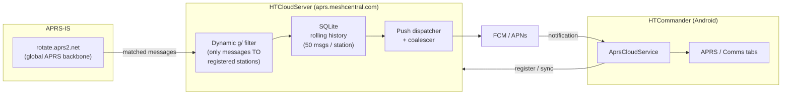

# When the App Is Closed: Push Notifications, Sync, and Avatars for APRS

*How HTCommander delivers an APRS text message to your phone even when the app
isn't running — and does it without turning the companion server into a
bandwidth furnace. This post walks the whole path: the companion server
(**HTCloudServer**), the passcode-based registration, the live push, the
`since`-cursor sync that fills any gaps, and the avatar system that lets a
sender's face ride along with the notification — every piece designed so the
server moves as few bytes as it possibly can.*

---

## The problem: radios are patient, phones are not

APRS is a store-and-forward world. A message addressed to your station can
arrive at any moment, from anywhere on the planet, via
[APRS-IS](aprs-is-integration.md) — the global internet backbone of APRS. On a
desktop that's fine: HTCommander keeps a socket open and hears it live. On a
phone it isn't. Mobile operating systems aggressively suspend backgrounded apps,
so a persistent APRS-IS connection from a phone is a battery-draining fiction —
the OS will kill it the moment you switch away.

The standard answer is a **push notification**: a tiny message the OS itself
delivers through Firebase Cloud Messaging (Android) or APNs (iOS), waking a
banner into existence without the app running at all. But APRS clients don't
talk to FCM — FCM talks to *servers*. So we built one:
**HTCloudServer**, a small Node.js companion that sits on APRS-IS on your
behalf, catches messages addressed to your station, and pushes them to your
phone.

The whole design has one obsession running through it: **the server should cost
almost nothing to run**. Every decision below — what we subscribe to, when we
push, what an avatar upload looks like — is bent toward moving the fewest bytes.

---

## The pieces



On the app side, the whole thing lives in one Android-only service,
`AprsCloudService`, wired into the app's internal event bus (the "Data Broker")
and driven entirely by settings changes. On the server side it's vanilla Node
`http`/`https` — no framework — so we keep socket-level control for the rate
limiter. Persistence is `better-sqlite3`; push is `firebase-admin` (FCM) and a
hand-rolled APNs HTTP/2 client.

Authentication reuses a trick from the
[APRS-IS work](aprs-is-integration.md): the **APRS passcode**. It's a number
derived from your callsign by a well-known (if deliberately unpublished)
algorithm that HTCommander already carries as `AprsUtil.aprsValidationCode`. It
isn't a secret — anyone can compute it for any callsign — but it proves you at
least *know* the callsign you're claiming, which is exactly the bar APRS itself
sets. Every request to the server carries it as `auth`.

---

## Registration: telling the server you exist

When you turn on **Push notifications** in Settings (only available once APRS-IS
is configured with a valid passcode), the app:

1. Obtains an FCM token from Firebase.
2. `POST`s it to `/v1/register` with your callsign, SSID, platform, the passcode,
   and — because it's the first contact after a launch — `wantHistory: true` and
   a `since` cursor so the server hands back anything you missed while away.

```
POST /v1/register
{ callsign, ssid, platform:"android", pushToken, ackMessages:false,
  wantHistory:true, since:<lastSyncMs>, auth:<passcode> }
```

That single call registers you, pulls your backlog, and starts a slow (6-hour)
**heartbeat** that refreshes the token and keeps you in the server's APRS-IS
filter. Everything after that is either a live push or a lightweight sync.

---

## The live push — and why the server hears so little

Here's the part that keeps the server cheap. APRS-IS can firehose *millions* of
packets. A naive gateway would drink the whole thing. HTCloudServer instead
builds a **dynamic server-side filter** and asks APRS-IS to send it only what it
needs:

```
g/CALL1/CALL2/CALL3/...      # messages addressed TO these callsigns
```

That `g/` construct means "message packets *to* any of these stations." The
server does **not** subscribe to their position beacons, telemetry, or weather —
those never cross the wire. The filter is rebuilt and pushed to APRS-IS **only
when the set of registered stations changes**, not per message. (There's a
`b/` variant for tracking a station's *outgoing* traffic too, but it's off by
default precisely because it multiplies ingress.)

When a matching message does arrive, the pipeline:

1. **Deduplicates it.** APRS senders retransmit until they get an ACK. An
   identical message (same sender, addressee, sequence id, and text) is stored
   and pushed **once** — though the server still re-ACKs each retransmission so
   the sender stops repeating.
2. **Stores it** in a rolling per-station ring buffer (default 50 messages), so
   a phone that was offline can catch up later.
3. **Coalesces the push.** If several messages for one station land within a
   short window, they fold into a *single* notification ("3 new APRS messages")
   carrying a `collapseId` so the OS replaces the previous banner instead of
   stacking. One provider send instead of three.

The notification's data payload is deliberately tiny — `fromCall`, `seqId`, `to`,
`count` — just enough for the app to know who and how many.

> **A sharp edge we hit:** `from` is a *reserved* key in an FCM data payload.
> Using it makes FCM v1 reject the whole message with `invalid-argument`. We
> rename it `fromCall`. (Other reserved keys to dodge: `notification`,
> `message_type`, `collapse_key`, anything starting `google`/`gcm`.)

---

## Sync: the `since` cursor that fills the gaps

Push is best-effort. A notification can be dropped, delayed, or squelched by a
battery optimizer. So the app never *trusts* push to be complete — it treats
every push as a hint to **sync**.

The mechanism is a monotonic cursor. Each server response carries a `serverTime`;
the app persists the newest one it has seen. To catch up it simply asks for
everything after it:

```
POST /v1/sync   { callsign, ssid, since:<lastSyncMs>, auth }
   → { messages:[ …only newer than since… ], serverTime }
```

- **Foreground:** when a push arrives while the app is open, the OS shows no
  banner, so the app calls `/v1/sync` and pulls the message straight into the
  list.
- **On launch:** `/v1/register` with `wantHistory` does the same job for the
  whole backlog.
- **On tap:** the app syncs, switches to the APRS tab, and opens the sender's
  conversation.

Because `since` only ever moves forward and the server returns strictly newer
rows, syncs are small and idempotent. Injected messages are de-duplicated
against any copy that also arrived over RF or a live APRS-IS connection, so a
message never appears twice no matter how many paths delivered it.

---

## Keeping the server cheap: the whole ledger

Every one of these is in the shipping server, and every one exists to move fewer
bytes or burn less CPU:

| Technique | What it saves |
|---|---|
| `g/`-only APRS-IS filter | Drops position/telemetry/weather ingress entirely |
| Filter rebuilt on registry change (not per message) | No churn on the APRS-IS control channel |
| Duplicate suppression | Store + push each message once, not once per retransmit |
| Auto-ACK throttle | Caps ACK transmits for a repeated message |
| Push coalescing (`collapseId`) | One provider send per burst, not one per message |
| `since`-cursor sync | Incremental pulls, never the full history |
| gzip responses (≥ ~860 B) | Shrinks the message and avatar payloads |
| TLS session resumption (ticket keys) | Skips full handshakes on reconnect |
| Rate limiter with silent connection drop | Abusive IPs get *no* response — cheapest possible refusal |

The through-line: the server subscribes to as little as possible, remembers just
enough, and speaks only when it must.

---

## Avatars: a face on the message, for almost no bytes

An operator can set an **avatar** — either a built-in **icon** (a named logo like
`radio` or `mail`) or a custom **image** (a base64 64×64 PNG). We wanted a
sender's avatar to appear next to their messages on other people's phones. The
challenge: an image is *kilobytes*, and we refuse to ship kilobytes we don't have
to.

### Uploading only what changed

The app never re-uploads an unchanged avatar. It computes a small **identity
string** for the current avatar and only sends the full payload when that
identity differs from what the server last confirmed:

- **Custom image:** the identity is `sha256(icon \n image)` — hashing the large
  image so a change is detected without shipping it.
- **Icon only:** an icon *needs no image hash*. Its name is already a compact,
  stable identity, so the app uses `icon:<name>` directly — no SHA-256, and a
  ~9-byte identity instead of a 64-char digest.
- **No avatar:** the identity is empty, so a station without one uploads nothing,
  ever.

Every `register`/`heartbeat` carries just that small `avatarHash`. The full
`avatarIcon`/`avatarImage` ride along **only** when the hash differs, flagged
with `avatarUpdate:true`. The server stores it and **echoes back the hash it now
holds** — so if the server is ever reset, the app sees the mismatch and
re-uploads on its own. A heartbeat for an unchanged avatar is a few bytes.

The server keeps this backward compatible and abuse-resistant: avatar columns
were added to the stations table with an in-place migration, images are capped at
24000 characters, and older clients that send no avatar fields are completely
unaffected.

### Riding along with the push

Here's the efficient bit the app cares about most: when the server pushes a
message, it attaches the **sender's** stored avatar to the notification the app
was already going to receive — **no extra request**.

Push payloads are capped at roughly 4 KB by both FCM and APNs, so we can't just
stuff an image in. Instead:

- The tiny `fromAvatarIcon` (logo name) and `fromAvatarHash` **always** travel.
- The `fromAvatarImage` is inlined **only** when its base64 fits a safe budget
  (≤ 3000 chars); otherwise it's dropped and the app falls back to initials.

The app caches whatever arrives, keyed by callsign, and **never fetches the
missing image** — honoring the rule that a push must not cost the server an extra
round trip. A custom image too big for the budget simply shows initials until the
app learns it another way.

And when a sender *clears* their avatar, the server sends a two-byte
**tombstone** — `fromAvatarCleared:"1"` — but only for a known cloud station that
genuinely cleared it (its record has an update time but nothing stored, which is
distinguishable from a station that never set one). The app drops its cached copy.

### Filling in avatars on sync (for desktops)

Push is an Android luxury. A desktop that only *syncs* messages needs a way to
learn avatars too — and the same efficiency rule applies: send the hash, fetch
the image only if it changed.

So `/v1/register` (with history) and `/v1/sync` responses now include a compact
map of the message senders that have an avatar:

```
"avatars": { "KJ7ABC-7": "icon:radio", "KK7VZT-6": "9f3c…" }
```

The client compares each hash against its local copy and calls a batch endpoint
**only for the ones that changed**:

```
POST /v1/avatars   { callsign, ssid, auth, stations:[ …up to 50… ] }
   → { avatars:{ "KJ7ABC-7":{ icon, image, hash } } }
```

Because push already populates the cache on Android, those hashes usually match
and no fetch happens at all. On a desktop, the larger image travels exactly once
and then never again while it's unchanged.

---

## Backward compatibility, on purpose

Every addition here is **additive**. Avatar fields, the `avatars` map, the
tombstone, the `/v1/avatars` endpoint — an older client that knows none of them
simply ignores them and keeps working. The rollout order is deliberate: the
**updated server ships first**, so by the time a client learns to ask for an
avatar hash, the server already knows how to answer.

---

## The honest ledger

- **iOS** is wired on the server (a full APNs HTTP/2 + JWT client) but the app
  ships Firebase only for Android today; an iOS build needs its own push
  configuration before end-to-end works there.
- **Background-delivered avatars** are captured when the app is foregrounded or a
  notification is tapped — the background isolate has no access to the app's
  storage, so an avatar from a push that's never opened waits until the next
  sync.
- **A cleared avatar over sync-only** (no push) isn't tombstoned; the desktop
  path advertises present avatars, not absent ones. Acceptable, and cheap.
- The `since` cursor is only as good as the client's willingness to render every
  message it pulls — an early bug where a pulled message advanced the cursor
  without being displayed taught us to make injection and persistence the same
  step.

None of it is exotic. It's a small server that listens narrowly, remembers
briefly, speaks rarely, and never sends a byte it can avoid — which is exactly
what you want standing between a global packet firehose and a phone in your
pocket.
