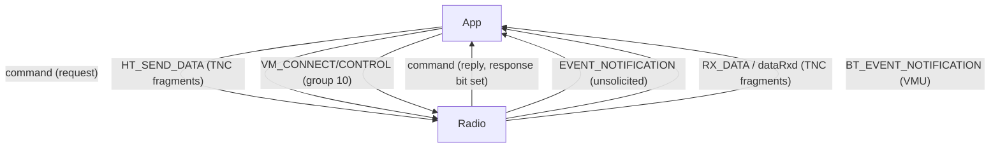
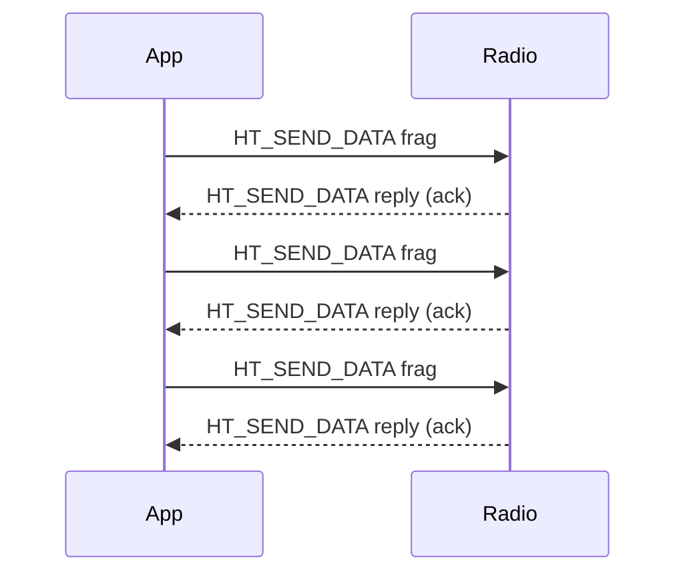
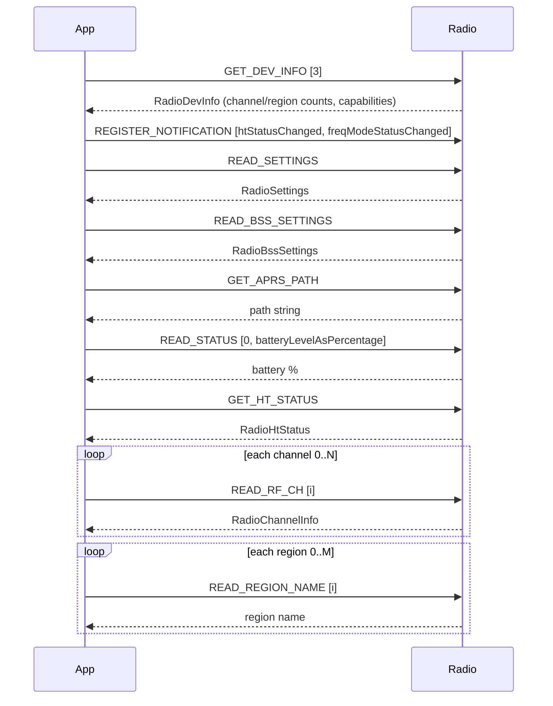

# Every Command a Benshi Radio Understands: A Complete Protocol Reference

*A reference deep-dive on the wire protocol HTCommander speaks to Benshi
handheld radios (BTech UV-Pro, RadioOddity GA-5WB, Vero VR-N76 / VR-N7500, and
friends). This post documents the framing, the command set, the status/response
model, the bit-level layout of every important payload, and the two sub-protocols
that ride on top: TNC data (AX.25 packet) and the VM firmware-update channel.*

*The canonical implementation lives in
[src/lib/radio/gaia_protocol.dart](../../src/lib/radio/gaia_protocol.dart),
[src/lib/radio/radio_models.dart](../../src/lib/radio/radio_models.dart),
[src/lib/radio/tnc_data_fragment.dart](../../src/lib/radio/tnc_data_fragment.dart),
and [src/lib/radio/radio.dart](../../src/lib/radio/radio.dart). This document
describes exactly what that code does.*

---

## The big picture

Everything the app and the radio say to each other is a **command** — a small
binary message with a group, a command id, and an optional payload. The same
message shape is used for requests, replies, and unsolicited notifications. On
top of that single mechanism the radio layers three conceptually different kinds
of traffic:

1. **Control** — read/write settings, channels, volume, GPS, FM radio, buttons,
   trusted devices, and so on. Request/reply.
2. **Notifications** — the radio pushes state changes (status, channel, position,
   incoming packet data) without being polled.
3. **Bulk sub-protocols** — TNC data fragments (carrying AX.25 packets) and the
   GAIA VM protocol (carrying firmware images). These reuse the command envelope
   but define their own internal formats.



---

## Layer 1: framing

Before a command reaches the radio it must be *framed* for the transport. There
are two framings, chosen automatically by transport type.

### GAIA serial framing (Bluetooth Classic / RFCOMM)

Used on **macOS, Windows, and Android**, where the radio is reached over an
RFCOMM serial link. Each command is wrapped in a GAIA-style header:

```
FF 01 CS LEN  <command bytes...>
```

| Byte | Name | Value |
| --- | --- | --- |
| 0 | Start of frame | `0xFF` |
| 1 | Version | `0x01` |
| 2 | Checksum flag | `0x00` (HTCommander never uses a checksum) |
| 3 | Payload length | number of *data* bytes after the 4-byte command header |
| 4.. | Command | `[group_hi, group_lo, cmd_hi, cmd_lo, data...]` |

The encoder is deliberately minimal — see `GaiaProtocol.encode()`:

```dart
bytes[0] = 0xFF;
bytes[1] = 0x01;
bytes[2] = 0x00;          // no checksum
bytes[3] = cmd.length - 4; // payload length (data only)
bytes.setRange(4, 4 + cmd.length, cmd);
```

On receive, `GaiaProtocol.decode()` walks the RX buffer looking for `FF 01`. It
needs at least 8 bytes to decide anything (`4` header + `4` command header),
reads the payload length from byte 3, reads the checksum flag (bit 0 of byte 2),
and computes the total frame length as `payloadLen + 8 + hasChecksum`. If the
whole frame is present it returns the **un-framed** command
(`[group_hi, group_lo, cmd_hi, cmd_lo, data...]`) and how many bytes it consumed;
if the leading bytes are not `FF 01` it returns `-1` so the caller can skip one
byte and resynchronise.

### Raw GATT framing (Bluetooth LE)

Used on **web, iOS, and Linux**, where the radio is a BLE GATT peripheral. Here
there is *no* `FF 01` wrapper at all — the command bytes are written directly to
the characteristic and arrive directly in notifications:

```
<group_hi> <group_lo> <cmd_hi> <cmd_lo> <data...>
```

The selector is a single getter in [radio.dart](../../src/lib/radio/radio.dart):

```dart
bool get _useGattFraming =>
    kIsWeb || _transport?.connectedDevice?.type == BluetoothType.ble;
```

> **Compact BLE variants.** Some UV-PRO web-BLE firmware speaks a *compact*
> dialect where the 16-bit group is collapsed to a single byte and/or the
> command is little-endian. HTCommander auto-detects this (a tell-tale
> `FF 01 80 02 01` error reply) and rotates through six framings
> (`cmd16-be`, `group+cmd8`, `cmd8`, `cmd16-le`, `group+cmd16-be`,
> `group+cmd16-le`) until one answers. This is a compatibility shim; the logical
> command set below is identical.

---

## Layer 2: the command envelope

Once un-framed, every message has the same 4-byte header followed by an optional
payload. All multi-byte integers in the header are **big-endian**.

```
+--------+--------+--------+--------+-----------------+
| group_hi group_lo | cmd_hi  cmd_lo | payload ...    |
+--------+--------+--------+--------+-----------------+
     16-bit group       16-bit command
```

### Groups

| Group | Value | Purpose |
| --- | --- | --- |
| `basic` | `2` | Everything except firmware update |
| `extended` | `10` | GAIA VM firmware-update protocol |

### The response bit

Replies from the radio set **bit 15 (`0x8000`)** in the command field. That is
the *only* structural difference between a request and its reply. The parser
strips it back off:

```dart
final isResponse = (cmdValue & 0x8000) != 0;
final actualCmd  =  cmdValue & 0x7FFF;
```

So a `GET_HT_STATUS` request carries command `0x0014`, and its reply carries
`0x8014`.

### Building a command

`GaiaProtocol.buildRawCommand(group, cmd, data)` lays the header down
big-endian and appends the payload:

```dart
cmdData[0] = (group >> 8) & 0xFF;
cmdData[1] =  group       & 0xFF;
cmdData[2] = (cmd   >> 8) & 0xFF;
cmdData[3] =  cmd         & 0xFF;
// data...
```

Convenience helpers exist for the common payload shapes: `buildCommandByte`
(single byte) and `buildCommandInt` (a big-endian 32-bit int, via
`RadioUtils.setInt`).

### Endianness helpers

Almost every field in this protocol is big-endian, and the codec funnels through
four helpers in [utils.dart](../../src/lib/radio/utils.dart):

| Helper | Reads/writes |
| --- | --- |
| `getByte(d, p)` | one byte, bounds-checked (returns 0 past end) |
| `getShort(d, p)` | big-endian `uint16` = `d[p]<<8 \| d[p+1]` |
| `getInt(d, p)` | big-endian `uint32` |
| `setShort` / `setInt` | big-endian writes |

The notable exception is the **BSS user id**, which is little-endian — a wrinkle
called out explicitly in the code.

### Reply layout and status byte

For basic-group replies, the first payload byte (offset 4 of the whole frame) is
a **status byte**:

| Value | Meaning |
| --- | --- |
| `0` | success |
| `1` | notSupported |
| `2` | notAuthenticated |
| `3` | insufficientResources |
| `4` | authenticating |
| `5` | invalidParameter |
| `6` | incorrectState |
| `7` | inProgress |

Because the header is 4 bytes and the status byte is at offset 4, the model
parsers consistently read their **real payload starting at offset 5** — you will
see `RadioUtils.getByte(msg, 5)` at the top of almost every `fromBytes`.

---

## The complete basic command set (group 2)

These are the `RadioBasicCommand` opcodes. Opcode is the 16-bit command id
(shown in decimal / hex). "R" = HTCommander sends it as a request; "N" = the
radio sends it unsolicited; a reply always mirrors the request opcode with
`0x8000` set.

| Opcode | Name | Dir | Notes |
| ---: | --- | :---: | --- |
| 0 | `UNKNOWN` | — | Sentinel for unrecognised opcodes |
| 1 | `GET_DEV_ID` | R | Device id |
| 2 | `SET_REG_TIMES` | R | |
| 3 | `GET_REG_TIMES` | R | |
| 4 | `GET_DEV_INFO` | R | Capabilities; payload `[3]`. **Parsed** → `RadioDevInfo` |
| 5 | `READ_STATUS` | R | Battery / power status; request `[0, type16]` |
| 6 | `REGISTER_NOTIFICATION` | R | No reply. Payload = list of notification bytes |
| 7 | `CANCEL_NOTIFICATION` | R | |
| 8 | `GET_NOTIFICATION` | R | |
| 9 | `EVENT_NOTIFICATION` | N | Unsolicited; byte 4 = notification type |
| 10 | `READ_SETTINGS` | R | **Parsed** → `RadioSettings` |
| 11 | `WRITE_SETTINGS` | R | No reply on some firmware; app re-reads |
| 12 | `STORE_SETTINGS` | R | |
| 13 | `READ_RF_CH` | R | Channel; request `[channelId]`. **Parsed** → `RadioChannelInfo` |
| 14 | `WRITE_RF_CH` | R | Payload = 25-byte channel struct |
| 15 | `GET_IN_SCAN` | R | |
| 16 | `SET_IN_SCAN` | R | |
| 17 | `SET_REMOTE_DEVICE_ADDR` | R | |
| 18 | `GET_TRUSTED_DEVICE` | R | Read one entry by index; walks list |
| 19 | `DEL_TRUSTED_DEVICE` | R | |
| 20 | `GET_HT_STATUS` | R | **Parsed** → `RadioHtStatus` |
| 21 | `SET_HT_ON_OFF` | R | |
| 22 | `GET_VOLUME` | R | Reply: `[status, level]` |
| 23 | `SET_VOLUME` | R | Payload `[level]` (0–15) |
| 24 | `RADIO_GET_STATUS` | R | FM broadcast receiver → `RadioFmRadioStatus` |
| 25 | `RADIO_SET_MODE` | R | Payload `[2]` on / `[0]` off |
| 26 | `RADIO_SEEK_UP` | R | FM seek |
| 27 | `RADIO_SEEK_DOWN` | R | FM seek |
| 28 | `RADIO_SET_FREQ` | R | Payload = big-endian `uint16`, units of 10 kHz |
| 29 | `READ_ADVANCED_SETTINGS` | R | |
| 30 | `WRITE_ADVANCED_SETTINGS` | R | |
| 31 | `HT_SEND_DATA` | R | **TNC fragment out** (see TNC section) |
| 32 | `SET_POSITION` | R | Payload = 18-byte position |
| 33 | `READ_BSS_SETTINGS` | R | **Parsed** → `RadioBssSettings` |
| 34 | `WRITE_BSS_SETTINGS` | R | Payload = 46-byte BSS struct |
| 35 | `FREQ_MODE_SET_PAR` | R | VFO |
| 36 | `FREQ_MODE_GET_STATUS` | R | VFO tuned frequency |
| 37 | `READ_RDA1846S_AGC` | R | RF chip register |
| 38 | `WRITE_RDA1846S_AGC` | R | |
| 39 | `READ_FREQ_RANGE` | R | |
| 40 | `WRITE_DE_EMPH_COEFFS` | R | |
| 41 | `STOP_RINGING` | R | |
| 42 | `SET_TX_TIME_LIMIT` | R | |
| 43 | `SET_IS_DIGITAL_SIGNAL` | R | |
| 44 | `SET_HL` | R | |
| 45 | `SET_DID` | R | |
| 46 | `SET_IBA` | R | |
| 47 | `GET_IBA` | R | |
| 48 | `SET_TRUSTED_DEVICE_NAME` | R | |
| 49 | `SET_VOC` | R | |
| 50 | `GET_VOC` | R | |
| 51 | `SET_PHONE_STATUS` | R | |
| 52 | `READ_RF_STATUS` | R | |
| 53 | `PLAY_TONE` | R | |
| 54 | `GET_DID` | R | |
| 55 | `GET_PF` | R | Programmable-function button table |
| 56 | `SET_PF` | R | One effect byte per slot |
| 57 | `RX_DATA` | N | **TNC fragment in** (BLE data path) |
| 58 | `WRITE_REGION_CH` | R | |
| 59 | `WRITE_REGION_NAME` | R | Payload `[index] + UTF-8 name` |
| 60 | `SET_REGION` | R | Payload `[region]` (no reply) |
| 61 | `SET_PP_ID` | R | |
| 62 | `GET_PP_ID` | R | |
| 63 | `READ_ADVANCED_SETTINGS2` | R | |
| 64 | `WRITE_ADVANCED_SETTINGS2` | R | |
| 65 | `UNLOCK` | R | |
| 66 | `DO_PROG_FUNC` | R | Trigger a PF effect remotely |
| 67 | `SET_MSG` | R | |
| 68 | `GET_MSG` | R | |
| 69 | `BLE_CONN_PARAM` | R | |
| 70 | `SET_TIME` | R | |
| 71 | `SET_APRS_PATH` | R | Payload = UTF-8 digipeater path |
| 72 | `GET_APRS_PATH` | R | Reply: `[status] + UTF-8 path` |
| 73 | `READ_REGION_NAME` | R | Reply: `[status, index] + UTF-8 name` |
| 74 | `SET_DEV_ID` | R | |
| 75 | `GET_PF_ACTIONS` | R | |
| 76 | `GET_POSITION` | R | **Parsed** → `RadioPosition` |
| 77 | `SET_SATELLITE_INFO` | R | Native satellite mode; payload not yet decoded |

Only a subset of these are actively used by HTCommander today; the rest are
defined for recognition (so an unexpected reply is named rather than shown as raw
hex). The next sections give the bit-level layout for the payloads the app
actually encodes and decodes.

---

## Payload deep-dives

### GET_DEV_INFO (4) → `RadioDevInfo`

The request payload is a single byte `[3]`. The reply is a fixed capability
block; fields are bit-packed starting at offset 5:

| Offset | Bits | Field |
| --- | --- | --- |
| 5 | 8 | `vendorId` |
| 6–7 | 16 (BE) | `productId` |
| 8 | 8 | `hwVer` |
| 9–10 | 16 (BE) | `softVer` |
| 11 | `0x80` | `supportRadio` (has FM broadcast receiver) |
| 11 | `0x40` | `supportMediumPower` |
| 11 | `0x20` | `fixedLocSpeakerVol` |
| 11 | `0x10` | `notSupportSoftPowerCtrl` |
| 11 | `0x08` | `haveNoSpeaker` |
| 11 | `0x04` | `haveHmSpeaker` |
| 11–12 | `0x03` + `0xF0` | `regionCount` (spans two bytes) |
| 12 | `0x08` | `supportNoaa` |
| 12 | `0x04` | `gmrs` |
| 12 | `0x02` | `supportVfo` |
| 12 | `0x01` | `supportDmr` |
| 13 | 8 | `channelCount` |
| 14 | `0xF0` | `freqRangeCount` |

`productId` also drives the friendly name (`0x0001` → VR-N7500, `0x0002` →
VR-N76, `0x0003` → SA-888S, `0x0004` → HG-UV98, `0x0005` → HAM-AIO). This reply
is what tells the app how many channels and regions to enumerate.

### GET_HT_STATUS (20) → `RadioHtStatus`

A compact live-status block. Note how several fields straddle byte boundaries —
a recurring theme in this protocol.

| Offset | Bits | Field |
| --- | --- | --- |
| 5 | `0x80` | `isPowerOn` |
| 5 | `0x40` | `isInTx` |
| 5 | `0x20` | `isSq` (squelch open) |
| 5 | `0x10` | `isInRx` |
| 5 | `0x0C` | `doubleChannel` (0=off,1=A,2=B,3=C) |
| 5 | `0x02` | `isScan` |
| 5 | `0x01` | `isRadio` (FM broadcast active) |
| 6 | `>>4` | `currChIdLower` (low 4 bits of channel id) |
| 6 | `0x08` | `isGpsLocked` |
| 6 | `0x04` | `isHfpConnected` |
| 6 | `0x02` | `isAocConnected` |
| 7 | `>>4` | `rssi` |
| 7–8 | `0x0F`<<2 + `>>6` | `currRegion` |
| 8 | `0x3C`>>2 | `currChannelIdUpper` (high bits of channel id) |

`currChId` is reassembled as `(upper << 4) | lower`. This status arrives both as
a direct `GET_HT_STATUS` reply and inline inside the `htStatusChanged`
notification.

### READ_RF_CH (13) / WRITE_RF_CH (14) → `RadioChannelInfo`

A channel is a 25-byte record (offset 5 onward in a reply; offset 0 onward in a
`WRITE_RF_CH` payload). The frequency fields cleverly pack the **modulation** in
the top 2 bits of a 32-bit big-endian frequency, so the frequency mask is
`& 0x3FFFFFFF`:

| Offset (reply) | Field |
| --- | --- |
| 5 | `channelId` |
| 6 | `txMod` = byte `>> 6`; `txFreq` = `getInt(6) & 0x3FFFFFFF` (Hz) |
| 10 | `rxMod` = byte `>> 6`; `rxFreq` = `getInt(10) & 0x3FFFFFFF` (Hz) |
| 14–15 | `txSubAudio` (BE `uint16`) |
| 16–17 | `rxSubAudio` (BE `uint16`) |
| 18 `0x80..0x01` | `scan`, `txAtMaxPower`, `talkAround`, `bandwidth`(wide=0x10), `preDeEmphBypass`, `sign`, `txAtMedPower`, `txDisable` |
| 19 `0x80..0x10` | `fixedFreq`, `fixedBandwidth`, `fixedTxPower`, `mute` |
| 20–29 | `name` (10 bytes, UTF-8, null-trimmed) |

Writing rebuilds the record from the fields — see `RadioChannelInfo.toByteArray()`
— re-inserting the modulation bits into the high 2 bits of each frequency word
(`r[1] = (r[1] & 0x3F) | ((txMod << 6))`).

### READ_SETTINGS (10) / WRITE_SETTINGS (11) → `RadioSettings`

The densest structure in the protocol: ~40 fields packed into ~20 bytes, many
split across byte boundaries. A few representative examples (see
[radio_models.dart](../../src/lib/radio/radio_models.dart) for the full list):

| Field | Source bits |
| --- | --- |
| `channelA` | `(byte5 & 0xF0)>>4` + `(byte14 & 0xF0)` |
| `channelB` | `(byte5 & 0x0F)` + `((byte14 & 0x0F)<<4)` |
| `scan` | `byte6 & 0x80` |
| `squelchLevel` | `byte6 & 0x0F` |
| `micGain` | `(byte7 & 0x0E)>>1` |
| `txTimeLimit` | `byte8 & 0x1F` |
| `autoShareLocCh` | `(byte10 & 0x1F)` \| `((byte16 & 0x07)<<5)` |
| `vfo1ModFreqX` | `getInt(17)` (BE `uint32`) |
| `vfo2ModFreqX` | `getInt(21)` (BE `uint32`) |

Because so many fields share bytes, HTCommander never builds a settings block
from scratch. Instead `toByteArray()` **copies the last-read raw block** (minus
the 4-byte header + status byte) and overwrites only the bytes it needs to change
(channel A/B, dual-channel mode, scan, squelch). `toByteArrayWith(...)` is the
copy-on-write wrapper the app calls. This preserves every field the app does not
model. After a write, the radio may or may not push a `htSettingsChanged`
notification, so the app re-reads settings to be safe.

### GET_POSITION (76) / SET_POSITION (32) → `RadioPosition`

An 18-byte position payload (offset 5 onward in a reply). Latitude and longitude
are **24-bit signed** values in an unusual unit:

```
degrees = raw / 60.0 / 500.0        (i.e. raw = degrees × 60 × 500)
```

The 24-bit two's-complement sign is handled explicitly (subtract `0x01000000`
when bit 23 is set) because Dart ints are 64-bit and naive sign-extension would
produce a huge positive number.

| Offset | Field |
| --- | --- |
| 5–7 | latitude (24-bit signed) |
| 8–10 | longitude (24-bit signed) |
| 11–12 | altitude (BE `uint16`, metres) |
| 13–14 | speed (BE `uint16`) |
| 15–16 | heading (BE `uint16`, degrees) |
| 17–20 | Unix time (BE `uint32`, seconds) |
| 21–22 | accuracy (BE `uint16`) |

`toByteArray()` emits exactly these 18 bytes for `SET_POSITION`. The radio only
transmits APRS position beacons while a `positionChange` notification is
registered — which is why the app (re)registers it on every connect whenever GPS
sharing is on.

### READ_BSS_SETTINGS (33) / WRITE_BSS_SETTINGS (34) → `RadioBssSettings`

Beacon / location-sharing configuration, 46 bytes. The one little-endian field in
the whole protocol lives here (`bssUserIdLower`, a LE `int32` at offset 9):

| Offset | Field |
| --- | --- |
| 5 | `maxFwdTimes` (`>>4`), `timeToLive` (`&0x0F`) |
| 6 | flags: `pttReleaseSendLocation`(0x80), `…SendIdInfo`(0x40), `…SendBssUserId`(0x20), `shouldShareLocation`(0x10), `sendPwrVoltage`(0x08), `packetFormat`(0x04), `allowPositionCheck`(0x02) |
| 7 | `aprsSsid` (`>>4`) |
| 8 | `locationShareInterval` = byte × 10 (seconds) |
| 9–12 | `bssUserIdLower` (**LE** `int32`) |
| 13–24 | `pttReleaseIdInfo` (12 bytes UTF-8) |
| 25–42 | `beaconMessage` (18 bytes UTF-8) |
| 43–44 | `aprsSymbol` (2 bytes UTF-8) |
| 45–50 | `aprsCallsign` (6 bytes UTF-8) |

(`toByteArray()` produces a 46-byte payload — offsets above are shown relative to
the received frame, which is 5 bytes higher because of the header + status byte.)

### FM broadcast: RADIO_* (24–28) → `RadioFmRadioStatus`

The built-in FM broadcast receiver has its own little command family:

- `RADIO_SET_MODE` (25): payload `[2]` = on, `[0]` = off.
- `RADIO_SET_FREQ` (28): big-endian `uint16` in units of 10 kHz, so 91.5 MHz →
  `9150` → `0x23BE`.
- `RADIO_SEEK_UP` / `RADIO_SEEK_DOWN` (26/27): no payload; progress arrives via
  notifications.
- `RADIO_GET_STATUS` (24) reply / `radioStatusChanged` notification share a
  layout at offset 5: `[flags, 0x00, freqHi, freqLo]` where `flags & 0x80` = FM
  on, `flags & 0x10` = seeking, and the frequency is a BE `uint16` in 10 kHz
  units (so `0x290E` = 10510 → 105.10 MHz).

### READ_STATUS (5): battery and power

The request is `[0, type]` where `type` is a `RadioPowerStatus`
(`batteryLevel`=1, `batteryVoltage`=2, `rcBatteryLevel`=3,
`batteryLevelAsPercentage`=4). The reply payload (relative to the status byte)
is `[status, type_hi, type_lo, value...]`; voltage is a BE `uint16` in
hundredths of a volt (`getShort/100.0`), everything else is a single byte.

### Programmable functions: GET_PF (55) / SET_PF (56)

The button table maps physical buttons to effects. The `GET_PF` reply is a
status byte followed by **two bytes per slot**:

```
byte0 = (buttonId << 4) | actionType
byte1 = effectType
```

`actionType` is a `PFActionType` (short/long/double/edge transitions/…) and
`effectType` is a `PFEffectType` (`mainPtt`, `toggleRadioTx`, `nextChannel`,
`sendLocation`, …). `SET_PF` sends one effect byte per slot in the same order.
Because the radio commits the write asynchronously, the app waits ~800 ms before
re-reading so the cached table reflects the settled state.

### Region names: READ_REGION_NAME (73) / WRITE_REGION_NAME (59) / SET_REGION (60)

- `READ_REGION_NAME` request `[index]`; reply `[status, index, UTF-8 name…]`.
- `WRITE_REGION_NAME` payload `[index] + UTF-8 name`.
- `SET_REGION` payload `[region]` — this one gets **no reply** (it is in the
  "expected response = none" list alongside `REGISTER_NOTIFICATION` and
  `WRITE_SETTINGS`).

### APRS path: GET_APRS_PATH (72) / SET_APRS_PATH (71)

A simple variable-length UTF-8 string, e.g. `"WIDE1-1,WIDE2-1"`. The reply is
`[status] + UTF-8 path`. The app updates its cache optimistically on write and
re-reads to confirm.

---

## Notifications (EVENT_NOTIFICATION, opcode 9)

The radio pushes state changes as `EVENT_NOTIFICATION` frames. Byte 4 (the first
payload byte) is the **notification type**; the rest of the frame is that
notification's inline payload.

| Type | Name | Payload / action |
| ---: | --- | --- |
| 1 | `htStatusChanged` | Inline `RadioHtStatus` (offset 5) |
| 2 | `dataRxd` | Inline TNC fragment (hardware AFSK path) |
| 3 | `newInquiryData` | |
| 4 | `restoreFactorySettings` | |
| 5 | `htChChanged` | App re-reads settings |
| 6 | `htSettingsChanged` | Inline `RadioSettings` |
| 7 | `ringingStopped` | |
| 8 | `radioStatusChanged` | Inline `RadioFmRadioStatus` |
| 9 | `userAction` | |
| 10 | `systemEvent` | |
| 11 | `bssSettingsChanged` | App re-reads BSS settings |
| 12 | `dataTxd` | |
| 13 | `positionChange` | Inline `RadioPosition` |
| 14 | `freqModeStatusChanged` | Live VFO frequency while tuning/scanning |

To subscribe, the app sends `REGISTER_NOTIFICATION` (opcode 6) with a payload
that is simply a **list of notification-type bytes** — e.g. on connect it
registers `htStatusChanged` and `freqModeStatusChanged` in one call:

```dart
_sendCommand(RadioCommandGroup.basic, RadioBasicCommand.registerNotification,
  Uint8List.fromList([
    RadioNotification.htStatusChanged.value,      // 1
    RadioNotification.freqModeStatusChanged.value // 14
  ]));
```

`positionChange` is registered with a 4-byte form `[0, 0, 0, 13]`. A radio power
cycle clears all registrations, so the app re-applies them on every connection.

### freqModeStatusChanged (14) layout

Worth calling out because it packs several fields and has a subtle "authoritative
bit". Relative to the frame start:

| Offset | Field |
| --- | --- |
| 4 | notification type (14) |
| 5–8 | live RX frequency (BE `uint32`, top 2 bits = modulation, mask `0x3FFFFFFF`) |
| 9–12 | TX frequency |
| 13–16 | sub-audio |
| 17–18 | status flags |

Only the **low** flags byte (offset 18) reliably indicates whether the radio is
in frequency (VFO) mode — the high byte can remain set after leaving VFO mode.

---

## Sub-protocol A: TNC data (AX.25 packet radio)

Packet data does not fit in a single command, so it is **fragmented**. Outgoing
fragments use `HT_SEND_DATA` (31); incoming fragments arrive as either `RX_DATA`
(57, BLE) or the `dataRxd` notification (hardware AFSK path). Both directions use
the same fragment format defined in
[tnc_data_fragment.dart](../../src/lib/radio/tnc_data_fragment.dart).

### Fragment format

The payload begins with a single **control byte**, then the fragment data, then an
optional trailing channel-id byte:

```
+----------+------------------+-----------------+
| control  | data ...         | [channelId]     |
+----------+------------------+-----------------+
```

| Control byte bit | Meaning |
| --- | --- |
| `0x80` | final fragment |
| `0x40` | a channel-id byte is appended at the end |
| `0x3F` | fragment id (0–63) |

Decoding (`fromBytes`) reads the control byte at offset 5, extracts the flags and
fragment id, copies the data, and — if `0x40` is set — reads the last byte as the
channel id. Encoding (`toByteArray`) is the mirror image.

### Reassembly

Fragments are numbered sequentially starting at 0. The accumulator only starts on
fragment id 0, and `append()` merges a fragment only when its id is exactly
`previous + 1` and the previous fragment was not marked final; anything out of
order discards the partial and restarts. When the final fragment
(`0x80`) arrives, the completed frame is dispatched.



Outgoing sending is strictly one-fragment-in-flight: the next fragment is only
sent after the previous `HT_SEND_DATA` is acknowledged, and only when the radio
is not already transmitting (`htStatus.isInTx == false` and `rssi == 0`, i.e. the
channel is clear). Each fragment carries at most `_maxMtu` data bytes.

### What rides inside: AX.25

The reassembled fragment data is an **AX.25 frame**, decoded by
[ax25_packet.dart](../../src/lib/radio/ax25_packet.dart). AX.25 is its own topic,
but the essentials of the encoding:

- **Addresses** (7 bytes each): 6 callsign characters shifted left by 1 bit, plus
  an SSID byte carrying the command/response (C) bits and the "last address"
  marker in bit 0.
- **Control field** (1 byte for modulo-8, 2 bytes for modulo-128): encodes the
  frame type (I / S / U), the send/receive sequence numbers `N(S)`/`N(R)`, and
  the poll/final bit.
- **PID** (1 byte): present on I-frames and UI-frames (`0xF0` = "no layer 3").
- **Info**: the payload (e.g. an APRS message).

The C/R bits are set so that address 0 (destination) carries the command bit and
address 1 (source) carries its complement, per the AX.25 spec — see the
`toByteArray()` address loop. Connected-mode sequencing (SABM/UA/DISC, I/RR/RNR/
REJ/SREJ, retries and windowing) is handled a layer up in
[ax25_session.dart](../../src/lib/radio/ax25_session.dart).

---

## Sub-protocol B: the VM firmware-update channel (group 10)

Firmware update uses the **extended** command group (10) and a different opcode
space, the GAIA VM protocol. Only Bluetooth Classic transports support it.

| Opcode | Name | Direction |
| ---: | --- | --- |
| 769 | `GET_BT_SIGNAL` | R |
| 1600 | `VM_CONNECT` | R |
| 1601 | `VM_DISCONNECT` | R |
| 1602 | `VM_CONTROL` | R |
| 1825 | `DEV_REGISTRATION` | R |
| 16385 | `REGISTER_BT_NOTIFICATION` | R |
| 16386 | `CANCEL_BT_NOTIFICATION` | R |
| 16387 | `BT_EVENT_NOTIFICATION` | N |

The flow is: the app sends `VM_CONNECT` / `VM_CONTROL` (each carrying VMU
protocol packets in the payload), and the radio replies **asynchronously** by
pushing `BT_EVENT_NOTIFICATION` events that carry the VMU responses. The
extended group is routed separately in `_handleCommand` → `_handleExtendedCommand`
precisely because these opcodes fall outside `RadioBasicCommand`. The full
firmware-update state machine — image assembly, chunking, and flashing — is a
story of its own, told in
[How a Benshi Radio Updates Its Firmware, Step by Step](benshi-firmware-update.md)
and [Where Does the Firmware Come From?](benshi-firmware-server.md).

Encoding for extended commands reuses `buildRawCommand` with the 16-bit opcode
laid down big-endian, then wraps in GAIA serial framing (or sends raw for GATT).

---

## Putting it together: connect handshake

The command set makes the most sense in the order the app actually uses it. A
fresh connection runs roughly:



Channel and region reads are **serialized** through a queue with a
response-timeout watchdog and a couple of retries, because firing them all at
once overruns some radios. Everything after that is event-driven: the app reacts
to notifications and issues writes as the user changes settings.

---

## Quick reference: the rules that never change

- **Two framings.** GAIA `FF 01 CS LEN …` on Bluetooth Classic; raw
  `group/cmd/data` on BLE. Chosen by transport, invisible above the framing
  layer.
- **4-byte header.** `[group16, cmd16]`, big-endian. Group 2 = basic, group 10 =
  firmware.
- **Response bit `0x8000`** distinguishes replies from requests.
- **Status byte at offset 4** of every basic reply; real payload at offset 5.
- **Big-endian everywhere** — except the BSS user id (little-endian) and the
  fragment control byte (bit flags).
- **Frequencies pack modulation** in the top 2 bits; mask with `0x3FFFFFFF`.
- **Notifications are opt-in** via `REGISTER_NOTIFICATION`, and reset on power
  cycle.
- **Bulk data fragments**, one in flight at a time, reassembled by sequential
  fragment id with a final-bit terminator.

That is the whole language a Benshi radio speaks. Everything HTCommander does —
tuning channels, sharing GPS, running packet radio, updating firmware — is one of
these commands, encoded exactly as described above.

---

*Source of truth: [gaia_protocol.dart](../../src/lib/radio/gaia_protocol.dart),
[radio_models.dart](../../src/lib/radio/radio_models.dart),
[tnc_data_fragment.dart](../../src/lib/radio/tnc_data_fragment.dart),
[utils.dart](../../src/lib/radio/utils.dart), and
[radio.dart](../../src/lib/radio/radio.dart). The browser mirror in
[radio.js](../../src/assets/web/radio.js) implements the same formats for the web
client.*
