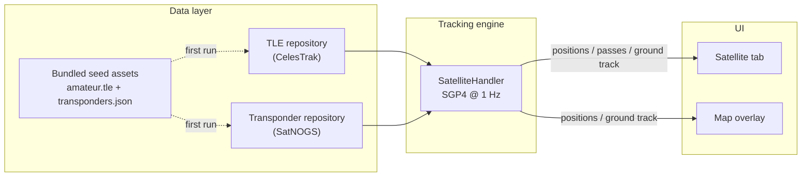

# Working the Birds: Amateur Satellite Support in HTCommander

*How HTCommander learned to track amateur radio satellites — computing where
every FM "easy sat" is right now, when it will next rise over you, and what
Doppler-shifted frequencies you'll need to work it. This post walks the whole
feature as it stands today: the orbital math, the two data sources that feed it,
the tab and the map overlay — and the honest ledger of what's still missing,
including a native radio command nobody has fully decoded yet.*

---

## What you can do today

Open the new **Satellite** tab and HTCommander shows you the amateur satellites
it can actually help you work: FM cross-band "repeater" birds like **SO-50**, the
**ISS** cross-band repeater, **PO-101**, **AO-91**, **LilacSat-2**, and the
**TEVEL** constellation. For each one you get:

- a **live list**, sorted so anything overhead floats to the top, with a
  countdown to the next pass and its maximum elevation;
- a **detail panel** for the selected bird — real-time azimuth/elevation, slant
  range, the sub-satellite point, altitude, and the **Doppler-corrected uplink
  and downlink frequencies** (plus the CTCSS tone needed to open the repeater);
- an **upcoming-passes** list with rise/set times, peak elevation, and the
  azimuths the satellite tracks across.

Flip over to the **Map** tab and turn on *Show Satellites*: each bird is drawn at
its sub-point with its radio-horizon **footprint circle**, and the selected
satellite gets its **ground track** — the path it traces over the Earth for the
next ~50 minutes either side of now.

It works **offline on first run** (a small seed of orbital data ships in the
app) and quietly refreshes itself from the internet when it can.

One important honesty up front: these radios are **FM/AM only**. That means the
FM cross-band birds are fair game, but the **SSB/CW linear-transponder**
satellites (RS-44, FO-29, and friends) are *not* — the radio simply can't do the
mode. HTCommander filters the list down to birds you can really use.

---

## The shape of it

The feature is split into three layers, wired together over the app's internal
event bus (the "Data Broker"), exactly like every other HTCommander feature.



**Data layer.** Two small repositories load orbital elements and transponder
frequencies, each cached to disk with a bundled seed as the offline fallback.

**Tracking engine.** A background handler joins those two sources into a catalog
of workable FM birds, then once per second propagates each one and publishes its
position, look-angle, and Doppler. Pass predictions are computed when they need
to be (on a location change), not every tick.

**UI.** The tab and the map overlay are pure display + selection. They subscribe
to the handler's broadcasts and never do orbital math themselves.

---

## The orbital math: SGP4, without reinventing it

Satellites are tracked from **Two-Line Element sets (TLEs)** — the compact,
decades-old format that encodes an orbit as a handful of mean orbital elements.
You feed a TLE into the **SGP4** propagator (Simplified General Perturbations 4)
to get the satellite's position at any instant.

We did **not** hand-roll SGP4. It's a notoriously fiddly algorithm where small
mistakes produce plausible-but-wrong answers, so we lean on the pure-Dart
[`satellite_observer`](https://pub.dev/packages/satellite_observer) package. Per
satellite we build the propagator once and reuse it every tick (constructing it
runs the SGP4 initialisation, which isn't free):

```dart
final elements = GpElements.fromTle(tle.line1, tle.line2, name: tle.name);
final observer = SatelliteObserver(
  elements: elements,
  observer: Observer(latitudeDeg: lat, longitudeDeg: lon, altitudeMeters: alt),
);

final sub  = observer.subPointAt(now);   // lat/lon/alt beneath the satellite
final look = observer.lookAngleAt(now);  // az / el / range / range-rate
```

The observer's location comes from a connected **GPS** fix (or a manually set
position). We ignore sub-kilometre GPS jitter so a wandering fix doesn't force
the engine to rebuild every propagator once a second.

### Doppler, from range-rate

A low-Earth-orbit satellite closes on you at several km/s, so its signal arrives
Doppler-shifted — a few kHz on 2 m, up to ~10 kHz on 70 cm. `satellite_observer`
gives us the line-of-sight **range-rate** (positive when the satellite is
receding), which is all we need. With the speed of light *c*:

- **Downlink (what you receive):** tune to `downlink × (1 − range_rate / c)` — the
  signal is lower in frequency as the bird recedes.
- **Uplink (what you transmit):** pre-compensate to `uplink × (1 + range_rate / c)`
  so the satellite hears its nominal input frequency.

At AOS the bird is approaching (frequency high); at LOS it's receding (frequency
low). Today those corrected numbers are **displayed** in the tab so you can dial
them in by hand or spot the trend. Whether the app should push them to the radio
automatically is the interesting open question — more on that below.

---

## Where the data comes from

Two independent internet sources feed the feature, each answering a different
question.

### 1. Orbits — CelesTrak

Orbital elements come from **[CelesTrak](https://celestrak.org)**, the long-running
(since 1985) home of public GP/TLE data. We query the **amateur-radio group**:

```
https://celestrak.org/NORAD/elements/gp.php?GROUP=amateur&FORMAT=TLE
```

CelesTrak is a donation-funded non-profit, and it **aggressively firewalls
clients that abuse it** — re-downloading unchanged data will get your IP blocked.
Their data only updates every couple of hours, so our repository enforces a hard
rule: **never refetch if the cache is younger than two hours**, and treat any
non-200 response (a 301 redirect, a 403 block, a 404) as "stop, keep what we
have" rather than retrying in a loop. This is a correctness requirement, not an
optimisation.

### 2. Transponders — SatNOGS

A TLE tells you *where* a satellite is, not *what frequencies it uses*. For that
we use the **[SatNOGS DB](https://db.satnogs.org)** — a community-run database of
satellite transmitters:

```
https://db.satnogs.org/api/transmitters/?format=json
```

We keep only entries that are **active**, **FM**, and whose **uplink and downlink
both fall inside a band this radio can actually tune** (the 2 m and 70 cm FM
segments). That filter is what turns "every satellite in orbit" into "the handful
you can work with this handheld." SatNOGS doesn't carry CTCSS tones, so we carry
those over from our seed catalog for the well-known birds.

### 3. The offline seed

So the feature works on a first run with no internet, the app **bundles a seed**:
a small `amateur.tle` (real, recent elements for the marquee FM birds) and a
`transponders.json` frequency catalog. On first launch these load instantly;
the online refresh then quietly brings everything up to date.

---

## Verifying it

Orbital code is easy to get subtly wrong, so the feature ships with unit tests
that check the parts most likely to break: that the seed TLEs parse to the right
NORAD catalog numbers; that SGP4 puts the ISS at a plausible LEO altitude with a
valid look-angle; and that the Doppler math has the **right sign and magnitude**
(a receding bird lowers the downlink and raises the uplink; ~7 kHz of shift at
5 km/s on 70 cm). Against a known TLE and observer, the pass times and
azimuth/elevation line up with independent trackers like Gpredict and
Heavens-Above.

---

## What's left: let the radio do it

Here's the honest part. Everything above is the "*which bird, when, and where*"
layer, and it's done. The remaining piece is **tuning the radio through the
pass** — and this is where a course-correction happened.

The obvious approach is to have the app stream Doppler-corrected frequencies to
the radio a couple of times a second (rewriting a channel, or driving the VFO
directly). But it turns out **the radio's own firmware already has satellite
support** — the same feature the manufacturer's app exposes. Studying the Benshi
GAIA protocol (with thanks to the reverse-engineering in the
[benlink](https://github.com/khusmann/benlink) project), the firmware's basic
command set was recently found to include:

```
GET_POSITION        = 76
SET_SATELLITE_INFO  = 77   ← the native satellite command
```

So the right design is **not** to build our own Doppler loop — it's to hand the
bird to the radio via `SET_SATELLITE_INFO` and let the firmware track it. We've
added the opcode to HTCommander's protocol enum so the app *recognises* it.

**The blocker:** only the **opcode name** is known publicly. Nobody has decoded
the **payload** — the actual byte layout of what `SET_SATELLITE_INFO` carries
(almost certainly the up/downlink frequencies and tone, and very likely the
orbital elements or a Doppler schedule, implying the radio does the tracking
itself). There's no captured example to work from yet, and guessing the layout
is exactly the "make our own" trap we want to avoid.

### The options from here

1. **Capture and decode (preferred).** Record the manufacturer app's Bluetooth
   traffic while it configures a satellite (an Android `btsnoop_hci.log`), decode
   the opcode-77 frames, and implement the exact message plus a "send to radio"
   button. This gets a correct, native integration — the radio does Doppler in
   hardware and the app just picks the bird.

2. **Scaffold now, fill in later.** Wire up the method and the UI button with the
   byte layout left as a clearly-marked TODO. Nothing is transmitted to the radio
   until the layout is verified against a capture.

3. **App-side Doppler as a fallback.** If some radio or firmware lacks opcode 77,
   fall back to the app pushing frequency updates through the existing channel /
   VFO commands. We keep the Doppler helpers around for exactly this reason (and
   for the on-screen display), but it's the backup plan, not the headline.

Until we have a capture, HTCommander is a capable **satellite tracker and pass
predictor** that tells you precisely what to dial in — and it's one decoded
message away from letting the radio do the rest.

---

**Related:** [How a Benshi Radio Updates Its Firmware, Step by Step](benshi-firmware-update.md) ·
[A Channel You Can Text: The Channel-Share String](channel-share-string.md)
