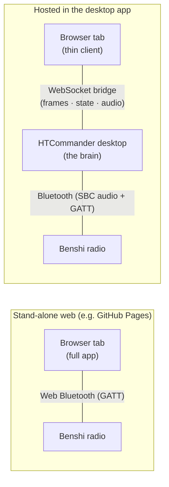

# The Same App, Two Homes: Running HTCommander's Web UI Inside the Desktop

*HTCommander ships as a Flutter app, and Flutter builds for the web as easily as
for Windows or Android. That gives us two very different ways to run the exact
same UI in a browser: a **stand-alone** web build that talks to a radio directly
over Web Bluetooth, and a **hosted** build that the desktop app serves from its
own built-in web server and drives over a WebSocket bridge. This post is about
the second one — why you'd want the desktop app to host its own web page, how a
browser tab ends up sharing the desktop's already-connected radio, and the design
rule that keeps the two from stepping on each other: **the host does all the
work; the web page only syncs and displays.***

---

## Two ways to be a web app

Because HTCommander is a single Flutter codebase, `flutter build web` produces a
complete, self-contained copy of the app that runs in any modern browser. But a
browser can't open a Bluetooth RFCOMM channel the way a desktop app can, and it
certainly can't reach a Dump1090 server sitting on your LAN or open a raw TCP
socket to an APRS-IS server. So the same web build can live in one of two worlds:

- **Stand-alone web** — hosted on a plain static site (for example GitHub
  Pages). The browser talks to a Benshi radio *directly* using the
  [Web Bluetooth API](https://developer.mozilla.org/en-US/docs/Web/API/Web_Bluetooth_API).
  Everything the desktop app does on its own, this build also does on its
  own — it decodes packets, runs the software modem where it can, tracks
  satellites, and stores its state in the browser. It is a full, independent
  station that happens to run in a tab.

- **Hosted in HTCommander** — served by the *desktop* app itself, from a small
  web server built into the program. This build does **not** use Web Bluetooth.
  Instead it connects back to the desktop over a WebSocket and shares the radio
  the desktop already has connected. The desktop is the brain; the browser is a
  second face on the same station.

The difference matters because the two builds have opposite jobs. The
stand-alone build is *alone* and must do everything. The hosted build is a
*client of the desktop* and must do almost nothing — because if it did the work
itself, two copies of HTCommander would be fighting over one radio.



---

## Why host the web UI at all

If the desktop app already controls the radio, why serve a web page from it?
Because the web page can then run **somewhere else**. Once HTCommander is running
on the computer that owns the Bluetooth link, anyone on the same network can open
a browser — on a phone, a tablet, a laptop across the room — point it at the
desktop's address, and get the full HTCommander interface driving *that* radio.
No second Bluetooth pairing, no second physical radio, no installing anything.

That opens up some genuinely useful setups:

- **A phone or tablet as a second screen** for a radio that stays plugged into a
  desktop or a shack computer.
- **Remote operating on the local network** — leave the radio and the desktop in
  the garage, sit on the couch with a tablet and still *hear* the radio.
- **A shared station** where several people around the room can each pull up the
  APRS tab, the map, or the messages on their own device.

Bluetooth only lets one host talk to the radio at a time, and re-pairing a radio
between devices is a chore. Hosting the web UI sidesteps both: the desktop keeps
the single Bluetooth connection, and every browser that connects is just another
window onto it.

---

## The trick: the bridge is a byte pipe

The part that makes this cheap to build is a happy accident of how the radio code
already works on the web.

On the web, HTCommander's `Radio` class always uses the radio's **GATT command
framing** — the short, un-framed control frames `[group_hi, group_lo, cmd_hi,
cmd_lo, payload…]` that the Bluetooth path uses. It already knows how to *send*
those frames and how to *decode* the responses that come back. That's exactly the
shape of data the desktop's radio exchange produces and consumes. So the WebSocket
between the browser and the desktop doesn't need to translate anything — it's a
plain two-way pipe of raw radio frames:

- **Browser → desktop:** binary messages are raw GATT command frames. The desktop
  hands them straight to the radio.
- **Desktop → browser:** binary messages are the radio's response frames. The
  browser decodes them with the same radio code it would use for a Web Bluetooth
  notification. (One kind of binary message is *not* a radio frame — mirrored
  audio — but it's tagged with a magic first byte, and radio frames always start
  with `0x00`, so the two can never be confused. More on that below.)
- **A few text messages** ride alongside for control and sync: `wasconnected` /
  `connecting` / `disconnected` report whether a radio is available, and a set of
  prefixed messages (`settings:`, `history:`, `mail:`, `airplanes:`, `radiolist:`,
  and friends) carry state the browser can't compute for itself.

On the client side this is a custom `RadioTransport` — a `WebSocketRadioTransport`
that opens the socket and, from then on, pumps bytes both directions. It's a
*persistent session*: the socket stays open (and reconnects itself if it drops)
whether or not the host currently has a radio, so the browser keeps mirroring the
desktop live rather than spinning on a reconnect loop. As far as the rest of the
app is concerned, it's just another radio that happens to live at the other end of
a WebSocket instead of a Bluetooth link.

### Knowing which world you're in

A build has to know whether it's stand-alone or hosted, because that decides
whether it reaches for Web Bluetooth or the WebSocket. The desktop serves its
copy with a compile-time flag baked in:

```powershell
flutter build web --base-href / --dart-define=HTC_HOSTED=true
```

A tiny `HostBridge` helper reads that flag (and also honors `?bridge=1` in the URL
so a developer can point an ordinary dev build at a running desktop for testing):

```dart
static bool get isHosted {
  if (!kIsWeb) return false;
  if (Uri.base.queryParameters['bridge'] == '1') return true;
  return _hostedBuild; // bool.fromEnvironment('HTC_HOSTED')
}
```

Everything else keys off `HostBridge.isHosted`. When it's true, the app connects
to the host on startup instead of scanning for Bluetooth radios, and — as we'll
see — quietly steps back from doing work the desktop is already doing.

The desktop serves the build straight off disk from its own web server, and to
avoid shipping the same megabytes twice, the shared app assets (fonts, the
callsign database, images) are served out of the desktop's own bundle rather than
the copy baked into the web output.

---

## The rule that makes it work: the host does the work

Here's the subtle part, and the reason this post exists. A hosted browser tab is
*running the whole HTCommander app*. Left to its own devices, it would happily do
everything the desktop does: digipeat APRS frames it hears, send its own position
beacons on a timer, auto-acknowledge incoming messages, answer BBS connections,
serve file transfers. And because the browser's "radio" is really the desktop's
radio piped over the bridge, every one of those actions would go out **on the air
for real** — *in addition to* the desktop doing the exact same thing. Two beacons.
Two digipeats. Two ACKs. One very confused channel.

So the design rule for the hosted build is simple to state and worth stating
plainly:

> **On the hosted web build, the desktop host performs all autonomous work. The
> browser only mirrors the host's state and forwards the operator's explicit
> actions.**

The stand-alone build, by contrast, still does all of that itself — it has no
host to defer to. The same code, two behaviors, gated on one boolean.

Concretely, when a build is hosted:

- The **digipeater**, **software beacon**, **BBS server**, **file-transfer
  (torrent) server**, and **software modem** don't run in the browser at all. The
  desktop runs them.
- The **APRS handler** still decodes and displays packets — that's how the live
  APRS tab fills in — but its *automatic* behaviors (auto-ACKing a message
  addressed to you, raising a notification) are left to the host so they don't
  fire twice.
- The **Winlink client** doesn't run; the browser mirrors the desktop's mailbox
  and forwards send/receive requests over the bridge.

What the browser *does* do is show you everything and let you act. Sending an
APRS message, keying up in the terminal, opening a connected-mode session — those
are *your* actions, initiated once, and they flow through the shared radio exactly
like any other command. One press, one transmission.

---

## Keeping the two in sync

For the browser to be a faithful second face, it needs the host's state. A hosted
build can't read the desktop's saved settings, its message history, or its
mailbox from the browser's own storage — that storage is empty. So the bridge
carries the state across:

- **Settings.** The browser proxies the app's settings to and from the host
  instead of the browser's local storage. Change a setting on the desktop and it
  pushes to every connected browser; change it in the browser and it's written on
  the host (which then re-broadcasts it to the others). Transient per-window UI
  state — which tab you're on, which radio is selected — is deliberately kept
  local so windows don't drag each other around.
- **History.** On connect, the host sends a one-shot snapshot of its recent
  Comms and APRS history so the tabs aren't blank; after that the browser builds
  its own live history from the frames flowing over the bridge.
- **Mail.** The host owns the Winlink mailbox and streams it to the browser,
  which forwards any changes (compose, delete, move) and sync requests back.
- **Airplanes.** Only the desktop can reach a Dump1090 server on the local
  network, so it polls and pushes the aircraft list to the browser for the map.

A couple of features that *are* configured in the browser still let the desktop do
the actual work. The digipeater and beacon settings, for instance, sync to the
host like any other setting — and because the browser's radio has a different
internal ID than the desktop's, the host resolves the configured radio to *its*
real radio when it acts. The software-modem menu works the same way: choosing a
mode in the browser writes the setting, which the host applies to the modem it's
actually running.

Where a feature genuinely can't be driven remotely yet — the BBS and the
file-transfer server, which keep live per-connection state on the host — the
browser is honest about it, showing a small "managed on the desktop host" banner
instead of dead buttons that pretend to work.

---

## Relaying the radio, not just its data

Early on, the browser treated "the host has no radio" as a *failed connection* and
kept retrying — you'd load the page and watch it spin, reconnecting every few
seconds, even though the host was perfectly reachable and simply had no radio
plugged in yet. That's backwards. The browser isn't connecting to a radio; it's
connecting to the *desktop*, which may or may not have a radio at any moment. So
the session was split from the radio: the socket stays up as a stable channel, and
the host just *tells* the browser what its radio situation is. No radio on the
host now shows a calm "no radio" state, and the moment the desktop connects one,
the browser lights up — no reconnect dance.

Once the session relays state instead of just data, three things fall out of it
naturally:

- **The real radio's name.** Instead of a generic "shared radio" label, the
  browser shows the actual name of whatever radio the desktop has selected.
- **Switching radios.** If the desktop has more than one radio connected, the host
  sends the browser its radio list, and the browser's normal radio switcher (the
  File menu and the Radio tab's name dropdown) lets you pick which one the desktop
  shares. Choosing a different radio tells the host to re-point the bridge, and the
  browser re-fetches the new radio's channels and status.
- **Disconnect means disconnect *the radio*.** Hitting File → Disconnect in the
  browser used to tear down the browser's own session — surprising, since you were
  really trying to disconnect the radio. Now it asks the desktop to drop its radio;
  the browser session stays open and simply shows "no radio" afterwards, exactly as
  if you'd unplugged it on the desktop.

---

## Hearing the radio in the browser

A screen is only half the station — you want to *hear* it too. On the desktop,
every source of audio the app plays — received radio audio, the transmit monitor,
EchoLink, AllStarLink — is mixed down through one shared PCM player before it
reaches the speaker. That single choke point turned out to be the perfect place to
tap: one hook there captures **everything** the desktop plays, no matter which
feature produced it, and streams it to any browser that's asked to listen.

The audio rides the same WebSocket as tagged binary frames — a tiny header
(`magic`, channel count, sample rate) followed by raw 16-bit PCM. Because radio
command frames always begin with `0x00` and the audio magic byte doesn't, the
transport tells them apart with a single byte compare and routes audio to the
browser's player instead of the radio decoder.

In the browser, playback uses the [Web Audio API](https://developer.mozilla.org/en-US/docs/Web/API/Web_Audio_API):
each incoming buffer becomes an `AudioBuffer` scheduled back-to-back on the audio
context's clock, with a small pre-roll so a little network jitter doesn't cause a
dropout. Browsers won't start audio without a user gesture, so it's **opt-in** — a
"Play Host Audio" toggle (and a headphone indicator up in the menu bar) turns it
on from a click, which both satisfies the autoplay rule and tells the host to only
bother streaming to browsers that actually want it.

The nicest part is what this makes possible with **volume**. The "Application
Volume" slider used to be applied deep in the audio pipeline, before our tap — so
if you turned the desktop down, the browser went quiet too. We moved the volume to
the *playback* stage on each side, and made the setting **local to each side**: the
desktop keeps its level in its own preferences, and the browser saves its own in
the browser's local storage instead of syncing it across the bridge. The mirrored
stream now leaves the host at full volume, and each end applies its own level. So
you can **mute the desktop and keep listening on your phone**, or the other way
around — the two are genuinely independent. (One deliberate consequence: on the
desktop this slider became a true master output volume, so it now also rides
EchoLink and AllStarLink audio, which it previously left alone.)

---

## The honest ledger

A few rough edges remain, in the tradition of these posts:

- **The software modem is host-only, by physics.** We mirror the audio the
  desktop *plays*, but the modem needs the raw, pre-decode SBC audio stream to
  *demodulate* — and that lower-level stream isn't bridged, only the played-back
  PCM and the control frames are. So the desktop runs the modem; the browser
  reflects its settings and hears the result, but can't decode on its own.
- **Audio is a one-way mirror, and opt-in.** The browser plays what the desktop
  plays; it can't independently pick a different source to monitor, and (per the
  browser's autoplay rules) nothing is heard until you click "Play Host Audio".
- **BBS and file transfer are "managed on host" for now.** Their live,
  per-connection state isn't bridged yet, so the browser shows status rather than
  offering full remote control. Building that sync — the way mail already
  works — is future work.
- **A stale indicator or two.** The digipeater dialog's "active" light reads a
  per-radio lock state that isn't bridged, so it can look inactive in the browser
  even while the desktop is happily digipeating.
- **It's a local-network tool.** Hosting the web UI is designed for the same
  network as the desktop. Exposing it safely to the wider internet is a separate
  conversation about authentication and transport security that we haven't had
  yet.

None of these change the shape of the thing. The hosted web build is the full
HTCommander interface, running wherever you want a screen, driving one radio
through the one desktop that owns it — and careful, on purpose, to let that
desktop do the talking.

---

**Related:** [Build It Yourself: Compiling HTCommander on Every Platform](building-from-source.md) ·
[Every Command a Benshi Radio Understands](radio-command-protocol.md) ·
[Two Modems Are Better Than One](aprs-dual-modem.md)
