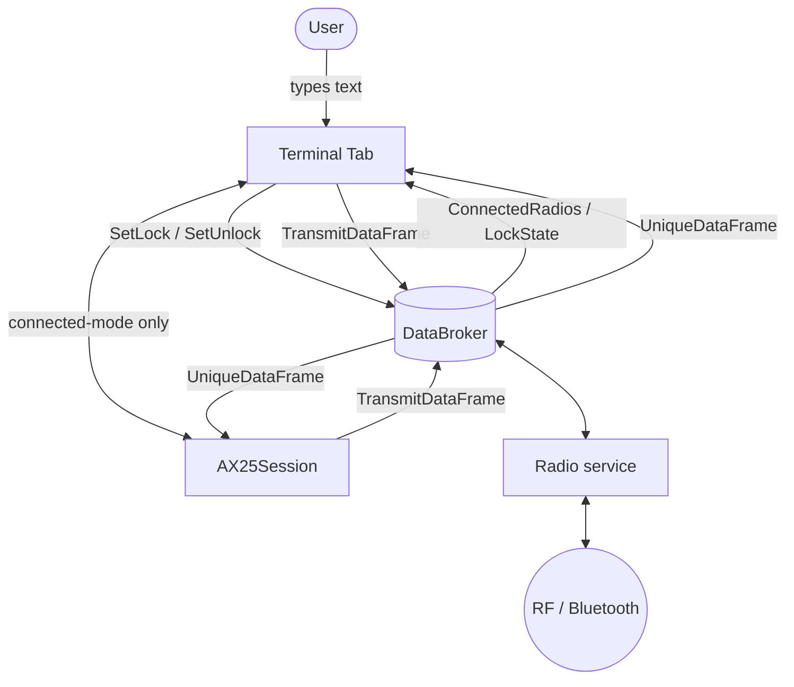
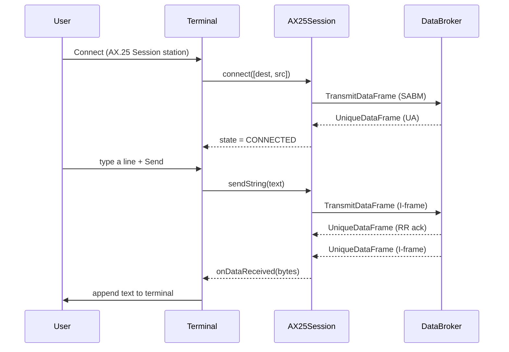

# Terminal

The **Terminal** is a packet‑radio terminal tab in HTCommander. It connects to a remote station over a radio and exchanges text, much like a classic TNC terminal. It is a Flutter port of the original C# `TerminalTabUserControl`.

Like every component in the app, the Terminal never talks to the radio directly. All of its interaction flows through the [DataBroker](databroker.md) using a small set of named wires.

## What it does

* Lets the user pick a saved **Terminal station** and connect to it over an available radio.
* Sends the text typed by the user and displays text received from the remote station.
* Supports several on‑air **protocols** (connectionless and connected‑mode).
* Renders incoming/outgoing text with per‑station colouring, optional callsign prefixes, and word‑wrap.

## Architecture

The Terminal is a thin UI layer on top of the DataBroker. To transmit, it dispatches frames; to receive, it subscribes to decoded frames. For the connected‑mode protocol it delegates the AX.25 link‑layer logic to an [`AX25Session`](../lib/radio/ax25_session.dart).

## Connecting to a station

A radio must be **locked** to the Terminal before it can be used, so that two features never transmit on the same radio at once. The lock is just a value on the DataBroker.

1. The user presses **Connect**. The Terminal looks at `ConnectedRadios` (device `1`) and `LockState` to find a radio that is connected and not already in use.
2. The user chooses a saved station from the **active station selector** (a port of the C# `ActiveStationSelectorForm`). Saved stations live in `Stations` on device `0`.
3. The Terminal dispatches `SetLock` (usage `"Terminal"`) for the chosen radio, optionally resolving the station's channel name to a channel id.
4. The header switches to `Terminal - <callsign>` and the input box is enabled.

Pressing **Disconnect** dispatches `SetUnlock` (for connectionless protocols) or performs a graceful AX.25 disconnect (for the connected‑mode protocol).

## Protocols

The behaviour of *send* and *receive* depends on the station's configured protocol:

| Protocol | Description | On‑air frame |
| --- | --- | --- |
| **Raw AX.25** | Plain UTF‑8 text in a UI frame. | `U_FRAME_UI`, PID `0xF1` |
| **Raw AX.25 (compressed)** | Same as above, but the smaller of plain or Deflate‑compressed payload is sent. | `U_FRAME_UI`, PID `0xF1`/`0xF3` |
| **APRS messaging** | Text wrapped as an APRS message (`:CALLSIGN  :message`). | `U_FRAME_UI`, PID `0xF0` |
| **AX.25 Session** | Connected‑mode link with sequencing, acknowledgements and retries, handled by `AX25Session`. | `SABM(E)` / `I` / `RR` / `DISC` … |

> Note: the original C# build can also use Brotli compression (PID `0xF2`). The Dart SDK has no Brotli, so the Terminal sends only plain/Deflate and shows a notice if a Brotli frame is received.

## Sending and receiving

For the connectionless protocols the Terminal builds an `AX25Packet` itself and dispatches it; incoming frames arrive on `UniqueDataFrame` as a `TncDataFragment`, which the Terminal decodes and renders.

For the **AX.25 Session** protocol the `AX25Session` owns the conversation. Sending hands the text to the session, which splits it into I‑frames and manages the link; received data comes back through a callback.

## Rendering

Incoming and outgoing text are merged into lines and drawn on a dark, monospaced view:

* Incoming callsigns are green, outgoing blue, received text light‑grey, and system messages (`*** Connected ***`, etc.) yellow.
* **Show Callsign** prefixes each line with the sender's callsign; **Word Wrap** toggles wrapping vs. horizontal scrolling. Both settings are persisted on the broker (`TerminalShowCallsign`, `TerminalWordWrap`).
* Line endings are normalised (a bare `\r` becomes `\n`) and non‑printable control characters are stripped so every line is displayed correctly.

## DataBroker wires used

| Wire (`deviceId` · `name`) | Direction | Purpose |
| --- | --- | --- |
| `1` · `ConnectedRadios` | in | Discover radios available to connect with. |
| `*` · `LockState` | in | Know which radios are free or locked to Terminal. |
| `*` · `UniqueDataFrame` | in | Receive incoming frames (as `TncDataFragment`). |
| `<radio>` · `SetLock` / `SetUnlock` | out | Reserve / release a radio for the Terminal. |
| `<radio>` · `TransmitDataFrame` | out | Transmit an `AX25Packet`. |
| `0` · `Stations` | in/out | Read and save Terminal stations. |
| `0` · `TerminalShowCallsign` / `TerminalWordWrap` | in/out | Persist view preferences. |

## Summary

* The Terminal is a UI tab that talks to radios entirely through the DataBroker.
* A radio is reserved with a `SetLock` (usage `"Terminal"`) before use.
* Connectionless protocols (Raw AX.25, compressed, APRS) build and decode single frames directly.
* The connected‑mode **AX.25 Session** protocol is delegated to `AX25Session`, which manages the reliable link.